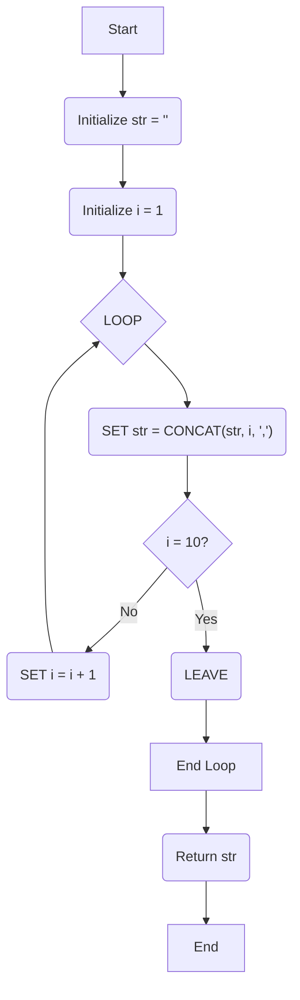

## **Session 10: Flow Control in Stored Procedures**

Welcome to Session 10. In the previous session, we learned how to create basic stored procedures. Now, we will make them truly powerful by adding **procedural logic**. This session covers the fundamental flow control statements—loops and conditionals—that allow you to create complex, intelligent programs that run directly on the MySQL server.

---

### Conditional Statements
Conditional statements allow your stored procedure to make decisions and execute different blocks of code based on certain conditions.

#### `IF` Statement
The `IF` statement is the most basic conditional construct.

**Syntax:**
```sql
IF condition THEN
    statements;
ELSEIF another_condition THEN
    another_statements;
ELSE
    else_statements;
END IF;
```
*   `ELSEIF` and `ELSE` blocks are optional.
*   You must always end the block with `END IF;`.

**Example: A procedure to give a bonus based on employee role.**
```sql
DELIMITER $$

CREATE PROCEDURE CalculateBonus(IN emp_id INT, OUT bonus DECIMAL(10,2))
BEGIN
    DECLARE emp_role VARCHAR(50);

    -- Get the employee's role from the table
    SELECT role INTO emp_role FROM Employees WHERE EmpID = emp_id;

    IF emp_role = 'Manager' THEN
        SET bonus = 5000;
    ELSEIF emp_role = 'Lead' THEN
        SET bonus = 3000;
    ELSE
        SET bonus = 1000;
    END IF;

END$$

DELIMITER ;
```

#### `CASE` Statement
The `CASE` statement is a more elegant way to handle checks against multiple possible values of a single variable, similar to a `switch` statement in Java or C++.

**Syntax 1: Simple CASE**
```sql
CASE case_variable
    WHEN when_value1 THEN statements;
    WHEN when_value2 THEN statements;
    ...
    ELSE else_statements;
END CASE;
```

**Example: Using `CASE` to determine a textual rating.**
```sql
DELIMITER $$

CREATE PROCEDURE GetPerformanceRating(IN emp_id INT, OUT rating_text VARCHAR(20))
BEGIN
    DECLARE performance_score INT;

    SELECT score INTO performance_score FROM PerformanceReviews WHERE EmpID = emp_id;

    CASE performance_score
        WHEN 5 THEN SET rating_text = 'Excellent';
        WHEN 4 THEN SET rating_text = 'Good';
        WHEN 3 THEN SET rating_text = 'Average';
        ELSE SET rating_text = 'Needs Improvement';
    END CASE;

END$$

DELIMITER ;
```
There is also a "Searched CASE" syntax (`CASE WHEN condition THEN ... END CASE;`) which works like a series of `IF-ELSEIF` statements.

> **Quick Question:** You need to check if an employee's salary is less than 30k, between 30k-60k, or greater than 60k. Would a simple `IF-ELSEIF-ELSE` or a simple `CASE` statement be more appropriate?
> **Answer:** An `IF-ELSEIF-ELSE` statement (or a Searched `CASE`) would be more appropriate because you are checking ranges of values, not a single variable against multiple exact values.

---

### Flow Control Statements (Loops)
Loops allow you to repeat a block of SQL statements. All loops in MySQL require a **label** (e.g., `my_loop: LOOP`).

#### `LOOP`
This creates a basic, infinite loop that you must explicitly exit using a `LEAVE` statement.

**Syntax:**
```sql
loop_label: LOOP
    statements;
    IF condition THEN
        LEAVE loop_label;
    END IF;
END LOOP loop_label;
```

**Example: A procedure to generate a string of numbers.**


```sql
DELIMITER $$

CREATE PROCEDURE GenerateNumbers(OUT result_string VARCHAR(255))
BEGIN
    DECLARE i INT DEFAULT 1;
    DECLARE s VARCHAR(255) DEFAULT '';

    number_loop: LOOP
        SET s = CONCAT(s, i, ' ');
        IF i >= 10 THEN
            LEAVE number_loop;
        END IF;
        SET i = i + 1;
    END LOOP number_loop;

    SET result_string = s;
END$$

DELIMITER ;
```

#### `WHILE`
The `WHILE` loop executes a block of code *as long as* a specified condition is true. The condition is checked **before** the loop body is executed.

**Syntax:**
```sql
WHILE condition DO
    statements;
END WHILE;
```

**Example: Summing numbers from 1 to N.**
```sql
DELIMITER $$

CREATE PROCEDURE SumUpToN(IN n_val INT)
BEGIN
    DECLARE total INT DEFAULT 0;
    DECLARE counter INT DEFAULT 1;

    WHILE counter <= n_val DO
        SET total = total + counter;
        SET counter = counter + 1;
    END WHILE;

    SELECT total;
END$$

DELIMITER ;
```

#### `REPEAT`
The `REPEAT` loop executes a block of code *until* a specified condition becomes true. The condition is checked **after** the loop body is executed, meaning the loop will always run at least once.

**Syntax:**
```sql
REPEAT
    statements;
UNTIL condition
END REPEAT;
```

**Example: Same as `LOOP` example, but with `REPEAT`.**
```sql
DELIMITER $$

CREATE PROCEDURE GenerateNumbersRepeat(OUT result_string VARCHAR(255))
BEGIN
    DECLARE i INT DEFAULT 1;
    DECLARE s VARCHAR(255) DEFAULT '';

    REPEAT
        SET s = CONCAT(s, i, ' ');
        SET i = i + 1;
    UNTIL i > 10
    END REPEAT;

    SET result_string = s;
END$$

DELIMITER ;
```

> **Quick Question:** You want to write a loop that might not run at all if a condition is initially false. Which loop construct should you use?
> **Answer:** The `WHILE` loop, because it checks the condition before the first execution.

---

### Topic Summary & Revision

*   **Flow Control:** Essential for adding procedural logic to stored programs.
*   **Conditionals:**
    *   **`IF-THEN-ELSEIF-ELSE-END IF`**: The standard structure for branching logic based on conditions.
    *   **`CASE`**: A cleaner alternative to `IF-ELSEIF` when checking a single variable against multiple specific values.
*   **Loops:** Used for repeating statements.
    *   **`LOOP...END LOOP`**: A basic loop that requires an explicit `LEAVE` statement to exit.
    *   **`WHILE...END WHILE`**: A pre-test loop; executes as long as a condition is true.
    *   **`REPEAT...UNTIL...END REPEAT`**: A post-test loop; executes until a condition becomes true. Runs at least once.
*   **Labels:** Loops in MySQL stored procedures must be labeled (e.g., `my_loop:`).

---

### MCQs for Exam Preparation

1.  **Which statement is required to terminate every `IF` block in a MySQL stored procedure?**
    - [ ] `END`
    - [ ] `ENDIF`
    - [ ] `END IF`
    - [ ] `CLOSE IF`
    <br>

2.  **You need to create a loop that is guaranteed to execute at least once. Which construct should you use?**
    - [ ] `LOOP`
    - [ ] `WHILE`
    - [ ] `FOR`
    - [ ] `REPEAT`
    <br>

3.  **What is the purpose of the `LEAVE` statement within a loop?**
    - [ ] To skip the current iteration and proceed to the next one.
    - [ ] To pause the execution of the loop temporarily.
    - [ ] To terminate the loop and transfer control to the statement immediately after the `END LOOP`.
    - [ ] To declare a local variable inside the loop.
    <br>

4.  **A stored procedure needs to assign a letter grade ('A', 'B', 'C', 'D', 'F') based on a numeric score `(score > 90, >80, >70, >60, else)`. Which is the most appropriate conditional structure?**
    - [ ] A simple `CASE score WHEN ...` statement.
    - [ ] A series of nested `IF` statements.
    - [ ] A searched `CASE WHEN score > 90 THEN ...` statement.
    - [ ] A `WHILE` loop.
    <br>

5.  **What is the primary difference between a `WHILE` loop and a `REPEAT` loop?**
    - [ ] `WHILE` is a pre-test loop (checks condition first), while `REPEAT` is a post-test loop (checks condition last).
    - [ ] `WHILE` loops can be nested, but `REPEAT` loops cannot.
    - [ ] `REPEAT` loops require a `LEAVE` statement to exit.
    - [ ] `WHILE` loops are for numbers, and `REPEAT` loops are for strings.
    <br>

6.  **In a stored procedure, `DECLARE x INT;`. How do you assign a value to `x`?**
    - [ ] `x = 10;`
    - [ ] `x := 10;`
    - [ ] `LET x = 10;`
    - [ ] `SET x = 10;`
    <br>

7.  **What must every `LOOP`, `WHILE`, and `REPEAT` statement have in MySQL procedural code?**
    - [ ] An `IN` parameter.
    - [ ] An `ELSE` clause.
    - [ ] A label (for `LOOP`) and an `END` statement (`END LOOP`, `END WHILE`, `END REPEAT`).
    - [ ] A `COMMIT` statement.
    <br>

8.  **The condition in a `WHILE` loop is `WHILE i < 10 DO ...`. If `i` starts at 10, how many times will the loop body execute?**
    - [ ] 10 times
    - [ ] 1 time
    - [ ] 0 times
    - [ ] Infinitely
    <br>

9.  **The condition in a `REPEAT` loop is `... UNTIL i >= 10`. If `i` starts at 10, how many times will the loop body execute?**
    - [ ] 10 times
    - [ ] 1 time
    - [ ] 0 times
    - [ ] Infinitely
    <br>

10. **The `CONCAT()` function used in the examples is a:**
    - [ ] Loop control statement.
    - [ ] Conditional statement.
    - [ ] MySQL built-in string function.
    - [ ] User-defined procedure.
    <br>

**Answer Key**
1.  **C**: ||The IF conditional block must always be closed with a two-word END IF; statement.||
2.  **D**: ||A REPEAT...UNTIL loop is a post-test loop, meaning the condition is checked after the body of the loop has executed. Therefore, the body is always guaranteed to run at least once.||
3.  **C**: ||LEAVE is used to exit a labeled block, which is most commonly a loop. It is functionally equivalent to the break statement in languages like Java or C.||
4.  **C**: ||Since the conditions are based on ranges (> 90, etc.) rather than specific values (= 90), a searched CASE statement (CASE WHEN ...) or an IF-ELSEIF chain is the correct choice. The searched CASE is often more readable.||
5.  **A**: ||This is the fundamental difference. WHILE might not execute at all if the condition is initially false. REPEAT always executes at least once because the check is at the end.||
6.  **D**: ||In MySQL stored procedures, the SET command is used to assign values to previously declared variables.||
7.  **C**: ||Loops in MySQL require a corresponding END statement (END LOOP, END WHILE, END REPEAT). The basic LOOP construct also requires a label for the LEAVE statement to reference.||
8.  **C**: ||WHILE is a pre-test loop. Since the initial value of i (10) does not satisfy the condition i < 10, the loop body will never be executed.||
9.  **B**: ||REPEAT is a post-test loop. The body will execute once. Then, the condition i >= 10 will be checked. Since i is 10, the condition is true, and the loop terminates. It executes exactly once.||
10. **C**: ||CONCAT() is one of MySQL's many built-in functions for manipulating data. In this case, it concatenates (joins) strings. We will cover more of these in the next session.||

---

### **Bonus Tips**

*   **`ITERATE` vs. `LEAVE`:** Inside a loop, you can use the `ITERATE loop_label;` command. This is equivalent to the `continue` keyword in other languages. It immediately skips the rest of the current loop iteration and starts the next one. `LEAVE` is equivalent to `break`.
*   **Variable Scope:** Variables declared with `DECLARE` inside a `BEGIN...END` block are local to that block. Once the block finishes, the variable is gone. This is similar to variable scope in Java or C++.
*   **Readability:** While a complex set of `IF-ELSEIF` statements can do anything a `CASE` statement can, `CASE` is often much more readable when you are comparing a single variable against many possible values. Choose the construct that makes your code's intent clearest.
*   **Performance:** All procedural logic (loops, conditionals) runs on the database server. While this is good for reducing network traffic, very complex, long-running loops can put a heavy load on the database CPU. The best approach is always to try to solve a problem with a single, set-based SQL query first. Use procedural logic only when set-based logic is not possible or is too complex.

**🔗Links:** [[DBT Session 11 - Functions and Loop Constructs]]