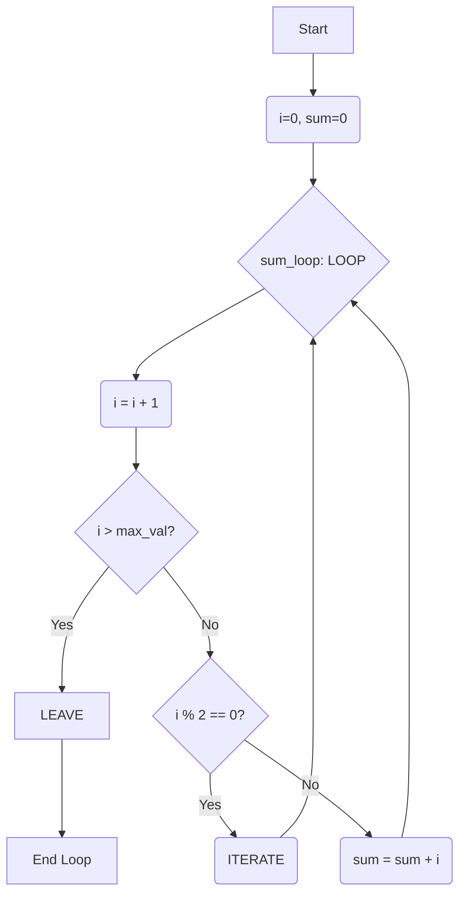

## Functions and Loop Constructs

Welcome to Session 11. Building upon our knowledge of [[DBT Session 10 - Flow Control in Stored Procedures|flow control]], we will now explore more advanced loop controls and introduce another type of stored program: the **Stored Function**. While procedures perform actions, functions are designed to perform a calculation and **return a single value**. We will also look at some of MySQL's powerful built-in functions.

---

### Advanced Loop Constructs (`ITERATE`, `LEAVE`)
We've seen that `LEAVE` is used to exit a loop entirely. There is another important command for controlling loop flow.

*   **`LEAVE loop_label`**: This is equivalent to the `break` statement in languages like Java or C. It immediately terminates the loop and execution continues at the statement following `END LOOP`.
*   **`ITERATE loop_label`**: This is equivalent to the `continue` statement. It skips the remaining statements in the current loop iteration and proceeds directly to the beginning of the next iteration.

**Example: A loop to sum only odd numbers.**
```sql
DELIMITER $$

CREATE PROCEDURE SumOddNumbers(IN max_val INT, OUT total_sum INT)
BEGIN
    DECLARE i INT DEFAULT 0;
    SET total_sum = 0;

    sum_loop: LOOP
        SET i = i + 1;

        IF i > max_val THEN
            LEAVE sum_loop;  -- Exit the loop entirely
        END IF;

        IF (i % 2 = 0) THEN
            ITERATE sum_loop; -- Skip the rest of this iteration for even numbers
        END IF;

        -- This line is only reached for odd numbers
        SET total_sum = total_sum + i;
    END LOOP;
END$$

DELIMITER ;
```
**Execution Flow Visualization:**


---

### Stored Functions
A **Stored Function** is a stored program that **must return a single value**. This is the key difference from a stored procedure.

#### Characteristics of Stored Functions
*   **Must Return a Value:** Defined with a `RETURNS` clause specifying the data type of the return value. The body must contain a `RETURN` statement.
*   **No `OUT`/`INOUT` Parameters:** Functions can only have `IN` parameters. They communicate their result via the `RETURN` value.
*   **Can be Used in SQL Queries:** This is their biggest advantage. You can use a user-defined function in a `SELECT`, `WHERE`, or `ORDER BY` clause, just like a built-in function. Stored procedures cannot be used this way.

#### Creating Functions
**Syntax:**
```sql
CREATE FUNCTION function_name(parameter_list)
RETURNS return_datatype
[DETERMINISTIC | NOT DETERMINISTIC]
BEGIN
    -- Declarations and logic
    RETURN some_value;
END;
```
*   `DETERMINISTIC`: A hint to the optimizer that the function will always return the same result for the same input parameters. Functions that read from tables are non-deterministic. Mathematical functions are deterministic.

**Example: A function to calculate an employee's age.**
```sql
DELIMITER $$

CREATE FUNCTION CalculateAge(birth_date DATE)
RETURNS INT
DETERMINISTIC
BEGIN
    RETURN TIMESTAMPDIFF(YEAR, birth_date, CURDATE());
END$$

DELIMITER ;
```
**How to use it in a query:**
`SELECT name, birthdate, CalculateAge(birthdate) AS age FROM Employees;`

> **Quick Question:** You need to create a reusable piece of code that takes a `product_id` and returns the current stock level for that product. Should you create a stored procedure or a stored function?
> **Answer:** A stored function is more appropriate because the goal is to calculate and return a single value (the stock level), and you would likely want to use this calculation directly in `SELECT` or `WHERE` clauses.

---

### MySQL Built-in Functions
MySQL provides a vast library of built-in functions to perform common operations on data within your SQL queries. This saves you from having to retrieve the raw data and process it in your application code.

#### String Functions
*   `CONCAT(str1, str2, ...)`: Joins strings together.
*   `LENGTH(str)`: Returns the length of a string in bytes.
*   `CHAR_LENGTH(str)`: Returns the length of a string in characters (better for multi-byte character sets).
*   `UPPER(str)`, `LOWER(str)`: Converts a string to upper or lower case.
*   `SUBSTRING(str, start, length)`: Extracts a substring.
*   `REPLACE(str, from_str, to_str)`: Replaces occurrences of a substring.

**Example:**
`SELECT CONCAT(UPPER(first_name), ' ', UPPER(last_name)) AS full_name FROM Users;`

#### Numeric Functions
*   `ABS(x)`: Returns the absolute value of x.
*   `ROUND(x, d)`: Rounds x to d decimal places.
*   `CEIL(x)`: Rounds x up to the nearest integer.
*   `FLOOR(x)`: Rounds x down to the nearest integer.
*   `MOD(n, m)`: Modulo operator, returns the remainder of n divided by m.

**Example:**
`SELECT order_id, ROUND(order_value, 2) FROM Orders;`

#### Date and Time Functions
*   `CURDATE()`: Returns the current date.
*   `NOW()`: Returns the current date and time.
*   `DATE_FORMAT(date, format)`: Formats a date according to a format string (e.g., `'%d-%m-%Y'`).
*   `DATEDIFF(date1, date2)`: Returns the number of days between two dates.
*   `TIMESTAMPDIFF(unit, start_date, end_date)`: A more general function to find the difference in a specific unit (YEAR, MONTH, DAY, HOUR, etc.).

**Example:**
`SELECT order_id, DATEDIFF(CURDATE(), order_date) AS days_ago FROM Orders;`

---

### Topic Summary & Revision

*   **Advanced Loop Control:**
    *   `LEAVE`: Exits a loop completely (like `break`).
    *   `ITERATE`: Skips the current iteration and starts the next one (like `continue`).
*   **Stored Functions:** Reusable programs that **must return a single value**. They are defined with `RETURNS datatype` and use the `RETURN value;` statement.
*   **Procedures vs. Functions:** Procedures are for performing actions and can have `OUT` parameters. Functions are for calculations, return one value, and can be used directly within SQL statements.
*   **Built-in Functions:** MySQL provides a rich library of functions for strings, numbers, and dates to manipulate data directly within a query.

---

### MCQs for Exam Preparation

1.  **What is the main difference between a stored procedure and a stored function in MySQL?**
    - [ ] A function can have parameters, but a procedure cannot.
    - [ ] A procedure can be used in a `SELECT` statement, but a function cannot.
    - [ ] A function must return a single value, while a procedure does not have to.
    - [ ] Procedures are faster than functions.
    <br>

2.  **The `ITERATE` statement inside a loop is functionally equivalent to which keyword in Java/C?**
    - [ ] `break`
    - [ ] `return`
    - [ ] `goto`
    - [ ] `continue`
    <br>

3.  **Which built-in function would you use to get the current date and time?**
    - [ ] `CURDATE()`
    - [ ] `TIMESTAMP()`
    - [ ] `NOW()`
    - [ ] `GETDATE()`
    <br>

4.  **What is the correct syntax to define a function `GetFullName` that takes `fname` and `lname` and returns a `VARCHAR`?**
    - [ ] `CREATE FUNCTION GetFullName(fname VARCHAR, lname VARCHAR) RETURNS VARCHAR ...`
    - [ ] `CREATE PROCEDURE GetFullName(fname VARCHAR, lname VARCHAR) RETURNS VARCHAR ...`
    - [ ] `CREATE FUNCTION GetFullName(OUT full_name VARCHAR) ...`
    - [ ] `CREATE FUNCTION GetFullName(fname, lname) ...`
    <br>

5.  **You want to display all employee names in uppercase. Which query would you use?**
    - [ ] `SELECT MANIPULATE(name, 'upper') FROM Employees;`
    - [ ] `SELECT TO_UPPER(name) FROM Employees;`
    - [ ] `SELECT UPPER(name) FROM Employees;`
    - [ ] `SELECT UCASE(name) FROM Employees;`
    <br>

6.  **The `DETERMINISTIC` keyword in a function definition is a hint that:**
    - [ ] The function will always return an integer.
    - [ ] The function has no input parameters.
    - [ ] The function's execution time is predictable.
    - [ ] The function will always produce the same output for the same input parameters.
    <br>

7.  **Which statement would you use to find the number of years an employee has worked at a company?**
    - [ ] `SELECT DATEDIFF(YEAR, hire_date, CURDATE()) FROM Employees;`
    - [ ] `SELECT AGE(hire_date) FROM Employees;`
    - [ ] `SELECT TIMESTAMPDIFF(YEAR, hire_date, CURDATE()) FROM Employees;`
    - [ ] `SELECT YEARDIF(CURDATE(), hire_date) FROM Employees;`
    <br>

8.  **What is the purpose of the `LEAVE` statement?**
    - [ ] To log out of the current MySQL session.
    - [ ] To terminate the execution of the containing labeled block (like a loop).
    - [ ] To return a value from a stored procedure.
    - [ ] To skip the current iteration of a loop.
    <br>

9.  **A stored procedure needs to return three calculated values: `total_sales`, `avg_sale_value`, and `order_count`. Which is the best approach?**
    - [ ] Create a single function that returns a concatenated string with all three values.
    - [ ] Create three separate functions, one for each value.
    - [ ] Create a single procedure with three `OUT` parameters.
    - [ ] This is not possible in MySQL.
    <br>

10. **What would `ROUND(123.456, 1)` return?**
    - [ ] 123
    - [ ] 123.4
    - [ ] 123.5
    - [ ] 123.46
    <br>

**Answer Key**
1. C: ||The defining characteristic of a function is that it is designed to compute and return a single value, specified by the RETURNS clause. A procedure is designed to perform a set of actions.||
2. D: ||ITERATE causes the loop to immediately jump to the next iteration, skipping any code below it in the current iteration. This is the exact behavior of the continue keyword. LEAVE is equivalent to break.||
3. C: ||NOW() returns the full current date and time (e.g., '2023-10-27 10:30:00'). CURDATE() returns only the date part.||
4. A: ||The correct syntax requires CREATE FUNCTION, a parameter list with data types, and a RETURNS clause specifying the return type. The size of the VARCHAR return type is also required, e.g., RETURNS VARCHAR(100).||
5. C: ||UPPER() is the standard SQL function for converting a string to uppercase. UCASE() is a synonym for UPPER() in MySQL, so it would also work, but UPPER is more standard.||
6. D: ||A deterministic function gives the same output for the same input every time (e.g., a mathematical calculation). A non-deterministic function's output can change even with the same input (e.g., NOW() or a function that reads from a table whose data might have changed).||
7. C: ||TIMESTAMPDIFF is the correct and most flexible function for finding the difference between two timestamps in a specified unit (YEAR, MONTH, DAY, etc.). DATEDIFF only calculates the difference in days.||
8. B: ||LEAVE is used to exit a block that has been given a label. This is most commonly used to break out of a LOOP, WHILE, or REPEAT block.||
9. C: ||Since a function can only return one value, a procedure with multiple OUT parameters is the standard and correct way to return multiple calculated values from a single call.||
10. C: ||ROUND(x, d) rounds the number x to d decimal places. The digit after the first decimal place is 5, so 123.4 is rounded up to 123.5.||

---

### **Bonus Tips**

*   **When to use a Function vs. a Procedure:**
    *   Use a **Function** when:
        *   You need to compute a single value.
        *   You want to use the result directly in a `SELECT` or `WHERE` clause.
        *   The logic is purely a calculation (deterministic).
    *   Use a **Procedure** when:
        *   You need to perform a series of actions (DML statements like `INSERT`, `UPDATE`).
        *   You need to return multiple values (using `OUT` parameters).
        *   The logic is complex and involves transaction control (`COMMIT`, `ROLLBACK`).
*   **The Power of Built-ins:** Before you write a complex function in your application code (Java, Python, etc.) to process data, always check if there is a MySQL built-in function that can do it for you. Performing calculations and transformations at the database level is almost always more efficient than pulling raw data across the network and processing it on the client side.
*   **Declaring Variables:** Always declare your variables at the very beginning of your `BEGIN...END` block. MySQL requires all `DECLARE` statements to come before any other statements in the block.
*   **Don't Reinvent the Wheel:** For common calculations like age, use the built-in functions (`TIMESTAMPDIFF`). They are highly optimized and handle edge cases (like leap years) correctly, which is something you might miss if you try to write the logic yourself.

**🔗Links:** [[DBT Session 12 - Cursors]]