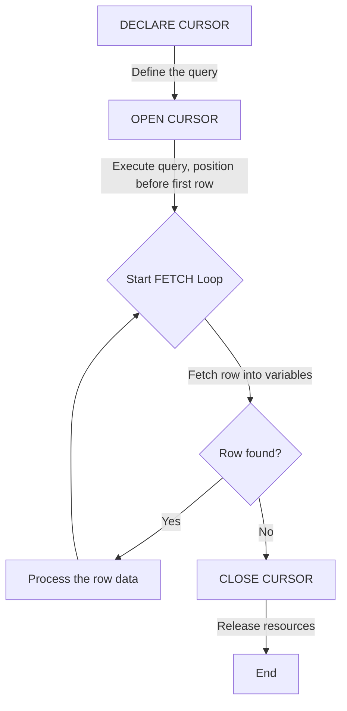

## Cursors

Welcome to Session 12. So far, our SQL queries and stored programs have operated on **sets of data**. A `SELECT` statement returns a whole result set, and an `UPDATE` statement modifies a whole set of rows at once. However, sometimes we need to process the results of a query one row at a time. A **Cursor** is a database object that allows you to traverse the records in a result set, row by row.

---

### What is a Cursor and Why Use It?
A **cursor** is a control structure that acts as a pointer to a single row within a result set. It enables you to fetch and process each row individually.

**The Mindset Shift:**
Using a cursor is a move away from the declarative, set-based nature of SQL towards a more traditional, **procedural, row-by-row processing** model, similar to iterating over a list in Java.

**When are Cursors Needed?**
While you should always try to solve problems with set-based SQL first, cursors are necessary for certain complex tasks:
*   **Complex Row-by-Row Logic:** When you need to perform a complicated series of actions for each row that cannot be expressed in a single SQL statement.
*   **Inter-row Calculations:** When the calculation for the current row depends on a value from the previous row.
*   **Calling other Procedures:** When you need to retrieve a list of IDs and then call another stored procedure for each ID in the list.

**The Downside:** Cursors are notoriously **inefficient** compared to set-based operations. They involve significant overhead and should be used as a last resort when a standard SQL query cannot solve the problem.

---

### The Lifecycle of a Cursor
Using a cursor involves a four-step process.



1.  **`DECLARE`**: Define the cursor and associate it with a `SELECT` statement. This step only defines the cursor; it does not execute the query yet.
2.  **`OPEN`**: Execute the `SELECT` statement and populate the result set. The cursor is now positioned *before* the first row.
3.  **`FETCH`**: Retrieve the next row from the result set and advance the cursor's position. This is typically done inside a loop.
4.  **`CLOSE`**: Release the memory and resources used by the cursor. It is crucial to close cursors once you are done with them.

---

### Using Cursors in a Stored Procedure
Let's see how these steps are implemented.

**Scenario:** We want to create a procedure that goes through each employee in the `Employees` table and generates a single comma-separated string of all their names.

```sql
DELIMITER $$

CREATE PROCEDURE BuildEmployeeList(OUT name_list TEXT)
BEGIN
    -- Step 0: Declare variables to hold data from each row
    -- and a handler for when the cursor runs out of rows.
    DECLARE done INT DEFAULT FALSE;
    DECLARE current_name VARCHAR(100);
    
    -- Step 1: DECLARE the cursor
    DECLARE emp_cursor CURSOR FOR
        SELECT name FROM Employees;

    -- Declare a "NOT FOUND" handler to exit the loop
    DECLARE CONTINUE HANDLER FOR NOT FOUND SET done = TRUE;

    SET name_list = '';

    -- Step 2: OPEN the cursor
    OPEN emp_cursor;

    -- Step 3: FETCH rows in a loop
    read_loop: LOOP
        -- Fetch the data from the current row into variables
        FETCH emp_cursor INTO current_name;

        -- If 'done' is TRUE, it means the last FETCH found no more rows
        IF done THEN
            LEAVE read_loop;
        END IF;

        -- Process the fetched row
        SET name_list = CONCAT(name_list, current_name, ', ');

    END LOOP;

    -- Step 4: CLOSE the cursor
    CLOSE emp_cursor;

END$$

DELIMITER ;
```

**Breakdown of the Code:**
*   `DECLARE current_name VARCHAR(100);`: We need local variables to store the data fetched from each row.
*   `DECLARE emp_cursor CURSOR FOR ...`: This names our cursor (`emp_cursor`) and ties it to the query `SELECT name FROM Employees;`.
*   `DECLARE CONTINUE HANDLER FOR NOT FOUND SET done = TRUE;`: This is a crucial piece of boilerplate. It sets up a "listener." When a `FETCH` statement fails to find another row (a "NOT FOUND" condition), it will automatically execute the command `SET done = TRUE;`. This is how we know when to exit our loop.
*   `OPEN emp_cursor;`: Executes the `SELECT` query.
*   `read_loop: LOOP ... END LOOP;`: A standard loop to iterate through the results.
*   `FETCH emp_cursor INTO current_name;`: This is the main operation. It retrieves the `name` from the row the cursor is pointing at and stores it in the `current_name` variable. It also advances the cursor to the next row.
*   `IF done THEN LEAVE read_loop; END IF;`: Checks the flag set by our handler to see if it's time to exit.
*   `CLOSE emp_cursor;`: Releases the resources.

---

### Cursor Attributes
MySQL cursors are **Asensitive**, **Insensitive**, **Read-only**, and **Non-scrollable**. Let's break down what this means.

*   **Asensitive / Insensitive:** This defines how the cursor reacts to changes made to the underlying table *after* the cursor has been opened.
    *   An **Insensitive** cursor works on a temporary copy of the data. Changes made to the base table by other connections will **not** be visible to the cursor.
    *   An **Asensitive** cursor's behavior is less strict. MySQL may or may not create a temporary copy. For simple queries, it often behaves like an insensitive cursor. You should generally assume that the result set is fixed at the time the cursor is opened.
*   **Read-only:** You cannot `UPDATE` or `DELETE` rows through the cursor itself. You can fetch the data and then run a separate `UPDATE` or `DELETE` command using the fetched values in a `WHERE` clause.
*   **Non-scrollable (Forward-only):** You can only move the cursor forward one row at a time using `FETCH`. You cannot go backward or jump to a specific row.

---

### Topic Summary & Revision

*   **Cursor:** A database object that allows row-by-row processing of a result set.
*   **When to Use:** Use as a last resort when set-based SQL is not possible, typically for complex procedural logic or inter-row calculations.
*   **Performance:** Cursors are generally inefficient and have high overhead compared to standard SQL queries.
*   **Lifecycle:** The four essential steps are **`DECLARE`**, **`OPEN`**, **`FETCH`** (in a loop), and **`CLOSE`**.
*   **Handler:** You must declare a `NOT FOUND` handler to detect when the cursor has run out of rows and to set a flag to exit the fetch loop.
*   **MySQL Cursor Properties:** They are non-scrollable (forward-only), read-only, and their sensitivity to underlying data changes can vary (asensitive).

---

### MCQs for Exam Preparation

1.  **What is the primary function of a database cursor?**
    - [ ] To sort the results of a query.
    - [ ] To allow row-by-row processing of a result set.
    - [ ] To create a temporary table.
    - [ ] To join multiple tables together.
    <br>

2.  **Which statement is used to define a cursor and associate it with a `SELECT` query?**
    - [ ] `OPEN`
    - [ ] `FETCH`
    - [ ] `CREATE`
    - [ ] `DECLARE`
    <br>

3.  **Why are cursors generally considered inefficient in database programming?**
    - [ ] They use too much network bandwidth.
    - [ ] They lock the entire table, preventing other users from accessing it.
    - [ ] They break the set-based nature of SQL and involve significant overhead for each row fetched.
    - [ ] They can only be used on tables with a primary key.
    <br>

4.  **What is the purpose of the `DECLARE ... HANDLER FOR NOT FOUND` statement when using a cursor?**
    - [ ] To handle syntax errors in the `SELECT` statement.
    - [ ] To provide a default value if a fetched column is `NULL`.
    - [ ] To define an action (like setting a flag) to be taken when the `FETCH` operation runs out of rows.
    - [ ] To start a transaction before opening the cursor.
    <br>

5.  **Which of the four cursor lifecycle steps actually executes the underlying `SELECT` query?**
    - [ ] `DECLARE`
    - [ ] `OPEN`
    - [ ] `FETCH`
    - [ ] `CLOSE`
    <br>

6.  **The `FETCH` statement in a cursor loop does which two things?**
    - [ ] Retrieves the next row and closes the cursor.
    - [ ] Checks for a condition and retrieves the next row.
    - [ ] Retrieves the current row into variables and advances the cursor to the next row.
    - [ ] Declares a variable and fetches a row into it.
    <br>

7.  **If a MySQL cursor is "Non-scrollable", it means:**
    - [ ] You cannot update the data through the cursor.
    - [ ] You can only move the cursor forward.
    - [ ] The cursor is not sensitive to changes in the underlying data.
    - [ ] The cursor can only be used with a `WHILE` loop.
    <br>

8.  **When should you use a cursor?**
    - [ ] For every `SELECT` statement to get maximum control.
    - [ ] When a simple `UPDATE` or `DELETE` statement can solve the problem.
    - [ ] As a last resort, for complex row-by-row procedural logic that cannot be done with set-based SQL.
    - [ ] To improve the performance of a simple query.
    <br>

9.  **Which statement is mandatory after you are finished using a cursor?**
    - [ ] `COMMIT;`
    - [ ] `LEAVE;`
    - [ ] `DROP CURSOR;`
    - [ ] `CLOSE CURSOR;`
    <br>

10. **The variables used in the `FETCH ... INTO ...` statement must be:**
    - [ ] Global variables.
    - [ ] Table columns.
    - [ ] Declared beforehand using the `DECLARE` keyword.
    - [ ] `OUT` parameters of the stored procedure.
    <br>

**Answer Key**
1. B: ||A cursor breaks down a result set, which is a set of rows, into its individual components, allowing you to iterate through them one at a time.||
2. D: ||The DECLARE CURSOR statement is used to name a cursor and define the SELECT statement that will generate its result set. This step does not execute the query.||
3. C: ||SQL is optimized for set-based operations. Processing row-by-row (often called RBAR) with a cursor introduces a lot of back-and-forth communication between the procedural logic and the SQL engine, which is much slower than a single set-based command.||
4. C: ||The handler is a mechanism to gracefully manage the end of the result set. When FETCH tries to get a row that doesn't exist, the NOT FOUND condition is triggered, and the handler's action (e.g., SET done = TRUE;) allows the loop to terminate cleanly.||
5. B: ||The OPEN statement is what causes the database to execute the SELECT query associated with the cursor and make the resulting rows available for fetching.||
6. C: ||FETCH is a two-part operation: it copies the data from the row the cursor is currently pointing at into local variables, and then it moves the internal cursor pointer to the next row in the result set.||
7. B: ||Non-scrollable, or forward-only, is a key characteristic of standard cursors. You can FETCH the next row, but there is no command to FETCH PREVIOUS or FETCH ABSOLUTE 5.||
8. C: ||Because of their poor performance, cursors should be avoided whenever a set-based SQL statement can achieve the same result. Their use is reserved for special cases requiring complex, iterative logic.||
9. D: ||It is crucial to CLOSE a cursor to release the memory and locks associated with its result set. Forgetting to close cursors can lead to resource leaks on the database server.||
10. C: ||You must declare local variables using DECLARE at the beginning of your BEGIN...END block to serve as containers for the data that the FETCH statement retrieves from each column of the result set.||

---

### **Bonus Tips**

*   **Avoid Cursors if Possible:** This is the most important tip. Before you write a cursor, ask yourself, "Can this be done with a single `UPDATE` statement with a complex `WHERE` clause? Can this be done with a `JOIN`? Can I use a temporary table to store intermediate results?" 95% of the time, the answer is yes, and the set-based solution will be dramatically faster.
*   **The "NOT FOUND" Handler is Key:** A common mistake for beginners is forgetting the `NOT FOUND` handler. Without it, your fetch loop will not terminate correctly when it runs out of rows and will instead throw an error, causing your stored procedure to fail. The `DECLARE HANDLER...` syntax is essential boilerplate for any cursor loop.
*   **Performance Alternative (Application Layer):** If you truly need to process a large result set row by row, it is often more efficient to run a simple `SELECT` query from your application (e.g., in Java) and loop through the result set *in your application code*. This moves the processing load from the database server CPU to the application server CPU, which is often a better-designed place for complex procedural logic.
*   **Index Your `WHERE` Clauses:** If the `SELECT` statement inside your cursor declaration has a `WHERE` clause, make sure the columns in that clause are properly [[DBT Session 8 - Indexes, ACID Properties, and Storage Engines#Indexes|indexed]]. While the cursor itself is slow, a fast `OPEN` step (because the underlying query is fast) is better than a slow one.

**🔗Links:** [[DBT Session 13 - Triggers]]