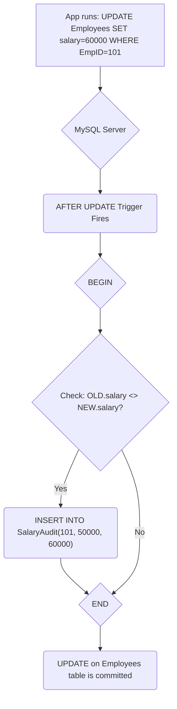

## Triggers

Welcome to Session 13. So far, all our SQL commands have been executed manually or called explicitly from a program. A **Trigger** is a special type of stored program that is **automatically executed** or "fired" in response to a specific data modification event (`INSERT`, `UPDATE`, or `DELETE`) on a particular table.

Triggers are a powerful tool for enforcing complex business rules, maintaining data integrity, and creating audit trails.

---

### Introduction to Triggers
A trigger is associated with a specific table and is activated by a specific event at a specific time.

**The Three Components of a Trigger:**
1.  **Event:** The DML statement that causes the trigger to fire. This can be `INSERT`, `UPDATE`, or `DELETE`.
2.  **Timing:** When the trigger should fire relative to the event.
    *   `BEFORE`: The trigger code runs *before* the DML operation is executed on the table.
    *   `AFTER`: The trigger code runs *after* the DML operation has successfully completed.
3.  **Table:** The specific table the trigger is attached to.

**Analogy: The Security Camera**
Imagine a secure vault (your `Employees` table).
*   A trigger is like a security camera system that is always watching the vault door.
*   **Event:** Someone tries to open the door (`INSERT`, `UPDATE`, or `DELETE` a row).
*   **Timing:**
    *   A `BEFORE` trigger is like a motion sensor that alerts security *before* the door is opened. It can be used to **validate** the person and **prevent** them from opening the door if they are not authorized.
    *   An `AFTER` trigger is like a camera that records who entered and when, *after* they have already gone through the door. It is used for **logging** or **auditing**.

---

### `NEW` and `OLD` Trigger Variables
Inside a trigger, you have access to special pseudo-rows called `NEW` and `OLD` to see the data that is being changed.

*   **`NEW`**: Represents the row that is **about to be inserted** or the **new version** of the row after an `UPDATE`.
    *   Available in `INSERT` and `UPDATE` triggers.
    *   In a `BEFORE INSERT` trigger, you can modify the values in `NEW` before they are stored (e.g., `SET NEW.name = UPPER(NEW.name);`).
*   **`OLD`**: Represents the row that is **about to be deleted** or the **old version** of the row before an `UPDATE`.
    *   Available in `DELETE` and `UPDATE` triggers.
    *   Values in `OLD` are read-only.

**Availability of `NEW` and `OLD`:**

| Trigger Event | `OLD` Variable | `NEW` Variable |
|:--------------|:---------------|:---------------|
| `INSERT`      | Not available  | Available      |
| `UPDATE`      | Available      | Available      |
| `DELETE`      | Available      | Not available  |

---

### Creating Triggers
The `CREATE TRIGGER` statement defines a trigger. The body of the trigger is enclosed in a `BEGIN...END` block if it contains multiple statements.

#### `BEFORE` Trigger Example
**Use Case:** Automatically set a `created_at` timestamp when a new record is inserted, or validate data before it's saved.

**Example: Validate that an employee's salary is not negative before insertion.**
```sql
DELIMITER $$

CREATE TRIGGER before_employee_insert
BEFORE INSERT ON Employees
FOR EACH ROW
BEGIN
    IF NEW.salary < 0 THEN
        -- Signal an error to prevent the INSERT operation
        SIGNAL SQLSTATE '45000'
        SET MESSAGE_TEXT = 'Salary cannot be negative.';
    END IF;
END$$

DELIMITER ;
```
*   `FOR EACH ROW`: This clause is required. It specifies that the trigger body will execute for every single row affected by the DML statement.
*   `SIGNAL SQLSTATE '45000'`: This is the standard way to raise a custom error in MySQL, which will cause the original `INSERT` statement to fail.

#### `AFTER` Trigger Example
**Use Case:** Create an audit trail. Log changes to a separate history table after they have occurred.

**Example: Log every salary update to an `Audit` table.**
First, we need an audit table:
```sql
CREATE TABLE SalaryAudit (
    id INT AUTO_INCREMENT PRIMARY KEY,
    emp_id INT,
    old_salary DECIMAL(10,2),
    new_salary DECIMAL(10,2),
    changed_at TIMESTAMP DEFAULT NOW()
);
```

Now, the trigger:
```sql
DELIMITER $$

CREATE TRIGGER after_employee_update
AFTER UPDATE ON Employees
FOR EACH ROW
BEGIN
    -- Log the change only if the salary was actually updated
    IF OLD.salary <> NEW.salary THEN
        INSERT INTO SalaryAudit (emp_id, old_salary, new_salary)
        VALUES (OLD.EmpID, OLD.salary, NEW.salary);
    END IF;
END$$

DELIMITER ;
```
**Execution Flow Visualization:**


> **Quick Question:** You want to prevent anyone from deleting an employee record if their status is 'Active'. Which type of trigger would you use (event and timing)?
> **Answer:** A `BEFORE DELETE` trigger. Before the `DELETE` happens, you would check `IF OLD.status = 'Active' THEN ...` and signal an error to stop the operation.

---

### Topic Summary & Revision

*   **Trigger:** A stored program that executes automatically in response to an `INSERT`, `UPDATE`, or `DELETE` event on a specific table.
*   **Timing:** Triggers can fire `BEFORE` or `AFTER` the DML event.
*   **`BEFORE` Triggers:** Used for **validation** and **data modification** before the data is written. You can change `NEW` values.
*   **`AFTER` Triggers:** Used for **auditing**, **logging**, or triggering subsequent actions after the original action has succeeded. You cannot change `NEW` or `OLD` values.
*   **`NEW` and `OLD`:** Special pseudo-rows that give you access to the data being changed.
    *   `NEW`: The incoming data in an `INSERT` or `UPDATE`.
    *   `OLD`: The existing data in an `UPDATE` or `DELETE`.
*   **`SIGNAL`:** Used in `BEFORE` triggers to raise an error and cancel the original DML operation.

---

### MCQs for Exam Preparation

1.  **Which of the following events CANNOT activate a trigger?**
    - [ ] `INSERT`
    - [ ] `UPDATE`
    - [ ] `SELECT`
    - [ ] `DELETE`
    <br>

2.  **Inside a `BEFORE INSERT` trigger, which pseudo-row variable is available?**
    - [ ] `NEW` only
    - [ ] `OLD` only
    - [ ] Both `NEW` and `OLD`
    - [ ] Neither `NEW` nor `OLD`
    <br>

3.  **What is the primary purpose of an `AFTER` trigger?**
    - [ ] To validate incoming data and reject it if it's invalid.
    - [ ] To modify the data before it is written to the table.
    - [ ] To perform actions like logging or updating another table after a DML operation has successfully completed.
    - [ ] To speed up the DML operation.
    <br>

4.  **You want to automatically convert all inserted usernames to lowercase before they are saved to the `Users` table. Which trigger is most appropriate?**
    - [ ] `AFTER INSERT ON Users`
    - [ ] `BEFORE INSERT ON Users`
    - [ ] `AFTER UPDATE ON Users`
    - [ ] `BEFORE DELETE ON Users`
    <br>

5.  **What does the `OLD.column_name` refer to inside an `UPDATE` trigger?**
    - [ ] The value of the column before the `UPDATE` statement began.
    - [ ] The new value that the column is being set to.
    - [ ] The oldest value the column has ever had.
    - [ ] A syntax error; `OLD` cannot be used in an `UPDATE` trigger.
    <br>

6.  **Which statement is used within a trigger to stop the original DML operation from happening by raising a custom error?**
    - [ ] `RETURN ERROR`
    - [ ] `THROW EXCEPTION`
    - [ ] `CANCEL OPERATION`
    - [ ] `SIGNAL SQLSTATE '...`
    <br>

7.  **If you drop a table using `DROP TABLE Employees;`, what happens to the triggers associated with that table?**
    - [ ] They remain in the database but are disabled.
    - [ ] They are automatically dropped along with the table.
    - [ ] They must be dropped manually before dropping the table.
    - [ ] They are converted into stored procedures.
    <br>

8.  **Can a single trigger be defined to fire for both `INSERT` and `UPDATE` events?**
    - [ ] Yes, using the syntax `CREATE TRIGGER ... ON MyTable FOR INSERT, UPDATE ...`
    - [ ] No, a trigger must be defined for exactly one event.
    - [ ] Yes, but only for `AFTER` triggers.
    - [ ] Yes, but only for `BEFORE` triggers.
    <br>

9.  **Inside an `AFTER DELETE` trigger, you try to run the statement `SET OLD.name = 'DELETED';`. What will happen?**
    - [ ] The value will be updated in the audit log.
    - [ ] The deletion will be rolled back.
    - [ ] An error will occur because the `OLD` pseudo-row is read-only.
    - [ ] The statement will be ignored.
    <br>

10. **A `BEFORE UPDATE` trigger on an `Orders` table checks `IF NEW.order_date < OLD.order_date`. What is this trigger likely trying to prevent?**
    - [ ] Preventing the order date from being updated at all.
    - [ ] Preventing the order date from being set to a future date.
    - [ ] Preventing the order date from being back-dated to an earlier date.
    - [ ] Ensuring the order date is always the current date.
    <br>

**Answer Key**
1. C: ||Triggers are DML triggers; they are fired only by data modification events (INSERT, UPDATE, DELETE), not by data retrieval (SELECT) events.||
2. A: ||In an INSERT operation, there is no "old" row, so only the NEW pseudo-row, which contains the data to be inserted, is available.||
3. C: ||AFTER triggers run after the data modification is complete. This makes them perfect for actions that should only happen if the primary operation was successful, such as creating an audit trail or updating summary tables.||
4. B: ||A BEFORE INSERT trigger allows you to inspect and modify the incoming NEW data before it is physically stored. The statement would be SET NEW.username = LOWER(NEW.username);.||
5. A: ||In an UPDATE trigger, OLD represents the state of the row as it existed on disk before the UPDATE command started, and NEW represents the state it will have if the command succeeds.||
6. D: ||SIGNAL is the standard SQL statement for raising user-defined errors. This is the correct way to programmatically cause a DML statement to fail from within a BEFORE trigger.||
7. B: ||Triggers are database objects that are dependent on a specific table. When the table is dropped, all of its dependent objects, including triggers and indexes, are also dropped automatically.||
8. B: ||In MySQL and standard SQL, a CREATE TRIGGER statement can only specify one DML event (INSERT, UPDATE, or DELETE). If you need logic for multiple events, you must create multiple triggers.||
9. C: ||The OLD and NEW pseudo-rows are read-only inside an AFTER trigger. The data modification has already happened, so you cannot change the historical (OLD) or new (NEW) values at this point.||
10. C: ||This condition checks if the proposed new date is earlier than the existing old date. If it is, the trigger could be designed to signal an error, thus preventing a user from changing an order's date to a time in the past.||

---

### **Bonus Tips**

*   **Triggers Can Be Dangerous:** Because triggers run automatically and implicitly, they can be a source of "hidden" logic that is difficult to debug. A complex chain of triggers (e.g., a trigger on table A updates table B, which has a trigger that updates table C) can lead to performance nightmares and unexpected behavior. Use them judiciously.
*   **Performance Impact:** Triggers add overhead to every DML statement they are attached to. A complex trigger on a heavily used table can significantly slow down your application's write performance. Always keep trigger logic as simple and efficient as possible.
*   **Use Cases: Audit vs. Validation:**
    *   **Best for Validation -> `BEFORE` trigger.** It's efficient because you can stop a bad operation before any data is actually written or logged.
    *   **Best for Auditing -> `AFTER` trigger.** You only want to log an action *after* you are certain it was successfully completed and committed.
*   **Triggers vs. Application Logic:** A common design question is whether to put business logic in a trigger or in the application code.
    *   **Put it in a trigger if:** The rule must be enforced for *all* modifications to the table, regardless of which application or user is making the change. This guarantees data integrity at the database level.
    *   **Put it in the application if:** The logic is specific to one application's workflow and doesn't represent a universal business rule for that data. This keeps the database "cleaner" and easier to manage.

**🔗Links:** [[DBT Session 14 - Error Handling in Stored Procedures]]