## Error Handling and Exceptions

Welcome to Session 14. In our previous sessions, we wrote [[DBT Session 9 - MySQL Programming and Stored Procedures|stored procedures]] and [[DBT Session 13 - Triggers|triggers]] with "happy path" logic. But what happens when an error occurs? By default, a stored program will terminate immediately. **Error Handling** is the mechanism that allows us to catch specific errors or general warnings and execute a block of code to handle them gracefully, preventing the program from crashing.

---

### Error Handling and Exceptions
In MySQL stored programs, an "exception" is any condition that occurs during execution that changes the normal flow. This can be an error (like "duplicate primary key") or a warning (like "data truncated").

MySQL provides a mechanism to "handle" these conditions using the `DECLARE HANDLER` statement. This is similar to a `try-catch` block in languages like Java, but the syntax is quite different.

**The Handler:**
A handler is a block of code that is executed when a specific condition occurs. You declare handlers at the beginning of a `BEGIN...END` block, along with your variables and cursors.

**Syntax:**
`DECLARE handler_action HANDLER FOR condition_value [, condition_value] ... statement;`

Let's break this down:
*   **`handler_action`**: What should happen when the condition is triggered.
*   **`condition_value`**: The specific condition to watch for.
*   **`statement`**: The code to execute when the handler is activated.

---

### Types of Handler Actions
There are three possible actions you can specify for a handler.

*   **`CONTINUE`**: Executes the handler's statement, and then program execution continues at the statement *immediately following* the one that caused the error.
*   **`EXIT`**: Executes the handler's statement and then terminates the current `BEGIN...END` block.
*   **`UNDO`**: Not supported in MySQL. This is a standard SQL feature that is not implemented.

**Visualizing `CONTINUE` vs. `EXIT`:**

```mermaid
graph TD
    subgraph Legend
        direction LR
        A[Normal Step] --> B[Error Step];
        B --> C[Handler Executes];
    end

    subgraph CONTINUE Handler
        D[Step 1] --> E[Step 2 Causes Error];
        E -- "Error Occurs" --> F(Handler Code Runs);
        F --> G[Step 3 Execution Resumes Here];
        G --> H[End Block];
    end
    
    subgraph EXIT Handler
        I[Step 1] --> J[Step 2 Causes Error];
        J -- "Error Occurs" --> K(Handler Code Runs);
        K --> L[End Block Execution Jumps Here];
    end
```


---

### How to Write a Handler
To write a handler, you need to specify the condition it should catch.

#### Catching Specific SQL Errors
You can catch specific errors by their standard `SQLSTATE` value or their MySQL-specific error code.
*   **`SQLSTATE '23000'`**: The standard code for an integrity constraint violation (e.g., duplicate primary key).
*   **MySQL Error Code `1062`**: The MySQL-specific code for a duplicate entry.

**Example: A procedure to insert a new department, handling a duplicate name.**
```sql
DELIMITER $$

CREATE PROCEDURE InsertDepartment(IN dept_name VARCHAR(50))
BEGIN
    -- Declare a handler for a duplicate key error.
    -- If error 1062 occurs, it will execute the SELECT statement and then EXIT the block.
    DECLARE EXIT HANDLER FOR 1062
        SELECT 'Error: Department with that name already exists.' AS message;

    -- The "normal" logic
    INSERT INTO Departments (DeptName) VALUES (dept_name);
    SELECT 'Department successfully created.' AS message;

END$$

DELIMITER ;
```
If you `CALL InsertDepartment('Technology');` a second time, instead of the procedure crashing, the handler will catch the error and return the custom error message.

#### Catching General Conditions
You can also use general condition names:
*   **`SQLWARNING`**: Catches any condition with an `SQLSTATE` code starting with '01' (warnings).
*   **`NOT FOUND`**: Catches any condition with an `SQLSTATE` code starting with '02'. This is the one we used for [[DBT Session 12 - Cursors|cursors]] when `FETCH` runs out of rows.
*   **`SQLEXCEPTION`**: Catches any condition with an `SQLSTATE` code that does not start with '00', '01', or '02' (most errors).

**Example: Using a `CONTINUE` handler for a warning.**
```sql
DELIMITER $$

CREATE PROCEDURE InsertShortenedName(IN long_name VARCHAR(100))
BEGIN
    DECLARE name_too_long INT DEFAULT 0;

    -- A CONTINUE handler to catch data truncation warnings.
    -- It will set a flag and let the program continue.
    DECLARE CONTINUE HANDLER FOR SQLWARNING
        SET name_too_long = 1;

    -- Imagine the 'ShortNames' table has a column `name VARCHAR(20)`.
    INSERT INTO ShortNames (name) VALUES (long_name);

    IF name_too_long = 1 THEN
        SELECT 'Warning: The provided name was truncated.' AS message;
    ELSE
        SELECT 'Name inserted successfully.' AS message;
    END IF;

END$$

DELIMITER ;
```
If you call this procedure with a very long name, the `INSERT` will generate a warning, the handler will set the flag, and the procedure will finish by printing the warning message instead of crashing.

> **Quick Question:** You are writing a procedure with a cursor. The loop that fetches from the cursor must stop when there are no more rows. Which handler action (`CONTINUE` or `EXIT`) is more appropriate for the `NOT FOUND` condition?
> **Answer:** A `CONTINUE` handler is generally used. It sets a `done` flag to `TRUE`, and then execution *continues* to the `IF done THEN LEAVE...` check inside the loop. An `EXIT` handler would terminate the entire `BEGIN...END` block immediately, which might skip other cleanup code (like closing the cursor) that is placed after the loop.

---

### Topic Summary & Revision

*   **Error Handling:** A mechanism to gracefully manage errors and warnings in stored programs without crashing.
*   **`DECLARE HANDLER`**: The statement used to define an error handler. Handlers must be declared at the beginning of a `BEGIN...END` block.
*   **Handler Actions:**
    *   **`CONTINUE`**: Executes handler code, then continues execution at the next statement.
    *   **`EXIT`**: Executes handler code, then terminates the `BEGIN...END` block.
*   **Conditions to Catch:**
    *   **Specific:** By MySQL error code (e.g., `1062`) or standard `SQLSTATE` (e.g., `'23000'`).
    *   **General:** By using `SQLEXCEPTION` (for most errors), `SQLWARNING` (for warnings), or `NOT FOUND` (for "no rows found" conditions).
*   **Boilerplate for Cursors:** The `DECLARE CONTINUE HANDLER FOR NOT FOUND SET done = TRUE;` pattern is the standard way to manage the end of a cursor's result set.

---

### MCQs for Exam Preparation

1.  **What is the main purpose of using `DECLARE HANDLER` in a stored procedure?**
    - [ ] To declare a new variable.
    - [ ] To define a block of code that runs when a specific error or warning occurs.
    - [ ] To create a cursor for iterating over a result set.
    - [ ] To speed up the execution of the procedure.
    <br>

2.  **A handler is declared with the `EXIT` action. What happens when the specified error occurs?**
    - [ ] The handler's code is executed, and then the procedure continues from the statement that caused the error.
    - [ ] The entire MySQL server shuts down.
    - [ ] The handler's code is executed, and then the containing `BEGIN...END` block is immediately terminated.
    - [ ] Only the handler's code is executed, and the rest of the procedure is skipped, but the block is not terminated.
    <br>

3.  **You are trying to `INSERT` a row with a `PRIMARY KEY` that already exists. This raises MySQL error `1062`. Which general condition will catch this error?**
    - [ ] `SQLWARNING`
    - [ ] `NOT FOUND`
    - [ ] `SQLEXCEPTION`
    - [ ] `DUPLICATE_KEY`
    <br>

4.  **Where must `DECLARE HANDLER` statements be placed inside a stored procedure?**
    - [ ] At the very end of the `BEGIN...END` block.
    - [ ] Immediately before the line of code that might cause the error.
    - [ ] At the beginning of the `BEGIN...END` block, after variable and cursor declarations.
    - [ ] Outside the `BEGIN...END` block.
    <br>

5.  **The `NOT FOUND` condition is most commonly used in a handler to manage:**
    - [ ] `UPDATE` statements that affect zero rows.
    - [ ] `DELETE` statements that do not find a matching row.
    - [ ] Cursors that have run out of rows to `FETCH`.
    - [ ] `SELECT ... INTO` statements that do not find a row.
    <br>

6.  **A handler is defined as `DECLARE CONTINUE HANDLER FOR SQLEXCEPTION ...`. An error occurs. What happens after the handler's code runs?**
    - [ ] The procedure terminates.
    - [ ] Execution continues at the statement that immediately follows the one that caused the error.
    - [ ] The current transaction is automatically committed.
    - [ ] The loop containing the error is exited.
    <br>

7.  **Which of these is a standard `SQLSTATE` value, as opposed to a MySQL-specific error code?**
    - [ ] `1062`
    - [ ] `1048`
    - [ ] `'23000'`
    - [ ] `1146`
    <br>

8.  **To handle any potential error without specifying a code, but ignore warnings, which general condition is most appropriate?**
    - [ ] `NOT FOUND`
    - [ ] `SQLWARNING`
    - [ ] `SQLEXCEPTION`
    - [ ] You must list all possible error codes.
    <br>

9.  **What is the primary difference between a `SIGNAL` statement (used in triggers) and a `DECLARE HANDLER` statement?**
    - [ ] `SIGNAL` is used to catch errors, while `HANDLER` is used to create them.
    - [ ] `SIGNAL` is used to manually raise an error, while `HANDLER` is used to catch an error that occurs.
    - [ ] `SIGNAL` can only be used in triggers, and `HANDLER` can only be used in procedures.
    - [ ] There is no difference.
    <br>

10. **A procedure contains a loop. Inside the loop, an `INSERT` statement might fail. You want the loop to stop processing the current iteration and move to the next one if an error occurs. What is the best way to achieve this?**
    - [ ] Declare an `EXIT` handler for the error.
    - [ ] Declare a `CONTINUE` handler for the error, and place no other code after the `INSERT` in the loop.
    - [ ] Use a `SIGNAL` statement.
    - [ ] This is not possible; any error will terminate the procedure.
    <br>

**Answer Key**
1. B: ||A handler is a pre-defined "trap" for specific conditions (errors or warnings), allowing you to define a custom action instead of letting the program crash.||
2. C: ||The EXIT action causes the execution to immediately jump to the end of the current BEGIN...END block, effectively terminating that block's execution path.||
3. C: ||A duplicate key error is an integrity constraint violation, which falls under the general category of SQLEXCEPTION. It is an error, not a warning (SQLWARNING) or a "not found" condition (NOT FOUND).||
4. C: ||In MySQL, all DECLARE statements for local variables, cursors, conditions, and handlers must appear at the start of a BEGIN...END block, before any procedural logic like SET or SELECT.||
5. C: ||While a SELECT ... INTO that finds no row also triggers NOT FOUND, its most common and idiomatic use is to detect the end of a cursor's result set during a FETCH loop.||
6. B: ||The CONTINUE action specifically means that after the handler's code finishes, program flow resumes at the line right after the statement that caused the handler to activate.||
7. C: ||SQLSTATE values, which are typically 5-character strings, are part of the ANSI SQL standard and are portable across different database systems. Numeric error codes are usually specific to the DBMS vendor (e.g., MySQL).||
8. C: ||SQLEXCEPTION is a shorthand for "any error condition" (specifically, any SQLSTATE not starting with '00', '01', or '02'). It is the broadest way to catch errors.||
9. B: ||SIGNAL is used to proactively create and throw a custom error. A HANDLER is reactive; it catches an error that has already been thrown by the system or by a SIGNAL statement.||
10. B: ||By defining a CONTINUE handler, when the INSERT fails, the handler will execute. Since CONTINUE means execution resumes after the failing statement, and there is no other code in the loop, the END LOOP will be reached, and the next iteration will begin. This effectively mimics a continue behavior for errors.||

---

### **Bonus Tips**

*   **Scope of Handlers:** A handler is active for the entire `BEGIN...END` block in which it is declared, including any nested blocks. If a nested block has its own handler for the same condition, the inner handler takes precedence.
*   **Named Conditions:** For better readability, you can associate a name with a specific error code. For example: `DECLARE duplicate_key_error CONDITION FOR 1062;` and then later, `DECLARE EXIT HANDLER FOR duplicate_key_error ...;`. This makes your code self-documenting.
*   **Get Diagnostics:** Inside a handler, you might want to know the exact error that occurred. You can use the `GET DIAGNOSTICS` command to retrieve the error code, message text, etc., into local variables for logging or custom error messages.
*   **Handlers vs. Application-Level Handling:** A common design choice is where to handle errors.
    *   **Handle in Stored Procedure:** Good for errors that the procedure can recover from, or for creating a clear, atomic transaction where you can `ROLLBACK` and return a clean error message.
    *   **Handle in Application (Java):** Good for errors related to system issues (e.g., cannot connect to the database) or when the application needs to make a complex decision based on the type of database error returned. In Java, this would be a `try-catch(SQLException e)` block.

**🔗Links:** [[DBT Session 15 - NoSQL Database]]