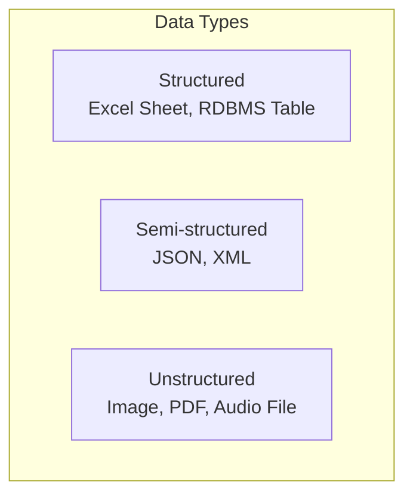
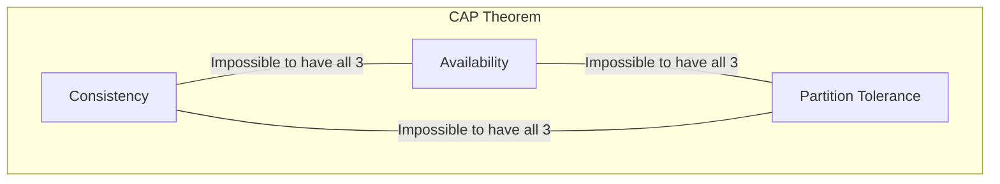

## Introduction to NoSQL Databases

Welcome to Session 15. For decades, the [[DBT Session 1 - Introduction to Database Technologies#Relational DBMS (RDBMS)|Relational DBMS]] has been the undisputed standard for data storage. However, the rise of the internet, social media, and big data introduced new challenges that RDBMSs were not originally designed for: massive scale, high velocity, and a wide variety of data types. **NoSQL Databases** emerged to meet these challenges.

---

### What is NoSQL?
**NoSQL** stands for "Not Only SQL." It is an umbrella term for a broad category of database management systems that differ from the traditional relational model. They are not built on tables with fixed schemas and they generally do not use SQL as their primary query language.

**Why was NoSQL needed?**
The internet era brought new requirements:
*   **Massive Scalability:** The need to handle petabytes of data and millions of users (e.g., Facebook, Google). NoSQL databases are typically designed to **scale horizontally** (by adding more servers), which is often cheaper and more flexible than scaling vertically (buying a bigger, more powerful server).
*   **High Availability:** Web applications must be online 24/7. NoSQL databases are often distributed across multiple servers, so if one server fails, the system can continue operating.
*   **Schema Flexibility:** Developers need to iterate and evolve applications quickly. A rigid RDBMS schema makes changes difficult. NoSQL databases often have a flexible or non-existent schema, allowing developers to add new fields without migrating the entire database.

### Structured vs. Semi-structured vs. Unstructured Data

*   **Structured Data:** Data that conforms to a strict, pre-defined model. It's the world of tables, rows, and columns. This is the domain of **RDBMS**.
*   **Unstructured Data:** Data with no inherent structure, like video files, audio files, images, or raw text documents.
*   **Semi-structured Data:** Data that does not fit into a rigid table structure but contains tags or other markers to separate semantic elements. **JSON** (JavaScript Object Notation) and **XML** are the prime examples. This is the domain where many **NoSQL** databases excel.

**Visualizing the Data Types:**

### RDBMS vs. NoSQL: Key Differences

| Feature | RDBMS (e.g., MySQL) | NoSQL (e.g., MongoDB) |
| :--- | :--- | :--- |
| **Data Model** | Structured (Tables, Rows, Columns) | Varies: Document, Key-Value, etc. (Often Semi-structured) |
| **Schema** | Rigid, defined in advance (Schema-on-write) | Dynamic or flexible (Schema-on-read) |
| **Scalability** | Vertical (Scale-up) | Horizontal (Scale-out) |
| **Consistency** | Strong Consistency (ACID properties) | Eventual Consistency (BASE properties) |
| **Language** | SQL (Structured Query Language) | Varies (e.g., MongoDB Query Language) |

---

### The CAP Theorem
The CAP Theorem (also known as Brewer's Theorem) is a fundamental principle in distributed computer systems. It states that it is **impossible for a distributed data store to simultaneously provide more than two out of the following three guarantees**:

*   **Consistency:** Every read receives the most recent write or an error. All nodes in the system see the same data at the same time.
*   **Availability:** Every request receives a (non-error) response, without the guarantee that it contains the most recent write. The system is always operational.
*   **Partition Tolerance:** The system continues to operate despite an arbitrary number of messages being dropped (or delayed) by the network between nodes (a "network partition").

In a modern distributed system, network partitions are a fact of life, so **Partition Tolerance (P) is mandatory**. This means a system designer must make a trade-off between Consistency and Availability.
*   **CP (Consistent & Partition Tolerant):** The system will return an error or time out if it cannot guarantee that the data being read is the most up-to-date version. It prioritizes correctness over being always online.
*   **AP (Available & Partition Tolerant):** The system will always respond, but the data returned might be stale (not the most recent version). It prioritizes being online over perfect consistency. This is known as **eventual consistency**.

**Most NoSQL databases are designed to be AP systems.** They choose availability over strong consistency to ensure they are always responsive.

### The BASE Model
As a response to [[DBT Session 8 - Indexes, ACID Properties, and Storage Engines|ACID]], NoSQL databases often follow the BASE principle, which is more suited for a distributed world.

*   **B**asically **A**vailable: The system guarantees availability (as in the CAP theorem).
*   **S**oft State: The state of the system may change over time, even without input, due to eventual consistency.
*   **E**ventual Consistency: The system will *eventually* become consistent once writes have propagated to all nodes. For a short period, reads may not reflect the latest write.

---

### Categories of NoSQL Databases

NoSQL is not one thing; it's a category with several different data models.

*   **Key-Value Store:** The simplest model. Data is stored as a dictionary or map of key-value pairs. Highly scalable and fast for simple lookups.
    *   **Example:** Redis, Amazon DynamoDB.
    *   `"user:101" : "{name: 'Ravi', city: 'Pune'}"`

*   **Document Store:** Stores data in structured documents, most commonly JSON or BSON (Binary JSON). The structure can vary from one document to another. Very flexible and popular for web applications.
    *   **Example:** **MongoDB**, CouchDB.
    *   `{ _id: 101, name: "Ravi", city: "Pune", interests: ["music", "sports"] }`

*   **Column-Oriented (or Wide-Column) Store:** Stores data in columns rather than rows. This is extremely efficient for analytical queries that need to read a few columns from a massive number of rows.
    *   **Example:** Apache Cassandra, HBase.

*   **Graph Store:** Optimized for storing and traversing network-like relationships. Uses nodes (vertices) and edges to represent data.
    - **Example:** Neo4j, Amazon Neptune.

> **Quick Question:** You need to build a caching system to store temporary user session data. You will always retrieve the data using a unique session ID. Which NoSQL model is the best fit?
> **Answer:** A Key-Value store. It provides the fastest possible lookup (O(1)) for a given key (the session ID).

---

### Topic Summary & Revision

*   **NoSQL ("Not Only SQL"):** A category of databases designed for scalability, flexibility, and availability, often at the cost of the strict consistency found in RDBMS.
*   **Data Types:** RDBMS handles **Structured** data well. NoSQL excels at **Semi-structured** data (like JSON).
*   **CAP Theorem:** A distributed system can only pick two out of three guarantees: **C**onsistency, **A**vailability, **P**artition Tolerance. Since P is a must, the trade-off is between C and A.
*   **BASE vs. ACID:** Most NoSQL systems favor the **BASE** model (Basically Available, Soft State, Eventual Consistency) over the strict **ACID** guarantees of an RDBMS.
*   **NoSQL Categories:** Key-Value, Document (MongoDB), Column-Oriented, and Graph.

---

### MCQs for Exam Preparation

1.  **Which of the following is the primary reason for the emergence of NoSQL databases?**
    - [ ] The need for stricter data schemas.
    - [ ] The challenges of scalability and flexible data models presented by big data and web applications.
    - [ ] The desire for a more complex query language than SQL.
    - [ ] The need for better vertical scaling.
     

2.  **JSON (JavaScript Object Notation) is an example of what kind of data?**
    - [ ] Structured Data
    - [ ] Unstructured Data
    - [ ] Semi-structured Data
    - [ ] Binary Data
     

3.  **According to the CAP Theorem, a distributed database must choose between which two properties in the face of a network partition?**
    - [ ] Atomicity and Durability
    - [ ] Scalability and Performance
    - [ ] Consistency and Availability
    - [ ] Tables and Documents
     

4.  **A system that guarantees it will always respond to a request, but the data it returns might be slightly stale, is best described as an:**
    - [ ] CP (Consistent & Partition Tolerant) system.
    - [ ] AC (Available & Consistent) system.
    - [ ] AP (Available & Partition Tolerant) system.
    - [ ] A system with no guarantees.
     

5.  **You need to store product catalog information for an e-commerce site. Each product has a core set of fields, but many have unique, category-specific attributes. Which NoSQL model is most appropriate?**
    - [ ] Key-Value Store
    - [ ] Document Store
    - [ ] Graph Store
    - [ ] A traditional RDBMS
     

6.  **The acronym BASE, often associated with NoSQL databases, stands for:**
    - [ ] Before ACID, Start Early.
    - [ ] Binary, Available, Scalable, Efficient.
    - [ ] Basically Available, Soft State, Eventual Consistency.
    - [ ] Basically ACID, Stronger Eventually.
     

7.  **Which statement best describes the difference in scalability between RDBMS and NoSQL databases?**
    - [ ] RDBMS scales horizontally, while NoSQL scales vertically.
    - [ ] RDBMS scales vertically (scale-up), while NoSQL is designed to scale horizontally (scale-out).
    - [ ] Both typically scale in the same way.
    - [ ] NoSQL databases do not scale.
     

8.  **MongoDB is an example of which type of NoSQL database?**
    - [ ] Key-Value
    - [ ] Column-Oriented
    - [ ] Graph
    - [ ] Document
     

9.  **Which database property is often relaxed in NoSQL systems to achieve higher availability and performance?**
    - [ ] Atomicity
    - [ ] Strong Consistency
    - [ ] Durability
    - [ ] Security
     

10. **The term "Schema-on-read" is often associated with NoSQL databases. What does it mean?**
    - [ ] The schema must be read from a configuration file before use.
    - [ ] The database has a strict schema, but it is only checked when data is read.
    - [ ] The data is stored without a rigid schema, and the structure is interpreted by the application when it reads the data.
    - [ ] The schema is stored in a separate, read-only table.
     

**Answer Key**
1.  **B**: ||NoSQL databases were developed to handle the massive scale, high velocity, and varied data structures (flexibility) that traditional RDBMSs struggled with.||
2.  **C**: ||JSON has tags (keys) and a structure, but it is not required to conform to a rigid, predefined schema like a table. This makes it semi-structured.||
3.  **C**: ||The CAP theorem states that in a real-world distributed system where network partitions (P) are a given, a choice must be made between guaranteeing strong Consistency (C) or guaranteeing high Availability (A).||
4.  **C**: ||An "AP" system prioritizes Availability. It will always give you an answer, but due to network latency, that answer might not reflect the most recent write, leading to eventual consistency.||
5.  **B**: ||A Document Store like MongoDB is perfect for this. Each product can be a single document (JSON-like), and different product documents can have different fields, providing the required schema flexibility.||
6.  **C**: ||BASE (Basically Available, Soft State, Eventual Consistency) describes the common properties of many NoSQL systems, which often contrast with the strict ACID guarantees of traditional RDBMSs.||
7.  **B**: ||Vertical scaling (scale-up) means buying a bigger server, which has limits. Horizontal scaling (scale-out) means adding more commodity servers, a strategy for which NoSQL databases are typically designed and which allows for massive scale.||
8.  **D**: ||MongoDB is a leading Document Store database, where data is stored in flexible, JSON-like BSON documents.||
9.  **B**: ||To achieve higher availability and partition tolerance in a distributed system, many NoSQL databases relax the "C" from ACID (strong consistency) in favor of the "E" from BASE (eventual consistency).||
10. **C**: ||This is the opposite of the RDBMS "schema-on-write" model. In a document database, you can store data with varying structures. It is the responsibility of the application code that reads the data to understand and interpret that structure.||

---

### **Bonus Tips**

*   **Polyglot Persistence:** This is a modern design philosophy. It recognizes that no single database is perfect for all tasks. A complex application might use multiple data stores: an RDBMS for transactional financial data, a Document Store for a product catalog, a Key-Value store for user sessions, and a Graph database for a "people you may know" feature. The key is to choose the right tool for the right job.
*   **The NoSQL Trade-off:** Always remember that the benefits of NoSQL (scalability, flexibility) come at a cost, which is usually weaker consistency and the lack of powerful join operations found in SQL. Don't choose NoSQL just because it's "modern." Choose it because your problem's requirements (e.g., massive scale, flexible schema) are a good fit for the trade-offs it makes.
*   **JSON is the Lingua Franca:** A deep understanding of the JSON format (keys, values, objects, arrays) is essential for working with Document databases like MongoDB. Your application will primarily be sending and receiving JSON or similar object structures.
*   **CAP is a Trilemma, Not a "Theorem" for single nodes:** The CAP theorem applies only to *distributed* systems. A single-node MySQL server or a single-node MongoDB server can be both Consistent and Available because there is no possibility of a network Partition (P). The trade-offs only become relevant when you start sharding or replicating your data across multiple servers.

**🔗Links:** [[DBT Sessions 16, 17, 18 - MongoDB]]