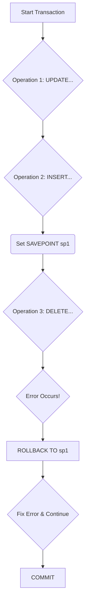

##  Subqueries, Views, and Transaction Control

Welcome to Session 7. This session covers several powerful SQL concepts. **Subqueries** allow us to write queries nested inside other queries to perform complex filtering. **Views** let us save a query as a virtual table for simplified access. Finally, **Transaction Control Language (TCL)** and **Data Control Language (DCL)** give us the power to manage the integrity and security of our data.

---

### Subqueries (Nested or Inner Queries)
A **subquery** is an SQL query nested inside a larger query. It can be used in a `SELECT`, `FROM`, `WHERE`, or `HAVING` clause. The subquery is executed first, and its result is then used by the outer query.

#### Subqueries in the `WHERE` Clause
This is the most common use case, often used with operators like `IN`, `NOT IN`, `=`, `>`, `<`, etc.

**Example: Find all employees who work in the 'Technology' department.**

*   **Step 1 (Inner Query):** First, find the `DeptID` for the 'Technology' department.
    `SELECT DeptID FROM Departments WHERE DeptName = 'Technology';` (This returns `10`)
*   **Step 2 (Outer Query):** Now, find all employees where the `DeptID` is in the result of the inner query.
```sql
SELECT Name FROM Employees
WHERE DeptID = (SELECT DeptID FROM Departments WHERE DeptName = 'Technology');
```

**Example with `IN`: Find all employees who work in departments located in 'Pune'.**
```sql
SELECT Name FROM Employees
WHERE DeptID IN (SELECT DeptID FROM Departments WHERE Location = 'Pune');
```

#### Correlated Subqueries
A **correlated subquery** is an inner query that depends on the outer query for its values. Unlike a normal subquery, which is executed once, a correlated subquery is executed **once for each row** processed by the outer query. This can be inefficient and should be used with care.

**Core Idea:** The inner query uses a value from the current row of the outer query.

**Example: Find all employees whose salary is greater than the average salary of their own department.**

```sql
SELECT E1.Name, E1.Salary, E1.DeptID
FROM Employees E1
WHERE E1.Salary > (
    SELECT AVG(E2.Salary)
    FROM Employees E2
    WHERE E2.DeptID = E1.DeptID  -- Correlation: links inner query to outer query row
);
```
**Execution Flow Visualization:**
1.  Outer query picks its first row (e.g., Ravi, Salary=80k, DeptID=10).
2.  Inner query runs: `SELECT AVG(Salary) FROM Employees WHERE DeptID = 10;`. Let's say it returns 75k.
3.  Outer query checks: `Is 80k > 75k?` Yes. Ravi is included in the result.
4.  Outer query picks its second row (e.g., Priya, Salary=90k, DeptID=20).
5.  Inner query runs again: `SELECT AVG(Salary) FROM Employees WHERE DeptID = 20;`. Let's say it returns 95k.
6.  Outer query checks: `Is 90k > 95k?` No. Priya is excluded.
... and so on for every row.

#### `EXISTS` and `NOT EXISTS`
The `EXISTS` operator is used to test for the existence of any record in a subquery. It returns `TRUE` if the subquery returns one or more records. It's often used with correlated subqueries and can be more efficient than other constructs because it can stop processing the subquery as soon as it finds one matching row.

**Example: Find all departments that have at least one employee.**
```sql
SELECT DeptName FROM Departments D
WHERE EXISTS (
    SELECT * FROM Employees E
    WHERE E.DeptID = D.DeptID
);
```

---

### Views
A **View** is a stored SQL query that is given a name. It behaves like a virtual table.

*   **Simplicity:** A view can hide the complexity of a multi-table join. A user can query the view as if it were a single table.
*   **Security:** A view can be used to restrict access to data. You can create a view that shows only certain columns or rows of a table and give users permission to access the view instead of the underlying table.

**Types of Views:**
*   **Simple View:** Based on a single table. DML operations (`INSERT`, `UPDATE`, `DELETE`) are generally possible through a simple view.
*   **Complex View:** Based on multiple tables (using joins), contains aggregate functions, or `GROUP BY` clauses. DML operations are generally not possible or are restricted on complex views.

**Syntax:**
```sql
-- Creating a view
CREATE VIEW EmployeeDeptView AS
SELECT E.Name, E.Salary, D.DeptName
FROM Employees E
JOIN Departments D ON E.DeptID = D.DeptID;

-- Querying the view
SELECT * FROM EmployeeDeptView WHERE DeptName = 'Technology';
```
Now, users can query `EmployeeDeptView` without needing to know how the `Employees` and `Departments` tables are joined.

---

### Transaction and Data Control (TCL & DCL)

#### TCL (Transaction Control Language)
A **transaction** is a sequence of one or more SQL operations that are executed as a single logical unit of work. The key property of a transaction is that it is **atomic**: either all of the operations succeed, or none of them do. This is critical for maintaining data integrity.

*   **`COMMIT`**: Saves all the changes made in the current transaction, making them permanent.
*   **`ROLLBACK`**: Undoes all the changes made in the current transaction, reverting the database to the state it was in before the transaction began.
*   **`SAVEPOINT name`**: Sets a named marker within a transaction. You can later `ROLLBACK` to this specific savepoint without undoing the entire transaction.

**Transaction Flow Visualization:**


#### DCL (Data Control Language)
DCL commands are used by database administrators to manage user access and permissions.

*   **`GRANT`**: Gives specific permissions to a database user (e.g., `SELECT`, `INSERT`, `UPDATE` on a specific table).
    `GRANT SELECT, INSERT ON Employees TO 'some_user'@'localhost';`
*   **`REVOKE`**: Takes away permissions that were previously granted.
    `REVOKE INSERT ON Employees FROM 'some_user'@'localhost';`

---

### Topic Summary & Revision

*   **Subquery:** A query inside another query. The inner query runs first and provides a value or set of values for the outer query.
*   **Correlated Subquery:** An inner query that depends on the outer query's current row. It runs once for each row of the outer query.
*   **`EXISTS`:** A boolean operator that checks if a subquery returns any rows. Often more efficient than `IN` or `COUNT()`.
*   **View:** A stored query that acts as a virtual table, used for simplifying complex queries and enforcing security.
*   **TCL:** Manages transactions. `COMMIT` saves work, `ROLLBACK` undoes it.
*   **DCL:** Manages permissions. `GRANT` gives rights, `REVOKE` takes them away.

---

### MCQs for Exam Preparation

1.  **Which statement best describes a correlated subquery?**
    - [ ] It is executed only once before the outer query runs.
    - [ ] It is executed repeatedly, once for each row considered by the outer query.
    - [ ] It is another name for a `JOIN` operation.
    - [ ] It cannot be used in the `WHERE` clause.
    <br>

2.  **What is the primary purpose of creating a database View?**
    - [ ] To store a physical copy of data for faster access.
    - [ ] To enforce `PRIMARY KEY` constraints.
    - [ ] To provide a simplified or secure virtual table based on a complex query.
    - [ ] To create a backup of a table.
    <br>

3.  **A series of database operations should be executed in an "all or nothing" manner. Which TCL command would you use to save the changes if all operations succeed?**
    - [ ] `SAVEPOINT`
    - [ ] `ROLLBACK`
    - [ ] `GRANT`
    - [ ] `COMMIT`
    <br>

4.  **The `EXISTS` operator will return `TRUE` if:**
    - [ ] The subquery returns at least one row.
    - [ ] The subquery returns a `NULL` value.
    - [ ] The subquery returns a value of `TRUE`.
    - [ ] The subquery returns more than one column.
    <br>

5.  **You want to find all employees who earn a salary less than the company's average salary. Which query structure would you use?**
    - [ ] A `GROUP BY` query.
    - [ ] A query with a `HAVING` clause.
    - [ ] A query with a subquery in the `WHERE` clause.
    - [ ] A `UNION` query.
    <br>

6.  **Which command is used to give a user the permission to read data from a table?**
    - [ ] `GRANT SELECT ON table_name TO user;`
    - [ ] `ALLOW SELECT ON table_name TO user;`
    - [ ] `GRANT READ ON table_name TO user;`
    - [ ] `REVOKE SELECT ON table_name FROM user;`
    <br>

7.  **Which of the following is a key difference between a simple view and a complex view?**
    - [ ] Simple views are faster than complex views.
    - [ ] You can generally perform DML operations (INSERT, UPDATE) on simple views, but not on complex views.
    - [ ] Simple views can only select one column.
    - [ ] Complex views must be created with the `WITH CHECK OPTION`.
    <br>

8.  **What does the `ROLLBACK` command do?**
    - [ ] It deletes the entire table.
    - [ ] It undoes all the modifications made since the last `COMMIT`.
    - [ ] It saves the current state of the database.
    - [ ] It removes a user's permissions.
    <br>

9.  **A subquery in a `FROM` clause is known as a(n):**
    - [ ] Correlated subquery
    - [ ] Scalar subquery
    - [ ] Inline view or derived table
    - [ ] Illegal syntax
    <br>

10. **To find all products that have NOT been sold (i.e., their `ProductID` does not exist in the `OrderDetails` table), which operator is most suitable?**
    - [ ] `IN`
    - [ ] `EXISTS`
    - [ ] `NOT EXISTS`
    - [ ] `JOIN`
    <br>

**Answer Key**
1. B: ||A correlated subquery is linked to the outer query and must be re-evaluated for each row that the outer query processes because its result depends on the data in that specific outer row.||
2. C: ||Views are not physical tables; they are named queries. Their primary benefits are abstracting away complex join logic for end-users and restricting data access for security.||
3. D: ||COMMIT is the TCL command that finalizes a transaction and makes all changes permanent in the database.||
4. A: ||The EXISTS operator simply checks if the result set of the subquery contains any rows. If it contains one or more, it evaluates to true; otherwise, it's false. It doesn't look at the values themselves.||
5. C: ||This requires a two-step logic: first, calculate the average salary for the whole company (inner query), and then select all employees whose salary is less than that result (outer query). This is a classic use case for a subquery in the WHERE clause.||
6. A: ||The GRANT command is used to assign privileges. The SELECT privilege allows a user to read data. The syntax is GRANT privilege ON object TO user.||
7. B: ||A view is considered complex if it involves joins, aggregate functions, DISTINCT, or GROUP BY. In such cases, the database cannot unambiguously map a DML operation on the view back to a single row in a base table, so such operations are typically disallowed.||
8. B: ||ROLLBACK discards all operations performed within a transaction, reverting the data to the state it was in at the time of the last COMMIT.||
9. C: ||When a subquery is used in the FROM clause, it generates a result set that the outer query then treats as a table. This temporary, unnamed table is called an inline view or a derived table.||
10. C: ||The NOT EXISTS operator is highly efficient for this kind of "anti-join" problem. The query would look for products where there NOT EXISTS a corresponding entry in the OrderDetails table.||

---

### **Bonus Tips**

*   **Subquery vs. `JOIN`:** Many problems that can be solved with a subquery can also be solved with a `JOIN`. In many modern database systems, the query optimizer is smart enough to convert a subquery (especially an `IN` subquery) into an equivalent `JOIN` behind the scenes. However, `JOIN`s are often more readable and can sometimes be more performant. It's good practice to learn how to write the query both ways.
*   **Correlated Subqueries Can Be Slow:** Because they execute once per row of the outer query, correlated subqueries can be very inefficient on large tables. Always check if you can rewrite a correlated subquery as a standard `JOIN` or a regular subquery, as this will usually result in better performance.
*   **Transactions are Implicit:** In most database clients (like MySQL Workbench), "autocommit" mode is on by default. This means every single SQL statement you run is treated as its own transaction and is committed immediately. To perform multi-statement transactions, you must first disable autocommit or explicitly start a transaction with `START TRANSACTION`.
*   **Use Views for APIs:** If you are building an application or an API that exposes data, it's a very good security practice to have it query Views instead of the base tables. This creates a layer of abstraction. If you later need to refactor the underlying tables, you can just update the view definition, and the application code doesn't need to change.

**🔗Links:** [[DBT Session 8 - Indexes, ACID Properties, and Storage Engines]]