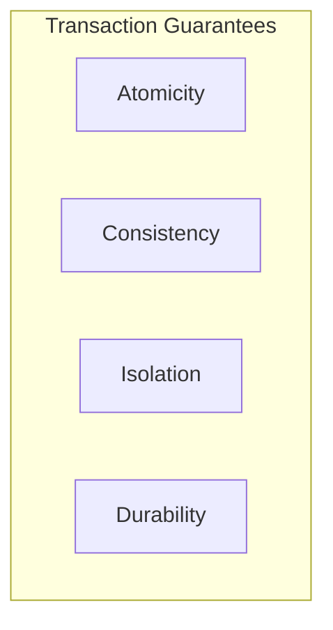

## Indexes, ACID Properties, and Storage Engines

Welcome to Session 8. This session moves beyond just writing queries to understanding how a database *works* internally to provide performance and reliability. We will cover **Indexes**, the most important tool for speeding up queries; the **ACID properties**, which guarantee the reliability of transactions; and **Storage Engines**, which control how MySQL physically stores and manages data on disk.

---

### Indexes
An **index** is a special lookup table that the database search engine can use to speed up data retrieval dramatically. An index is a pointer to data in a table.

*   **Analogy:** An index in the back of a book. Instead of reading the entire book from start to finish to find a topic (a "full table scan"), you can go to the index, find the topic, and get the exact page number (the data's physical address) to jump to directly.

#### Benefit of Indexes
*   **Performance:** The primary benefit is a massive improvement in the speed of `SELECT` queries with a `WHERE` clause, and in `JOIN` operations. A query on an un-indexed column in a large table can take minutes; on an indexed column, it can take milliseconds.

#### Types of Indexes
*   **Single-Column Index:** An index on a single column.
*   **Composite (or Multi-Column) Index:** An index on two or more columns. The order of columns in a composite index matters. An index on `(city, name)` can efficiently serve queries filtering by `city` or by `city AND name`, but it is less effective for queries filtering only by `name`.
*   **Unique Index:** Ensures that the indexed column (or combination of columns) has no duplicate values. A `PRIMARY KEY` is automatically a unique index.

**When to Create an Index:**
*   On columns that are frequently used in `WHERE` clauses.
*   On foreign key columns, as they are used constantly in `JOIN` operations.
*   On columns that are used in `ORDER BY` clauses.

**The Downside of Indexes:**
While indexes speed up reads (`SELECT`), they **slow down writes** (`INSERT`, `UPDATE`, `DELETE`). This is because every time you modify the data in a table, the database must also update all the indexes associated with that table. Therefore, you should not create indexes on every single column.

> **Quick Question:** You have a `Users` table with millions of rows. The most common query is `SELECT * FROM Users WHERE username = 'some_user';`. What should you do to optimize this query?
> **Answer:** Create a single-column index on the `username` column. A unique index would be even better, as usernames should be unique.

---

### Temporary Tables
A **temporary table** is a short-lived table that exists only for the duration of the current session. When the session ends, the temporary table is automatically dropped.

*   **Purpose:** They are useful for storing the intermediate results of a complex query. You can perform several operations on a small, temporary result set without repeatedly querying large base tables.
*   **Syntax:**
```sql
CREATE TEMPORARY TABLE TempSales AS (SELECT ... FROM ...);
```
---

### ACID Properties
The ACID properties are a set of four guarantees that ensure the reliability and integrity of database **transactions**.



*   **Atomicity:** ("All or Nothing")
    *   A transaction is treated as a single, indivisible unit of work. Either **all** of its operations are completed successfully and committed, or **none** of them are. If any part of the transaction fails, the entire transaction is rolled back.
    *   **Analogy:** A bank transfer. You debit money from Account A and credit it to Account B. If the credit operation fails, the debit must be undone (rolled back). You can't have one without the other.

*   **Consistency:** ("Valid State to Valid State")
    *   A transaction ensures that the database remains in a consistent (valid) state. It brings the database from one valid state to another. Any data written to the database must be valid according to all defined rules, including constraints, cascades, and triggers.
    *   **Analogy:** If a transaction attempts to create an order for a customer who doesn't exist, a `FOREIGN KEY` constraint would violate this, and the transaction would be aborted, keeping the database consistent.

*   **Isolation:** ("Transactions Don't Interfere")
    *   The results of concurrent transactions are isolated from each other. From any one transaction's perspective, it appears as if it is the only transaction running on the system. It prevents issues like "dirty reads" where one transaction sees the uncommitted, intermediate results of another.
    *   **Analogy:** Two people booking the last ticket for a flight. Isolation ensures that only one person can successfully complete the booking process. The other person's transaction will fail or have to wait, preventing a double-booking.

*   **Durability:** ("Once Saved, It Stays Saved")
    *   Once a transaction has been successfully committed, its changes are permanent and will survive any subsequent system failure (like a power outage or crash). The changes are written to non-volatile memory (like a hard disk).

> **Quick Question:** A power outage occurs immediately after your application receives a "Transaction successful" message from the database. Which ACID property guarantees that your data is safe when the system restarts?
> **Answer:** Durability.

---

### Database Instance and Schema
These two terms are often confused but have distinct meanings.

*   **Database Schema:** The **blueprint** or logical definition of the database. It includes the `CREATE TABLE` statements, constraints, views, etc. It is the static structure.
*   **Database Instance:** A **snapshot** of the data in the database at a specific moment in time. It is the set of data that currently resides in the database. The instance is dynamic and changes constantly as data is added, updated, and deleted.

**Analogy:**
*   **Schema:** The empty blueprint of a house, showing the rooms, doors, and windows.
*   **Instance:** The actual house at a point in time, with furniture and people inside it.

---

### MySQL Storage Engines
A **storage engine** is the underlying software component that a DBMS uses to create, read, update, and store data in a database. MySQL is unique because it supports multiple storage engines, allowing you to choose the best one for a specific table's workload.

The two most important storage engines are:

#### InnoDB
*   **The default and most used storage engine in modern MySQL.**
*   **Key Features:**
    *   **ACID Compliant:** It is a transactional storage engine, providing full support for Atomicity, Consistency, Isolation, and Durability.
    *   **Row-Level Locking:** This provides high concurrency. When one user is updating a specific row, another user can update a different row in the same table without being blocked.
    *   **Foreign Key Support:** Enforces referential integrity.
*   **Best For:** General-purpose, high-reliability applications where data integrity is critical (e.g., e-commerce, banking, ERP systems).

#### MyISAM
*   **The older, default storage engine before InnoDB.**
*   **Key Features:**
    *   **Non-Transactional:** It does **not** support ACID properties. Operations are faster because there is no transactional overhead.
    *   **Table-Level Locking:** When one user is writing to a table, it locks the *entire table*, preventing all other users from writing to it. This leads to poor concurrency.
    *   **No Foreign Key Support:** Does not enforce referential integrity.
    *   **Full-Text Indexing:** Historically, its full-text search capabilities were superior (though InnoDB has caught up).
*   **Best For:** Read-heavy, low-concurrency workloads where speed is more important than transactional integrity (e.g., data warehousing, logging, content catalogs).

---

### Topic Summary & Revision

*   **Index:** A data structure (like a B-Tree) that speeds up data retrieval (`SELECT`) but can slow down data modification (`INSERT`, `UPDATE`, `DELETE`). Create them on columns used in `WHERE`, `JOIN`, and `ORDER BY` clauses.
*   **ACID Properties:** The four guarantees for reliable transactions: **A**tomicity, **C**onsistency, **I**solation, **D**urability.
*   **Schema vs. Instance:** Schema is the blueprint; Instance is the data snapshot.
*   **Storage Engines:** The "pluggable" backend for tables in MySQL.
    *   **`InnoDB`:** Default, transactional (ACID), row-level locking, foreign keys. Use this for almost everything.
    *   **`MyISAM`:** Older, non-transactional, table-level locking. For specific read-heavy use cases.

---

### MCQs for Exam Preparation

1.  **What is the primary purpose of creating an index on a database table column?**
    - [ ] To enforce data integrity with a `CHECK` constraint.
    - [ ] To store the data in a compressed format.
    - [ ] To speed up the retrieval of rows based on that column.
    - [ ] To ensure the column only contains unique values.
    <br>

2.  **Which ACID property ensures that if a bank transfer transaction debits one account but fails before crediting the second account, the initial debit is undone?**
    - [ ] Atomicity
    - [ ] Consistency
    - [ ] Isolation
    - [ ] Durability
    <br>

3.  **You have a `Products` table and an `Orders` table. To improve the performance of joining these two tables on `Products.ProductID = Orders.ProductID`, where should you place an index?**
    - [ ] On the `Products.ProductName` column.
    - [ ] On the `Orders.OrderDate` column.
    - [ ] On the `Orders.ProductID` (foreign key) column.
    - [ ] On both primary keys only.
    <br>

4.  **What is the main difference between a database schema and a database instance?**
    - [ ] The schema is the physical data, while the instance is the logical design.
    - [ ] The schema is the logical design blueprint, while the instance is the actual data at a point in time.
    - [ ] The schema includes indexes, while the instance does not.
    - [ ] There is no difference; the terms are interchangeable.
    <br>

5.  **Which MySQL storage engine provides full ACID compliance and row-level locking?**
    - [ ] MyISAM
    - [ ] MEMORY
    - [ ] CSV
    - [ ] InnoDB
    <br>

6.  **What is a significant disadvantage of having too many indexes on a single table?**
    - [ ] It can slow down `SELECT` queries.
    - [ ] It increases the storage space required by the database.
    - [ ] It can slow down write operations like `INSERT`, `UPDATE`, and `DELETE`.
    - [ ] Both B and C.
    <br>

7.  **The "Isolation" property in ACID guarantees that:**
    - [ ] The database is isolated from network failures.
    - [ ] Each transaction executes as if it were the only transaction in the system.
    - [ ] The database can be restored after a failure.
    - [ ] All data is stored in a single file for isolation.
    <br>

8.  **For which type of application would the `MyISAM` storage engine be a more suitable choice than `InnoDB`?**
    - [ ] An online banking system.
    - [ ] An e-commerce website's shopping cart.
    - [ ] A high-traffic blog that is mostly read and rarely updated.
    - [ ] A hospital's patient management system.
    <br>

9.  **A `PRIMARY KEY` constraint automatically creates which type of index?**
    - [ ] A non-clustered index.
    - [ ] A unique index.
    - [ ] A full-text index.
    - [ ] A composite index.
    <br>

10. **A temporary table created with `CREATE TEMPORARY TABLE` is automatically dropped when:**
    - [ ] The database server is restarted.
    - [ ] A `COMMIT` is issued.
    - [ ] The user's session ends.
    - [ ] The table becomes empty.
    <br>

**Answer Key**
1.  **C**: ||The fundamental purpose of an index is to create a data structure that allows the database to find rows matching a query's criteria without having to scan the entire table, thus speeding up retrieval.||
2.  **A**: ||Atomicity guarantees that a transaction is an "all or nothing" operation. If any part fails, the entire transaction is rolled back to its starting state.||
3.  **C**: ||Indexes should be placed on columns used in join conditions. Primary keys are already indexed. To make the join efficient, the foreign key column (Orders.ProductID) should also be indexed.||
4.  **B**: ||The schema is the static structure or blueprint of the database. The instance is the dynamic data content within that structure at any given moment.||
5.  **D**: ||InnoDB is the default, fully-featured storage engine in MySQL, providing essential features like ACID transactions, row-level locking for high concurrency, and foreign key constraints.||
6.  **D**: ||Each index is a separate data structure that must be stored on disk, consuming space (B). More importantly, every time a row's data is changed, every relevant index must also be updated, which slows down write operations (C).||
7.  **B**: ||Isolation ensures that concurrent transactions do not interfere with each other's intermediate states, preventing anomalies like dirty reads or lost updates.||
8.  **C**: ||MyISAM's table-level locking and lack of transactional overhead make it very fast for read-heavy workloads where data integrity and high-concurrency writes are not primary concerns. A blog is a perfect example.||
9.  **B**: ||A primary key must, by definition, be unique. Therefore, the database automatically creates a unique index to enforce this rule and to facilitate fast lookups based on the primary key.||
10. **C**: ||Temporary tables are scoped to the session that created them. They are a private scratchpad for the user, and when that user disconnects, the table and its data are automatically destroyed.||

---

### **Bonus Tips**

*   **The Cost of Indexes:** Think of an index as a trade-off. You are trading faster read performance (`SELECT`) for slower write performance (`INSERT`, `UPDATE`, `DELETE`) and increased disk space. The key to good database design is finding the right balance and only indexing what is necessary.
*   **Clustered vs. Non-Clustered Index:** In InnoDB, the `PRIMARY KEY` index is a **clustered index**. This means the actual table data is physically stored on the disk in the order of the primary key. This makes lookups by primary key extremely fast. All other indexes are **non-clustered** and contain a pointer back to the primary key. This is a deeper topic, but understanding that the primary key is special is important.
*   **Choosing a Storage Engine:** For 99% of modern applications using MySQL, **always use InnoDB**. Its features (ACID, row-level locking, foreign keys) are essential for data integrity and performance in a concurrent environment. Only consider MyISAM if you have a very specific, read-dominant use case and you fully understand the trade-offs.
*   **EXPLAIN Your Queries:** A crucial tool in MySQL is the `EXPLAIN` command. Running `EXPLAIN SELECT ...` before your query will show you the *query execution plan*. It tells you which indexes the database is planning to use (or not use!). This is the first step in diagnosing and optimizing a slow query.

**🔗Links:** [[DBT Session 9 - MySQL Programming and Stored Procedures]]