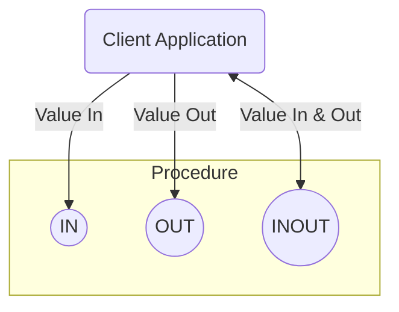

## MySQL Programming and Stored Procedures

Welcome to Session 9. So far, we have interacted with the database by sending individual SQL statements from a client application. This session introduces a powerful concept: **server-side programming**. We can write and store blocks of procedural code directly on the MySQL server. These stored programs are called **Stored Procedures**.

---

### Introduction to MySQL Programming
MySQL is not just a data storage system; it has its own procedural language that allows you to write programs that run on the server. This language includes variables, loops, conditional logic (`IF/ELSE`), and other constructs found in traditional programming languages.

Why would we want to do this?
*   **Performance:** Reduces network traffic. Instead of sending 20 individual SQL statements from your Java application to the server, you can make one call to a stored procedure that executes those 20 statements on the server itself.
*   **Reusability & Abstraction:** Complex business logic can be encapsulated in a procedure. Multiple applications (e.g., a web app, a mobile app, a reporting tool) can all call the same procedure, ensuring consistent logic.
*   **Security:** You can grant a user permission to execute a stored procedure without giving them direct access to the underlying tables. The procedure acts as a secure API to the data.

### Introduction to Stored Procedures
A **Stored Procedure** is a prepared SQL code block that you can save, so the code can be reused over and over again. It's essentially a function that you store in the database.

#### Benefits of Stored Procedures
*   **Reduced Network Traffic:** As mentioned, one call is cheaper than many.
*   **Improved Performance:** The database's query planner can analyze and pre-compile the procedure, creating a more efficient execution plan.
*   **Centralized Business Logic:** If a business rule changes (e.g., how a customer's credit score is calculated), you only need to update the stored procedure, not every application that uses it.
*   **Enhanced Security:** Provides an extra layer of access control.

#### Delimiters
When writing a stored procedure in a command-line client, you run into a problem. The procedure body contains semicolons (`;`) to end its internal statements. However, the client also uses a semicolon to signal the end of the command you are typing.

To solve this, we temporarily change the client's delimiter.

```sql
DELIMITER $$ -- Change the delimiter from ; to $$

CREATE PROCEDURE MyProcedure()
BEGIN
    -- SQL statements can now use ; as normal
    SELECT 'Hello World';
END$$ -- End the procedure definition with the new delimiter

DELIMITER ; -- Change the delimiter back to ;
```

### Procedure Parameters
Stored procedures can accept parameters to make them dynamic and more useful. MySQL supports three types of parameters.



*   **`IN` Parameter (Default):** This is an input parameter. The calling program passes a value *into* the procedure. The procedure can use this value, but any changes it makes to the parameter are not visible back in the calling program.
*   **`OUT` Parameter:** This is an output parameter. The procedure calculates or retrieves a value and passes it *out* to the calling program. The calling program can then access this returned value.
*   **`INOUT` Parameter:** A combination of both. The calling program passes in an initial value. The procedure can modify this value, and the modified value is visible back in the calling program.

#### Creating a Procedure without Parameters
This is the simplest form, used for fixed tasks.

**Example: A procedure to select all employees.**
```sql
DELIMITER $$

CREATE PROCEDURE GetAllEmployees()
BEGIN
    SELECT * FROM Employees;
END$$

DELIMITER ;
```
**How to use it:**
`CALL GetAllEmployees();`

#### Creating a Procedure with Parameters
This makes the procedure much more flexible.

**Example: A procedure to get an employee by their ID (`IN` parameter).**
```sql
DELIMITER $$

CREATE PROCEDURE GetEmployeeByID(IN emp_id_param INT)
BEGIN
    SELECT * FROM Employees WHERE EmpID = emp_id_param;
END$$

DELIMITER ;
```
**How to use it:**
`CALL GetEmployeeByID(101);`

**Example: A procedure to count employees in a department (`OUT` parameter).**
```sql
DELIMITAER $$

CREATE PROCEDURE GetEmployeeCountByDept(IN dept_id_param INT, OUT emp_count INT)
BEGIN
    SELECT COUNT(*) INTO emp_count
    FROM Employees
    WHERE DeptID = dept_id_param;
END$$

DELIMITER ;
```
**How to use it:**
In MySQL, you use session variables (prefixed with `@`) to receive `OUT` parameter values.
```sql
CALL GetEmployeeCountByDept(10, @employee_count);
SELECT @employee_count; -- This will display the result
```

---

### Topic Summary & Revision

*   **Server-Side Programming:** Stored Procedures allow you to write and store procedural code (logic) directly on the database server.
*   **Benefits:** This reduces network traffic, centralizes logic, and enhances security.
*   **Stored Procedure:** A reusable block of pre-compiled SQL statements stored in the database.
*   **`DELIMITER`:** A client command used to temporarily change the statement terminator (e.g., from `;` to `$$`) so that semicolons can be used inside the procedure body.
*   **Parameters:** Procedures can accept parameters to make them dynamic.
    *   **`IN` (Input):** Passes a value into the procedure.
    *   **`OUT` (Output):** Returns a value from the procedure.
    *   **`INOUT` (Input/Output):** Passes a value in, which can be modified and returned.
*   **Execution:** Stored procedures are executed using the `CALL` statement.

---

### MCQs for Exam Preparation

1.  **What is the primary benefit of using a stored procedure over sending multiple individual SQL queries from an application?**
    - [ ] It increases the security of the client application.
    - [ ] It reduces network traffic between the client and the server.
    - [ ] It uses less disk space on the database server.
    - [ ] It works with NoSQL databases.
    <br>

2.  **What is the purpose of the `DELIMITER` command in the MySQL client?**
    - [ ] To define the end of the database schema.
    - [ ] To temporarily change the character that signifies the end of a command.
    - [ ] To limit the number of rows returned by a query.
    - [ ] To set a parameter value in a stored procedure.
    <br>

3.  **A stored procedure is defined as `CREATE PROCEDURE GetUser(OUT user_name VARCHAR(50)) ...`. What does this signature mean?**
    - [ ] The procedure requires the caller to provide a `user_name` as input.
    - [ ] The procedure will return a `user_name` value back to the caller.
    - [ ] The `user_name` is both an input and an output parameter.
    - [ ] The procedure creates a table named `user_name`.
    <br>

4.  **Which keyword is used to execute a stored procedure?**
    - [ ] `EXECUTE`
    - [ ] `RUN`
    - [ ] `PERFORM`
    - [ ] `CALL`
    <br>

5.  **If a parameter in a stored procedure is not explicitly defined as `IN`, `OUT`, or `INOUT`, what is its default type?**
    - [ ] `OUT`
    - [ ] `INOUT`
    - [ ] `IN`
    - [ ] It will cause a syntax error.
    <br>

6.  **Which of the following is NOT a benefit of stored procedures?**
    - [ ] Centralized business logic.
    - [ ] Improved security through controlled access.
    - [ ] Portability of application logic across different database systems (e.g., from MySQL to Oracle).
    - [ ] Potential for pre-compilation and improved performance.
    <br>

7.  **Consider the procedure: `CREATE PROCEDURE UpdateSalary(IN emp_id INT, IN new_salary DECIMAL(10,2)) ...`. How would you call it?**
    - [ ] `CALL UpdateSalary(101);`
    - [ ] `CALL UpdateSalary(101, 50000.00);`
    - [ ] `CALL UpdateSalary(@id, @salary);`
    - [ ] `EXECUTE UpdateSalary(101, 50000.00);`
    <br>

8.  **How do you receive the value from an `OUT` parameter in a MySQL session?**
    - [ ] The value is printed to the console automatically.
    - [ ] By using a session variable (e.g., `@my_variable`) in the `CALL` statement.
    - [ ] By using a `SELECT ... INTO` statement after the `CALL`.
    - [ ] `OUT` parameters cannot be read in a standard session.
    <br>

9.  **An `INOUT` parameter is most similar to what programming concept?**
    - [ ] A global variable.
    - [ ] A constant.
    - [ ] A pass-by-reference parameter.
    - [ ] A return value from a function.
    <br>

10. **A company decides to change its commission calculation logic. If this logic is encapsulated in a stored procedure, where does the code need to be updated?**
    - [ ] In every application that calls the procedure.
    - [ ] Only in the stored procedure definition on the database server.
    - [ ] In a separate configuration file on the client machine.
    - [ ] The database schema must be dropped and recreated.
    <br>

**Answer Key**
1. B: ||Sending one CALL statement is much more efficient over a network than sending many individual SELECT, UPDATE, INSERT statements, especially in high-latency environments.||
2. B: ||The MySQL client needs a way to distinguish between a semicolon that is part of the procedure's internal logic and the semicolon that means "you are done typing this whole command, now execute it." The DELIMITER command temporarily changes this end-of-command marker.||
3. B: ||The OUT keyword signifies that this parameter is used to pass a value from the procedure back out to the calling environment. The caller does not provide an initial value for it.||
4. D: ||The standard SQL command to invoke a stored procedure is CALL procedure_name(arguments);.||
5. C: ||If a parameter mode is not specified, it defaults to IN, meaning it is an input-only parameter.||
6. C: ||The procedural language syntax (BEGIN...END, IF, LOOP, etc.) is specific to the database vendor (e.g., MySQL's syntax is different from Oracle's PL/SQL or MS SQL Server's T-SQL). This makes the logic non-portable.||
7. B: ||The CALL statement must provide a value for every IN parameter defined in the procedure signature.||
8. B: ||In a standard MySQL client session, you pass a session variable (which starts with @) to the procedure call. The procedure then assigns its output value to this variable, which you can then query with a SELECT statement.||
9. C: ||An INOUT parameter allows the caller to pass a value in and receive a modified value back out using the same variable. This is analogous to passing a variable by reference in languages like C++, where the function can modify the original variable.||
10. B: ||This demonstrates the benefit of centralized logic. By placing the business rule on the server, you only have one place to update it, and all applications that use the procedure will automatically get the new logic without being re-deployed.||

---

### **Bonus Tips**

*   **Procedures vs. Functions:** MySQL also has Stored **Functions**. The main difference is that a function **must return a single value** and can be used directly in SQL statements (e.g., `SELECT MyFunction(column) FROM table;`). A procedure is called with `CALL` and can have multiple `OUT` parameters (or no output at all). Use functions for calculations and procedures for performing complex actions or returning multiple values.
*   **Error Handling:** Real-world stored procedures need robust error handling. We will cover this later, but they include mechanisms to declare handlers that can catch specific SQL errors (like "duplicate key") and execute a block of code in response, preventing the procedure from crashing.
*   **Performance Tuning:** While procedures can improve performance by reducing network latency, a poorly written procedure can be very slow. It's still crucial to ensure the SQL statements inside the procedure are optimized and use [[DBT Session 8 - Indexes, ACID Properties, and Storage Engines|indexes]] correctly. Use the `EXPLAIN` command on the queries inside your procedure to analyze their performance.
*   **Security Best Practice:** A very common security pattern is to deny users direct `SELECT`, `INSERT`, `UPDATE`, `DELETE` access to tables. Instead, you grant them `EXECUTE` permission on a set of well-defined stored procedures. This ensures they can only interact with the data in ways you have explicitly allowed, preventing accidental or malicious data modification.

**🔗Links:** [[DBT Session 10 - Flow Control in Stored Procedures]]