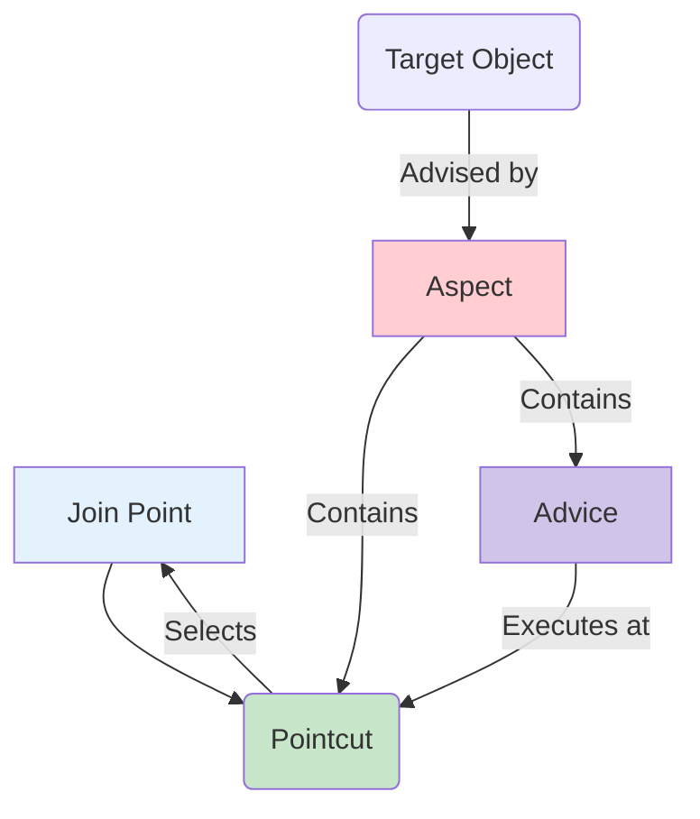

## **Session 23: Spring AOP**

Welcome to Session 23. So far, our application logic has been contained within specific objects and methods. A `UserService` handles user logic, and an `OrderService` handles order logic. But what about concerns that span across multiple parts of the application, like logging, security, and transaction management? This is known as a **cross-cutting concern**.

Placing logging code, for example, at the beginning and end of every single method is repetitive, error-prone, and clutters your business logic. **Aspect-Oriented Programming (AOP)** is a programming paradigm that aims to solve this by modularizing these cross-cutting concerns.

---

### AOP Overview
**AOP** allows you to add behavior to existing code without modifying the code itself. It complements Object-Oriented Programming (OOP) by providing another way to think about program structure.

*   **OOP** breaks down a program into a hierarchy of objects.
*   **AOP** breaks down a program into **aspects** or concerns.

**Analogy: The Movie Director**
*   **Your Business Logic (e.g., `OrderService`):** The actors performing the main scenes of the movie. Their job is to act out the plot.
*   **Cross-Cutting Concerns (Logging, Security):** The behind-the-scenes crew.
    *   **The Cinematographer (`LoggingAspect`):** Their job is to film *every* scene, regardless of what the actors are doing.
    *   **The Security Guard (`SecurityAspect`):** Their job is to check the ID of *every* person entering the set, no matter which scene they are in.
*   **Spring AOP:** The director who tells the cinematographer and security guard *when* and *where* to do their job ("film all scenes in Act 2," "check IDs for all actors entering the main stage").

AOP allows the actors to focus on acting, while the "aspects" of filming and security are handled separately and applied wherever needed.

### AOP Terminology and Annotations
Spring AOP uses a set of specific terms to describe its concepts.



*   **Aspect:** A class that implements a cross-cutting concern. In Spring, it's a class annotated with **`@Aspect`**. It contains the advice and the pointcuts.

*   **Join Point:** A specific point during the execution of a program, such as the execution of a method or the handling of an exception. In Spring AOP, a join point is **always the execution of a method**.

*   **Advice:** The action taken by an aspect at a particular join point. This is the actual code that gets executed (e.g., the logging code). There are five types of advice:
    1.  **`@Before`**: Advice that executes *before* the join point (method) runs.
    2.  **`@AfterReturning`**: Advice that executes *after* the join point completes successfully (i.e., does not throw an exception).
    3.  **`@AfterThrowing`**: Advice that executes only if the join point throws an exception.
    4.  **`@After` (Finally)**: Advice that executes *after* the join point completes, regardless of whether it was successful or threw an exception.
    5.  **`@Around`**: The most powerful type. Advice that "surrounds" the join point. It can execute code before and after the method runs and can even prevent the method from running at all.

*   **Pointcut:** A predicate or expression that **matches** join points. The pointcut defines *where* the advice should be applied. Pointcuts are defined using a special expression language.

*   **Target Object:** The object being advised by one or more aspects. This is your original bean (e.g., your `OrderService`).
*   **Proxy:** Spring AOP works by creating a **proxy** object at runtime. This proxy wraps your target object and contains all the advice logic. When your application code calls a method on the target object, it is actually calling the proxy, which executes the advice and then delegates the call to the original method.

### Example: A Simple Logging Aspect

Let's create an aspect that logs a message before any method in our service layer is executed.

**Step 1: Enable AOP in your Spring Boot application.**
In your main application class:
```java
@SpringBootApplication
@EnableAspectJAutoProxy // Enable AOP support
public class MyAopApplication { ... }
```

**Step 2: Create the Aspect class.**
```java
import org.aspectj.lang.annotation.Aspect;
import org.aspectj.lang.annotation.Before;
import org.aspectj.lang.annotation.Pointcut;
import org.springframework.stereotype.Component;

@Aspect      // 1. Mark this class as an Aspect
@Component   // 2. Make it a Spring bean so it's managed by the container
public class LoggingAspect {

    // 3. Define a Pointcut
    // This expression says "match the execution of any public method in any class
    // within the com.example.service package".
    @Pointcut("execution(public * com.example.service.*.*(..))")
    public void forServiceLayer() {}

    // 4. Define the Advice and link it to the Pointcut
    @Before("forServiceLayer()") // Run this advice BEFORE any method matched by the pointcut
    public void beforeServiceMethod() {
        System.out.println("=====> LOG: Executing a service method...");
    }
}
```

Now, whenever any public method of any class inside the `com.example.service` package is called (e.g., `orderService.placeOrder()`), the "LOG: Executing a service method..." message will be printed to the console first, without you ever having to modify the `OrderService` class itself.

---

### Topic Summary & Revision

*   **Cross-Cutting Concern:** A feature of a program that spans across multiple points of an application (e.g., logging, security, transactions).
*   **AOP (Aspect-Oriented Programming):** A paradigm for modularizing cross-cutting concerns into **Aspects**.
*   **Core AOP Terminology:**
    *   **Aspect (`@Aspect`):** The class containing the cross-cutting logic.
    *   **Join Point:** A point in the program's execution (in Spring, always a method execution).
    *   **Advice (`@Before`, `@After`, etc.):** The action to be taken (the "what").
    *   **Pointcut:** An expression that defines where the advice should be applied (the "where").
*   **Proxy-Based:** Spring AOP works by creating a proxy object at runtime that wraps your target bean and applies the advice.

---

### MCQs for Exam Preparation

1.  **Which of the following is considered a "cross-cutting concern" that AOP is well-suited to handle?**
    - [ ] Calculating the total of a shopping cart.
    - [ ] Validating a user's password format.
    - [ ] Logging method entry and exit for all methods in the data access layer.
    - [ ] The core business logic of creating a customer.
    <br>

2.  **In AOP terminology, what is an "Advice"?**
    - [ ] A class that contains the pointcuts.
    - [ ] The action taken by an aspect at a particular join point (i.e., the code that runs).
    - [ ] A point in the execution of the program, such as a method call.
    - [ ] An expression that selects which methods to apply actions to.
    <br>

3.  **You want to run a piece of code only if a method throws an exception. Which type of advice should you use?**
    - [ ] `@Before`
    - [ ] `@After`
    - [ ] `@AfterReturning`
    - [ ] `@AfterThrowing`
    <br>

4.  **A "Pointcut" in Spring AOP is used to:**
    - [ ] Define the logic that should be executed.
    - [ ] Define the join points (e.g., which methods) an advice should be applied to.
    - [ ] Mark a class as an Aspect.
    - [ ] Enable AOP for the application.
    <br>

5.  **How does Spring AOP typically implement its functionality at runtime?**
    - [ ] By modifying the bytecode of the original classes directly.
    - [ ] By creating a dynamic proxy object that wraps the target bean.
    - [ ] By using a special compiler.
    - [ ] By requiring your classes to extend a special `Aspect` class.
    <br>

6.  **What is a "Join Point" in the context of Spring AOP?**
    - [ ] The `JOIN` statement in an SQL query.
    - [ ] The execution of a method.
    - [ ] The point where two aspects are combined.
    - [ ] A configuration file.
    <br>

7.  **Which type of advice is the most powerful and can control whether the target method is even executed?**
    - [ ] `@Before`
    - [ ] `@After`
    - [ ] `@Around`
    - [ ] `@AfterReturning`
    <br>

8.  **What does the pointcut expression `execution(* com.myapp.service.UserService.*(..))` match?**
    - [ ] Any method execution in any class.
    - [ ] Any method execution within the `UserService` class.
    - [ ] The execution of the `UserService` constructor.
    - [ ] Any method execution in any class within the `com.myapp.service` package.
    <br>

9.  **A class marked with `@Aspect` must also be declared as what to be detected and used by Spring?**
    - [ ] A `@Bean` in a configuration class.
    - [ ] A component (e.g., using `@Component`) to be eligible for component scanning.
    - [ ] A `final` class.
    - [ ] A `public` class.
    <br>

10. **Transaction management in Spring (e.g., using `@Transactional`) is a classic example of:**
    - [ ] Dependency Injection
    - [ ] Aspect-Oriented Programming
    - [ ] The Factory Pattern
    - [ ] The DAO Pattern
    <br>

**Answer Key**
1.  **C**: ||Logging is a classic cross-cutting concern because it needs to be applied to many different methods across various layers of an application, but it is not part of their core business logic.||
2.  **B**: ||The Advice is the actual implementation of the action. The Pointcut specifies where it runs, and the Join Point is the opportunity to run it.||
3.  **D**: ||@AfterThrowing advice is specifically designed to execute only when the advised method terminates by throwing an exception. It is ideal for error logging.||
4.  **B**: ||A Pointcut is a predicate expression. It acts as a filter to select a subset of all possible join points where the advice should be woven in.||
5.  **B**: ||Spring AOP uses dynamic proxies (either JDK dynamic proxies for interfaces or CGLIB proxies for classes) to intercept method calls. The proxy executes the advice logic and then delegates the call to the actual target object.||
6.  **B**: ||While a join point can theoretically be other things (like field access or constructor execution), in Spring AOP, it is practically always the execution of a method.||
7.  **C**: ||@Around advice wraps the target method call. It receives a ProceedingJoinPoint object, which it can use to decide whether to call proceed() (which executes the target method) or not. It can also modify arguments and return values.||
8.  **B**: ||Let's break down the expression: * (any return type), com.myapp.service.UserService (the specific class), .* (any method name), (..) (any number of parameters). It matches all methods within the UserService class.||
9.  **B**: ||The @Aspect annotation marks a class for AOP, but it doesn't make it a Spring-managed bean. You must also declare it as a @Component (or @Service, etc.) so that Spring's component scan picks it up and creates an instance of it.||
10. **B**: ||The @Transactional annotation is implemented using an AOP aspect. A @Before advice starts the transaction, and @AfterReturning/@AfterThrowing advices either commit or roll back the transaction. This completely separates the transaction management logic from the business logic.||

---

### **Bonus Tips**

*   **AOP is Not Magic:** It's important to understand that Spring AOP works via proxies. This means if a method within an object calls another method *on the same object* (`this.otherMethod()`), the AOP advice will **not** be triggered for the inner call. This is because the call does not go through the proxy. This is a common "gotcha" for beginners.
*   **Pointcut Expressions are Powerful:** The AspectJ pointcut expression language is very rich. You can match methods based on annotations (`@annotation(com.myapp.MyAnnotation)`), method names, return types, arguments, and more. Mastering this syntax is key to applying advice precisely where you want it.
*   **Use AOP for Cross-Cutting Concerns ONLY:** Do not be tempted to put business logic inside an aspect. AOP is specifically for logic that "cuts across" your application, like security checks, logging, caching, and transaction management. Business logic belongs in your service layer objects.
*   **Spring's Built-in AOP:** You are already using AOP when you use features like `@Transactional` for transactions or `@Cacheable` for caching. Spring provides these ready-made aspects for common enterprise tasks, which is one of its most powerful features.

**🔗Links:** [[WJP Sessions 24 & 25 - REST services with Spring]]