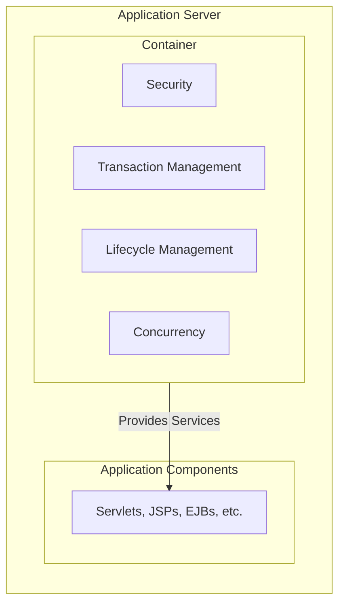

## **Session 3: J2EE Overview**

Welcome to Session 3. In the previous session, we learned how to connect a standalone Java application to a database using [[WJP Sessions 1 & 2 - JDBC & Transaction Management|JDBC]]. Now, we broaden our scope to understand the platform designed for building large-scale, multi-tiered, and reliable enterprise applications: **Java 2 Platform, Enterprise Edition (J2EE)**, now known as **Jakarta EE**.

This session is about the "big picture"—the architecture and components that make up an enterprise Java application.

---

### What is J2EE / Jakarta EE?
J2EE (or Jakarta EE) is not a language; it is a **platform and a set of specifications**. It extends the standard Java SE platform with a rich collection of APIs designed for building robust, scalable, and secure server-side applications.

*   **Specification:** A document that describes an API and its behavior (e.g., the Servlet specification, the JPA specification).
*   **Implementation:** The actual code that implements the specification. This is provided by an **Application Server**.

**Analogy: The Car Manufacturing Standard**
*   **Jakarta EE Specification:** A set of international standards for building a car. It defines what a "steering wheel" must do, what an "engine" is, and what a "brake pedal" must achieve. It does **not** say how to build them.
*   **Application Server (e.g., Tomcat, WildFly):** The car manufacturer (e.g., Toyota, Ford). They read the standards (specifications) and build an actual car (the server) that implements them. Toyota's engine might be different from Ford's, but both adhere to the standard.
*   **Your Web Application:** You are a company that makes custom car stereos. You can build your stereo according to the standard dashboard specifications, and you can be confident it will fit into a Toyota, a Ford, or any other car that follows the standard.

---

### The J2EE Container
The core of a J2EE application is the **container**. A container is a runtime environment provided by the application server that manages the lifecycle and provides services to the application components. It's the "magic" that makes enterprise development easier.

You don't have to write code for complex things like thread management, security, or transaction management. You declare what you need, and the container provides these services for you.

**Visualizing the Container's Role:**


The container acts as a layer between your application code and the low-level platform, handling the difficult "plumbing" so you can focus on business logic.

> **Quick Question:** If you write a component that needs to perform a database transaction, do you typically write the complex threading and connection management code yourself?
> **Answer:** No. In a J2EE environment, you would typically declare your method as transactional, and the container would automatically manage starting, committing, or rolling back the transaction for you.

---

### Packaging Web Applications
Enterprise applications are not deployed as simple `.jar` files. They are packaged into standard archive formats that application servers understand.

*   **.WAR (Web Application Archive):** The standard format for packaging a **web application**. It contains Servlets, JSPs, static files (HTML, CSS, JS), and library JARs. This is what we will be creating.
*   **.EAR (Enterprise Application Archive):** A "super" package that can contain multiple web applications (.war files) and other enterprise components (like EJBs) in a single deployable unit.

**Structure of a .war file:**
A .war file is essentially a ZIP file with a specific directory structure.
```c
- MyWebApp.war
  - index.html, styles.css, etc. (Static content at the root)
  - WEB-INF/
    - web.xml (The Deployment Descriptor - configuration file)
    - classes/ (Contains your compiled .class servlet files)
    - lib/ (Contains all required third-party .jar files, like the JDBC driver)
```

### The Web Application Life Cycle
The life cycle of a web application is managed by the container.

1.  **Deployment:** You deploy the `.war` file to the application server (e.g., by copying it to Tomcat's `webapps` directory).
2.  **Instantiation:** The server unpacks the `.war` file and creates a `ServletContext` object for the application. This object represents the application within the server.
3.  **Initialization:** The server reads the `web.xml` deployment descriptor and initializes any servlets, filters, or listeners configured to load on startup. The `init()` method of servlets is called.
4.  **Service:** The application is now running and ready to serve requests. The container directs incoming HTTP requests to the appropriate servlets, calling their `service()` (or `doGet`/`doPost`) methods.
5.  **Destruction:** When the application is undeployed or the server is shut down, the container calls the `destroy()` method on all its servlets to allow them to clean up resources.

> **Quick Question:** Which file inside a `.war` archive acts as the main configuration file, describing servlets and other components to the container?
> **Answer:** The `web.xml` file, also known as the Deployment Descriptor. (Note: In modern applications, annotations are often used instead of `web.xml`, but it's still a fundamental concept).

---

### Web Services Support
J2EE provides extensive support for creating and consuming **Web Services**. A web service is a standardized way of enabling communication between different applications over the web, often regardless of the programming language they are written in.

*   **SOAP (Simple Object Access Protocol):** An older, XML-based protocol that is very formal and has strict standards.
*   **REST (REpresentational State Transfer):** A more modern, lightweight architectural style that typically uses HTTP and JSON. This is the dominant approach today. We will cover this in detail in [[WJP Sessions 24 & 25 - REST services with Spring|later sessions]].

---

### Topic Summary & Revision

*   **J2EE / Jakarta EE:** A platform and a set of **specifications** for building large-scale, server-side Java applications.
*   **Application Server:** The software (e.g., Tomcat, WildFly) that **implements** the J2EE specifications.
*   **Container:** The runtime environment provided by the application server. It manages the component lifecycle and provides crucial services like security and transaction management.
*   **.WAR File:** The standard package for a web application. It has a specific directory structure (`WEB-INF/classes`, `WEB-INF/lib`).
*   **Web Application Life Cycle:** The container manages the deployment, initialization (`init()`), servicing of requests (`service()`), and destruction (`destroy()`) of the application and its components.

---

### MCQs for Exam Preparation

1.  **What is the primary role of a J2EE Container?**
    - [ ] To compile Java source code into bytecode.
    - [ ] To provide a runtime environment that manages the lifecycle and services for application components.
    - [ ] To design the user interface of a web application.
    - [ ] To act as a database server.
    <br>

2.  **A Java web application is typically packaged into which file format for deployment?**
    - [ ] `.jar` (Java Archive)
    - [ ] `.ear` (Enterprise Application Archive)
    - [ ] `.war` (Web Application Archive)
    - [ ] `.zip` (ZIP Archive)
    <br>

3.  **In a `.war` file structure, where are the compiled Java classes (e.g., your servlets) placed?**
    - [ ] In the root directory.
    - [ ] In the `lib/` directory.
    - [ ] In the `WEB-INF/classes/` directory.
    - [ ] In the `META-INF/` directory.
    <br>

4.  **Which statement best describes the relationship between the JDBC API and a JDBC Driver?**
    - [ ] The API is an implementation of the Driver.
    - [ ] The Driver is a specification, and the API is the implementation.
    - [ ] The API is a standard specification of interfaces, and the Driver is the vendor-specific implementation of those interfaces.
    - [ ] They are the same thing.
    <br>

5.  **What is the name of the main configuration file in a traditional J2EE web application, also known as the deployment descriptor?**
    - [ ] `config.xml`
    - [ ] `application.properties`
    - [ ] `web.xml`
    - [ ] `context.xml`
    <br>

6.  **Which of the following is a service typically provided by a J2EE container?**
    - [ ] HTML validation.
    - [ ] Spell checking for user input.
    - [ ] Transaction management.
    - [ ] CSS optimization.
    <br>

7.  **An Application Server like Apache Tomcat is an example of a(n):**
    - [ ] J2EE Specification
    - [ ] J2EE Implementation
    - [ ] JDBC Driver
    - [ ] Java Development Kit (JDK)
    <br>

8.  **The lifecycle of a servlet is managed by:**
    - [ ] The programmer, who must call `init()` and `destroy()` manually.
    - [ ] The Java Virtual Machine (JVM).
    - [ ] The web browser.
    - [ ] The Servlet Container.
    <br>

9.  **A `.ear` file is used when you need to:**
    - [ ] Deploy a simple web application with only static content.
    - [ ] Package multiple web modules (.war files) and other enterprise components together as a single application.
    - [ ] Archive the source code of your application.
    - [ ] Create an executable JAR file.
    <br>

10. **Modern enterprise applications are increasingly using RESTful web services over SOAP. What is a key reason for this trend?**
    - [ ] REST is more secure than SOAP.
    - [ ] REST typically uses lightweight JSON, which is easier to work with in web browsers than the heavier XML used by SOAP.
    - [ ] SOAP is a newer technology than REST.
    - [ ] REST requires a special type of application server.
    <br>

**Answer Key**
1.  **B**: ||The container's main job is to handle the "plumbing" of an enterprise application—managing component lifecycles, security, transactions, etc.—freeing the developer to focus on business logic.||
2.  **C**: ||A .war file is the standard for packaging all the necessary components of a web application (HTML, CSS, JSPs, Servlets, libraries) into a single deployable unit for a web container like Tomcat.||
3.  **C**: ||The WEB-INF/classes directory is the standard location where the servlet container looks for the application's compiled .class files.||
4.  **C**: ||JDBC is a perfect example of separating specification from implementation. The Java platform provides the java.sql interfaces (the API spec), and database vendors like MySQL provide the actual .jar file (the driver) that implements this API.||
5.  **C**: ||web.xml is the deployment descriptor. It tells the web container how to deploy and configure the components within the application, such as mapping URLs to servlets.||
6.  **C**: ||Transaction management is a classic cross-cutting concern that is complex to implement correctly. The J2EE container provides this as a service, allowing developers to simply declare the transactional behavior they need.||
7.  **B**: ||The Application Server (or Web Container for servlets) is the concrete software that implements the abstract rules and APIs defined in the J2EE/Jakarta EE specifications.||
8.  **D**: ||The Servlet Container (part of the application server) is responsible for loading the servlet class, calling its init() method once, calling service() for each request, and calling destroy() when the application is shut down.||
9.  **B**: ||An .ear file is a higher-level package format designed for bundling entire enterprise applications, which may consist of one or more web applications and other components like Enterprise JavaBeans (EJBs).||
10. **B**: ||REST's simplicity and its natural alignment with the HTTP protocol and lightweight data formats like JSON have made it the de facto standard for modern web APIs, especially for those consumed by JavaScript front-ends.||

---

### **Bonus Tips**

*   **Tomcat vs. Full Application Server:** Apache Tomcat is technically a **Servlet Container** and web server. It implements the Servlet, JSP, and a few other specifications. A full-blown Application Server like WildFly or GlassFish implements the *entire* Jakarta EE specification, including more complex features like Enterprise JavaBeans (EJBs). For most modern web development, a simple servlet container like Tomcat is sufficient.
*   **Annotations over XML:** While understanding `web.xml` is important, modern web applications heavily use **annotations** (e.g., `@WebServlet`, `@WebFilter`) to configure components directly in the Java code. This "convention over configuration" approach reduces the amount of XML needed and keeps the configuration closer to the code it affects.
*   **The "EE" in your Imports:** When you see `import jakarta.servlet.*;` in your code, the `jakarta` part signifies you are using the Jakarta EE APIs, which are provided by the application server, not by the standard Java SE JDK. You will need to add the server's libraries to your project's classpath to compile your code.
*   **Focus on the Pattern:** The pattern of "Specification vs. Implementation" is central to enterprise Java. You will see it again and again: JDBC is a spec, MySQL Connector/J is an implementation. JPA (Java Persistence API) is a spec, Hibernate is an implementation. Understanding this separation is key to understanding the entire ecosystem.

**🔗Links:** [[WJP Sessions 4, 5, 6 & 7 - Servlets]]