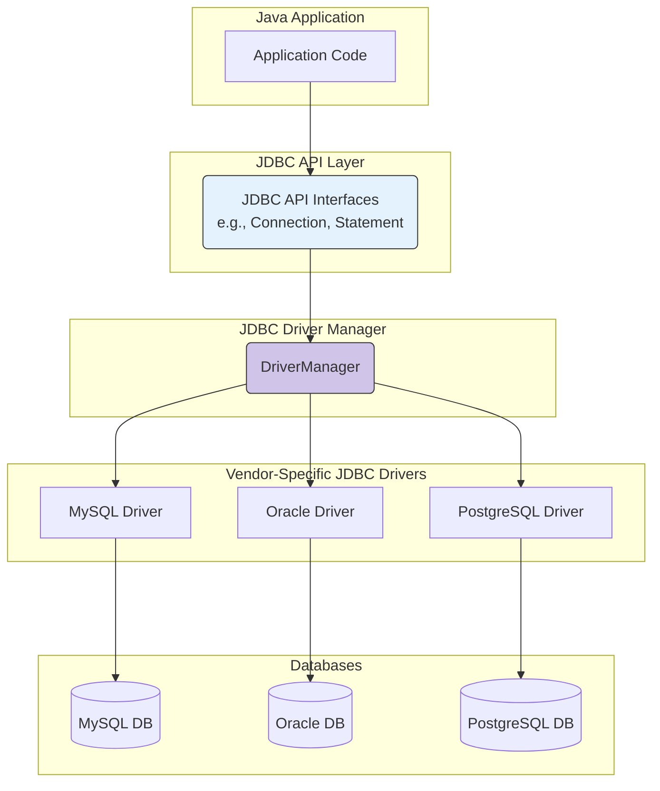
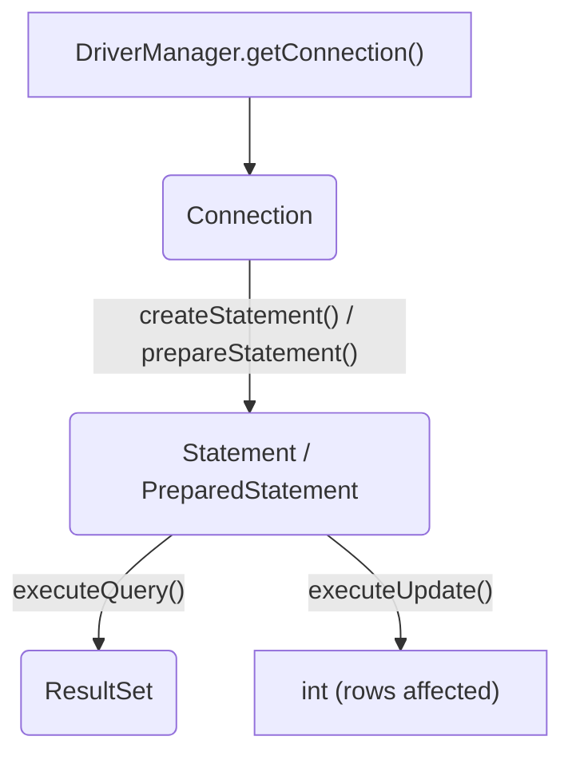
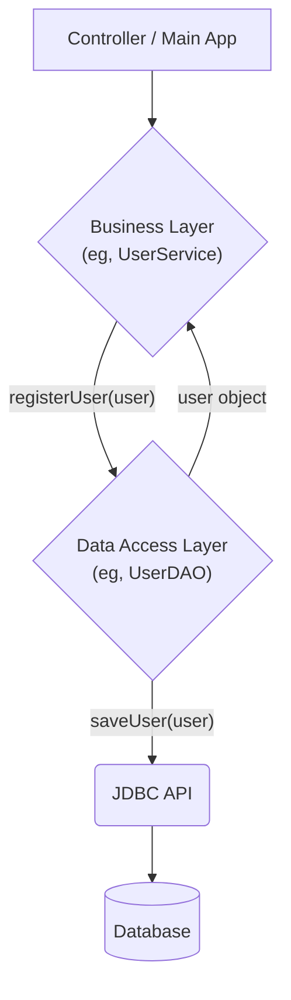

## **Sessions 1 & 2: JDBC & Transaction Management**

Welcome to your first session on Web-based Java Programming. Our [[DS Session 1 - Problem Solving & Computational Thinking|Core Java applications]] have run in isolation. To build real-world web applications, our Java code needs a standard way to communicate with a [[DBT Session 1 - Introduction to Database Technologies|database]]. **JDBC (Java Database Connectivity)** is that standard. It is a Java API that defines how a client can access any kind of tabular data, especially data stored in a Relational Database.

---

### Introduction to JDBC API
JDBC is a core part of the standard Java SE platform. It's a specification, not an implementation. It consists of a set of classes and interfaces written in Java. Different database vendors (like MySQL, Oracle, PostgreSQL) provide the actual implementation for these interfaces in a file called a **driver**.

**Analogy: The Universal Power Adapter**
*   **JDBC API:** A universal travel adapter kit. It has a standard socket (`Connection`, `Statement` interfaces) that your electronic device (your Java application) can plug into.
*   **JDBC Driver:** The specific plug for a specific country's wall outlet (the database). You have a UK plug, a US plug, a European plug.
*   **Your Application:** Your laptop. You plug your laptop into the universal adapter (JDBC API), and then you choose the correct plug (JDBC Driver) for the country (Database) you are in.

This design means your Java application code doesn't need to change significantly whether you are connecting to MySQL or Oracle; you just need to use the correct driver.

### JDBC Architecture
The JDBC architecture consists of two main layers, which clearly separates the application from the database-specific driver.



1.  **Your Application:** Makes calls to the standard JDBC API.
2.  **JDBC API:** Provides the standard interfaces like `Connection`, `Statement`, etc.
3.  **Driver Manager:** A factory class that manages the different database drivers. When your application requests a connection, the Driver Manager finds the appropriate driver for the given database URL.
4.  **JDBC Driver:** The specific implementation provided by the database vendor (e.g., MySQL Connector/J). This driver is responsible for translating the standard JDBC calls into the native protocol that the database understands.

> **Quick Question:** If you decide to migrate your application from a MySQL database to a PostgreSQL database, which component in the JDBC architecture is the main thing you would need to change?
> **Answer:** The JDBC Driver. You would swap out the MySQL driver JAR for the PostgreSQL driver JAR and update the database connection URL. Your core Java code that uses the `Connection` and `Statement` interfaces would remain largely the same.

### JDBC Drivers
There are four types of JDBC drivers, but in modern development, you will almost exclusively use the **Type 4 driver**.

*   **Type 4 Driver ("Thin Driver"):** A 100% pure Java driver that communicates directly with the database's native network protocol. It does not require any client-side software installation. This is the most common and recommended type.

### JDBC Classes & Interfaces
These are the core tools you will use to interact with a database.

*   **`Driver`**: The interface that every JDBC driver must implement. You rarely interact with this directly; the `DriverManager` handles it.
*   **`DriverManager`**: Used to get a connection to the database. Its `getConnection()` method is the starting point.
*   **`Connection`**: Represents a session with a specific database. All SQL statements are executed and results are returned within the context of a `Connection`.
*   **`Statement`**: Used for executing a static SQL statement and returning the results it produces.
*   **`PreparedStatement`**: **(Highly Important)** A pre-compiled SQL statement. This is the preferred way to execute SQL. It is more secure and generally more performant than a simple `Statement`.
*   **`ResultSet`**: Represents the result set of a database query. It maintains a cursor pointing to its current row of data. You iterate through the `ResultSet` to access the retrieved data.

**Relationship Flowchart:**


### SQL Injection Overview and Prevention
**SQL Injection** is a major security vulnerability that occurs when an attacker can manipulate an application's SQL query by inserting malicious SQL code into the user input.

**Vulnerable Example (using `Statement`):**
Imagine a login query:
```java
String query = "SELECT * FROM users WHERE username = '" + user_input + "' AND password = '" + pass_input + "'";
Statement stmt = conn.createStatement();
ResultSet rs = stmt.executeQuery(query);
```
An attacker could enter the username as: `' OR '1'='1`.
The final query becomes:
`SELECT * FROM users WHERE username = '' OR '1'='1' AND password = '...'`
Since `'1'='1'` is always true, the `WHERE` clause becomes true, and the attacker can log in without a valid password.

#### Prevention: `PreparedStatement`
A `PreparedStatement` solves this problem. It separates the SQL command from the data. The command is sent to the database and pre-compiled first. The user-supplied data is sent later and is treated purely as data, not as executable code.

**Secure Example:**
```java
String query = "SELECT * FROM users WHERE username = ? AND password = ?";
PreparedStatement pstmt = conn.prepareStatement(query);

// Set the parameters. The '?' are placeholders.
pstmt.setString(1, user_input); // The driver handles escaping any special characters.
pstmt.setString(2, pass_input);

ResultSet rs = pstmt.executeQuery();
```
With this approach, even if an attacker enters `' OR '1'='1`, it will be treated as a literal string, and the database will look for a user with that exact, strange username, which will fail.

> **Quick Question:** Why is a `PreparedStatement` more secure than a `Statement`?
> **Answer:** Because it treats user input as data only, not as part of the executable SQL command, which prevents malicious SQL code from being injected and executed.

### Design Pattern: Data Access Object (DAO)
The **DAO** pattern is a design pattern used to separate the low-level data access logic from the high-level business logic.

*   **Business Logic Layer** (e.g., `UserService`): Contains business rules, like "how to register a new user." It doesn't know how to talk to the database.
*   **Data Access Layer** (e.g., `UserDAO`): Contains all the JDBC code (`Connection`, `PreparedStatement`, etc.). Its only job is to perform CRUD operations on the `users` table.

This separation makes the application easier to maintain. If you change your database from MySQL to Oracle, you only need to update the DAO layer; the business logic remains untouched.

**DAO Pattern Visualization:**


---

### Topic Summary & Revision

*   **JDBC:** A standard Java API for database connectivity. It's a specification implemented by **drivers**.
*   **Type 4 Driver:** The modern, 100% Java driver used for connecting to databases over a network.
*   **Core Interfaces:** `Connection` (the session), `Statement` (for executing SQL), `PreparedStatement` (for pre-compiled, secure SQL), and `ResultSet` (the query result).
*   **SQL Injection:** A critical security vulnerability. **Always use `PreparedStatement` over `Statement`** to prevent it.
*   **DAO Pattern:** A design pattern that separates business logic from data access logic, improving modularity and maintainability.

---

### MCQs for Exam Preparation

1.  **Which JDBC class is responsible for managing a list of database drivers and providing a connection based on a URL?**
    - [ ] `Connection`
    - [ ] `Driver`
    - [ ] `DriverManager`
    - [ ] `Statement`
    <br>

2.  **What is the primary advantage of using a `PreparedStatement` over a `Statement`?**
    - [ ] It can execute multiple SQL queries at once.
    - [ ] It helps prevent SQL injection attacks and can improve performance for repeated queries.
    - [ ] It can return multiple `ResultSet` objects.
    - [ ] It does not require a `Connection` object.
    <br>

3.  **Which component in the JDBC architecture is responsible for converting standard JDBC calls into the database-specific native protocol?**
    - [ ] The JDBC API
    - [ ] The JDBC Driver
    - [ ] The Java Application
    - [ ] The `ResultSet` interface
    <br>

4.  **What does a `ResultSet` object represent?**
    - [ ] A single row of data from a table.
    - [ ] A single value from a column.
    - [ ] A representation of a database connection.
    - [ ] A table of data generated by executing a query, which can be iterated through using a cursor.
    <br>

5.  **The Data Access Object (DAO) pattern is primarily used to:**
    - [ ] Combine business logic and data access logic into a single class.
    - [ ] Provide an object-oriented view of a database.
    - [ ] Abstract and encapsulate all data access, separating it from business logic.
    - [ ] Define the database schema using Java objects.
    <br>

6.  **Which JDBC method is used to execute a `SELECT` query?**
    - [ ] `executeUpdate()`
    - [ ] `execute()`
    - [ ] `executeQuery()`
    - [ ] `executeSelect()`
    <br>

7.  **Consider a user login form. An attacker enters `' or 1=1 --` as the username. This is an example of what?**
    - [ ] A `PreparedStatement`
    - [ ] A stored procedure call
    - [ ] A SQL Injection attack
    - [ ] A valid username
    <br>

8.  **In the JDBC URL `jdbc:mysql://localhost:3306/mydatabase`, what does `mysql` represent?**
    - [ ] The name of the database.
    - [ ] The username for the connection.
    - [ ] The subprotocol, indicating which driver the `DriverManager` should use.
    - [ ] The hostname of the server.
    <br>

9.  **A JDBC Type 4 driver is also known as a:**
    - [ ] Native-API driver
    - [ ] JDBC-ODBC bridge driver
    - [ ] Network-protocol driver (Thin Driver)
    - [ ] Native-protocol driver
    <br>

10. **The method `connection.prepareStatement(sql)` returns an object of which type?**
    - [ ] `Statement`
    - [ ] `ResultSet`
    - [ ] `PreparedStatement`
    - [ ] `boolean`
    <br>

**Answer Key**
1.  **C**: ||The DriverManager class is the factory that reads the JDBC URL, identifies the required driver from the loaded ones, and asks it to create a Connection object.||
2.  **B**: ||PreparedStatement pre-compiles the SQL and treats parameters as data only, which prevents SQL injection. Because the query plan is cached, it can be more performant if the same query is executed multiple times with different parameters.||
3.  **B**: ||The JDBC Driver is the vendor-specific implementation that acts as a translator between the standard, generic JDBC API calls made by the application and the proprietary network protocol understood by the target database.||
4.  **D**: ||A ResultSet is the object that holds the data returned from a SELECT query. It maintains an internal cursor that initially points before the first row, and you use rs.next() to move through the rows.||
5.  **C**: ||The DAO pattern's purpose is to create a boundary. The rest of the application knows it can get or save data using the DAO, but it doesn't know (or care) if the DAO is using JDBC, Hibernate, or something else. This separation is key to maintainability.||
6.  **C**: ||executeQuery() is used for SELECT statements because it is expected to return a ResultSet. executeUpdate() is used for DML statements like INSERT, UPDATE, DELETE and returns an int representing the number of rows affected.||
7.  **C**: ||This is a classic SQL injection attack. The -- starts a comment in many SQL dialects, causing the rest of the original query (like the password check) to be ignored.||
8.  **C**: ||The JDBC URL format is jdbc:\<subprotocol>:\<subname>. The subprotocol part (here, mysql) tells the DriverManager which type of database it is connecting to so it can select the correct driver.||
9.  **C**: ||The Type 4 driver is a 100% pure Java driver that communicates directly with the database using its native network protocol. It is self-contained in a single JAR file and is the most common and portable type.||
10. **C**: ||The prepareStatement method on a Connection object takes an SQL string as input and returns a PreparedStatement object, which can then be used to set parameters and execute the query.||

---

### **Bonus Tips**

*   **`try-with-resources` is Essential:** A `Connection`, `Statement`, and `ResultSet` are all resources that must be closed. The `try-with-resources` statement (introduced in Java 7) is the best way to handle this, as it guarantees that the `.close()` method is called on these resources, even if an exception occurs. This prevents database resource leaks.
*   **Connection Pooling:** Opening a new database connection is a very expensive operation. In a real web application, you never create a new connection for every request. Instead, you use a **Connection Pool** (like HikariCP or C3P0). The pool maintains a set of open connections. Your application "borrows" a connection from the pool, uses it, and then "returns" it to the pool instead of closing it.
*   **ORM vs. JDBC:** While JDBC is the foundation, modern Java applications often use a higher-level abstraction called an **Object-Relational Mapper (ORM)** like **Hibernate** (which we will study later). An ORM maps your Java objects directly to database tables, allowing you to work with objects (`user.setName("John")`) instead of writing SQL (`UPDATE users SET name = 'John' ...`), and it handles the JDBC code for you.
*   **Batch Updates:** If you need to insert or update many rows, don't do it in a loop with individual `executeUpdate()` calls. This is very slow. Use `PreparedStatement`'s **batch update** feature (`addBatch()` and `executeBatch()`) to send all the operations to the database in a single network round trip for a massive performance improvement.

**🔗Links:** [[WJP Session 3 - J2EE Overview]]