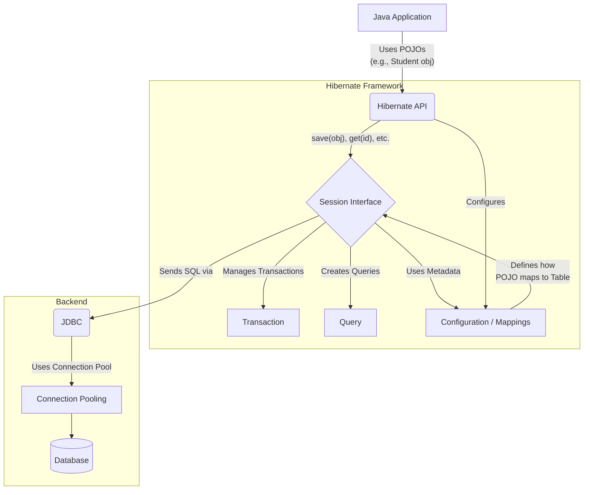

## **Sessions 10, 11, 12 & 13: Hibernate Framework**

Welcome. In our first sessions, we saw how to use [[WJP Sessions 1 & 2 - JDBC & Transaction Management|JDBC]] to communicate with a database. While powerful, JDBC involves a lot of boilerplate code: creating connections, writing SQL strings, creating prepared statements, executing them, and manually mapping `ResultSet` rows to Java objects. This is tedious and error-prone.

**Hibernate** is an **Object-Relational Mapping (ORM)** framework that automates this entire process. It provides a layer of abstraction that lets you work with your database using natural Java objects (POJOs) instead of writing SQL.

---

### Introduction to Hibernate Framework
**ORM** is a programming technique for converting data between incompatible type systems. In our case, it's converting data between the object-oriented world of Java (Classes, Objects) and the relational world of a database (Tables, Rows, Columns).

**The Core Idea:** You create simple Java classes (POJOs) that represent tables in your database. Hibernate then handles all the underlying JDBC and SQL work to save (persist), retrieve, update, and delete these objects.

**The Problem Hibernate Solves (The Object-Relational Impedance Mismatch):**
*   **Granularity:** OOP models can have many small objects, while a relational database might store that data in a few large tables.
*   **Relationships:** OOP models relationships using object references. RDBMS models them using foreign keys.
*   **Identity:** An object's identity (`==`) is different from a database row's identity (primary key).

Hibernate acts as a bridge to resolve these differences.

#### Hibernate Architecture
Hibernate has a layered architecture. You don't need to know every detail, but understanding the main components is key.



*   **POJO (Plain Old Java Object):** Your entity class (e.g., `Student.java`). It has simple fields, getters, and setters.
*   **Configuration (`hibernate.cfg.xml` or Java-based):** Tells Hibernate how to connect to the database (driver, URL, credentials) and which entity classes it will manage.
*   **Mappings (Annotations or XML):** Metadata that tells Hibernate how a class and its fields map to a database table and its columns. Modern Hibernate uses **JPA (Jakarta Persistence API) annotations** for this.
*   **`SessionFactory`**: A heavyweight, thread-safe object created once per application. It's a factory for creating `Session` objects.
*   **`Session`**: A lightweight, single-threaded object that represents a single unit of work with the database. It is the primary interface you use to save, retrieve, and delete objects. It wraps the JDBC `Connection`.
*   **`Transaction`**: Manages the atomicity of the work. You begin a transaction, perform your work, and then either `commit()` or `rollback()`.

### Hibernate Mappings and Relationships (using Annotations)
JPA annotations are used to map your POJO class to a database table.

*   **`@Entity`**: Marks a class as an entity that can be managed by Hibernate.
*   **`@Table(name="table_name")`**: Specifies the table name in the database.
*   **`@Id`**: Marks a field as the primary key.
*   **`@GeneratedValue`**: Configures how the primary key is generated (e.g., auto-increment).
*   **`@Column(name="col_name")`**: Specifies the column name for a field.

**Example: A Mapped `Student` Entity**
```java
import javax.persistence.*; // Note: modern usage is jakarta.persistence.*

@Entity
@Table(name = "students")
public class Student {

    @Id
    @GeneratedValue(strategy = GenerationType.IDENTITY)
    @Column(name = "roll_no")
    private int rollNo;

    @Column(name = "student_name", length = 100, nullable = false)
    private String name;

    // ... constructors, getters, setters
}
```

### Lifecycle of Hibernate Entities
An entity instance in Hibernate can be in one of four states:

1.  **Transient:** The object has just been created with `new` but is not yet associated with a Hibernate session. It has no representation in the database, and Hibernate is unaware of it.
2.  **Persistent:** The object is associated with an active Hibernate `Session`. Any changes made to the object will be automatically detected by Hibernate and saved to the database when the transaction is committed (this is called **automatic dirty checking**).
3.  **Detached:** The object was previously persistent, but the `Session` it was associated with has been closed. Hibernate is no longer tracking changes to this object.
4.  **Removed:** The object is associated with a session and has been marked for deletion from the database. The deletion will happen when the transaction is committed.

### HQL, Named Queries, and Criteria Queries
Hibernate provides several ways to query data, moving beyond simple primary key lookups.

*   **HQL (Hibernate Query Language):**
    *   An object-oriented query language, similar to SQL, but it operates on **entities and their properties**, not on tables and columns.
    *   **Example:** `from Student s where s.city = 'Pune'` (Notice `Student` is the class name, `s.city` is the property name).
    *   Hibernate translates the HQL into the correct SQL dialect for your database at runtime.

*   **Named Queries:**
    *   You can define HQL queries in your mapping files or as annotations on your entity class. This allows you to centralize your queries instead of scattering them as strings throughout your code.
    *   **Example (in `Student.java`):**
        `@NamedQuery(name="Student.findByName", query="from Student s where s.name = :nameParam")`

*   **Criteria API:**
    *   A programmatic, type-safe way to build queries using Java code instead of writing query strings. It is more verbose but prevents syntax errors at compile time.
    *   **Example:** `criteriaBuilder.equal(root.get("city"), "Pune")`

> **Quick Question:** What is the fundamental difference between an HQL query and an SQL query?
> **Answer:** HQL is object-oriented and database-independent; it queries against your Java entity classes and their properties. SQL is relational; it queries against database tables and their columns. Hibernate translates HQL into SQL.

---

### Topic Summary & Revision

*   **ORM:** Object-Relational Mapping bridges the gap between Java objects and relational database tables. **Hibernate** is a leading ORM framework.
*   **Core Components:** The `SessionFactory` creates `Session` objects. A `Session` represents a unit of work and is used to perform CRUD operations on entities.
*   **Mappings:** **JPA annotations** (`@Entity`, `@Id`, `@Column`, etc.) are used to map a POJO class to a database table.
*   **Entity Lifecycle:** An object can be **Transient** (new), **Persistent** (managed by a session), **Detached** (session is closed), or **Removed**.
*   **Querying:**
    *   **HQL:** Object-oriented query language (`from Student s where s.name = ...`).
    *   **Criteria API:** Programmatic, type-safe way to build queries.

---

### MCQs for Exam Preparation

1.  **What is the primary purpose of an ORM framework like Hibernate?**
    - [ ] To replace the database server.
    - [ ] To provide a secure connection to the database.
    - [ ] To automate the mapping between Java objects and database tables, reducing boilerplate JDBC code.
    - [ ] To define the database schema visually.
    <br>

2.  **In Hibernate, which object is considered a heavyweight, thread-safe object that is typically created only once per application?**
    - [ ] `Session`
    - [ ] `Transaction`
    - [ ] `SessionFactory`
    - [ ] `Query`
    <br>

3.  **An object has just been created (`new Student()`) but has not yet been passed to a Hibernate `session.save()` or `session.persist()` method. What is its state?**
    - [ ] Persistent
    - [ ] Detached
    - [ ] Transient
    - [ ] Removed
    <br>

4.  **Which annotation is used to mark a Java class as an entity that Hibernate should manage?**
    - [ ] `@Table`
    - [ ] `@Entity`
    - [ ] `@Column`
    - [ ] `@Id`
    <br>

5.  **What is HQL (Hibernate Query Language)?**
    - [ ] A dialect of SQL specific to the MySQL database.
    - [ ] A way to write queries using Java objects instead of tables.
    - [ ] A database-independent, object-oriented query language that operates on entities and their properties.
    - [ ] A graphical tool for querying the database.
    <br>

6.  **A developer modifies a property of a persistent object within an active transaction. What happens when `transaction.commit()` is called?**
    - [ ] Nothing, an explicit `session.update()` call is required.
    - [ ] An exception is thrown because persistent objects are immutable.
    - [ ] Hibernate automatically detects the change (dirty checking) and generates an `UPDATE` statement.
    - [ ] The object becomes detached.
    <br>

7.  **What is the main difference between the Hibernate `Session` methods `get()` and `load()`?**
    - [ ] `get()` returns null if the object is not found, while `load()` throws an `ObjectNotFoundException`.
    - [ ] `load()` can return a proxy object and may not hit the database until a property is accessed, while `get()` always hits the database immediately.
    - [ ] `get()` is for loading multiple objects, while `load()` is for a single object.
    - [ ] Both A and B are correct.
    <br>

8.  **The problem of "N+1 selects" in an ORM is a performance issue that occurs during:**
    - [ ] Saving a new entity.
    - [ ] Deleting an entity.
    - [ ] Lazy loading of a collection where one query retrieves the parent entities, and then N additional queries are fired to retrieve the collections for each parent.
    - [ ] Committing a transaction.
    <br>

9.  **Which technology provides the standard annotations (like `@Entity`, `@Id`) that Hibernate implements?**
    - [ ] JDBC (Java Database Connectivity)
    - [ ] JSTL (JSP Standard Tag Library)
    - [ ] JPA (Jakarta Persistence API)
    - [ ] JNDI (Java Naming and Directory Interface)
    <br>

10. **To build a query programmatically without using query strings, which Hibernate feature would you use?**
    - [ ] HQL
    - [ ] Native SQL
    - [ ] Named Queries
    - [ ] Criteria API
    <br>

**Answer Key**
1.  **C**: ||ORM frameworks like Hibernate exist to solve the object-relational impedance mismatch, allowing developers to work with their data in a more natural, object-oriented way.||
2.  **C**: ||The SessionFactory is expensive to create as it involves parsing configuration and mapping files. It is designed to be a singleton, thread-safe object from which lightweight, single-threaded Session objects are created.||
3.  **C**: ||A transient object is a standard Java object that has no connection to a database context. Hibernate is not aware of its existence until it is made persistent.||
4.  **B**: ||The @Entity annotation is the fundamental marker that tells Hibernate (or any JPA provider) that this class corresponds to a table in the database and its instances should be managed.||
5.  **C**: ||HQL provides a portable way to write queries. You write your query against your Java objects, and Hibernate is responsible for translating that into the specific SQL dialect required by your configured database (MySQL, PostgreSQL, etc.).||
6.  **C**: ||This feature is called automatic dirty checking. When a transaction is committed, the Hibernate session flushes, comparing the current state of all persistent objects with their original state. If a difference is found, an UPDATE statement is generated.||
7.  **D**: ||Both statements are correct and describe the key differences. get() is "eager" and returns null if not found. load() is "lazy," potentially returning a proxy object that will throw an exception later if you try to use it and the underlying data doesn't exist.||
8.  **C**: ||The N+1 select problem is a common performance pitfall. It can be solved by using an eager fetch strategy (e.g., a JOIN FETCH in HQL) to retrieve the parent entities and their collections in a single query.||
9.  **C**: ||Hibernate is an implementation of the JPA specification. JPA defines the standard interfaces and annotations for Java persistence, allowing you to potentially switch between different ORM implementations (like Hibernate or EclipseLink) with minimal code changes.||
10. **D**: ||The Criteria API allows you to build query objects through a fluent Java API. This provides compile-time checking of your query structure, which is not possible when writing HQL or SQL as plain strings.||

---

### **Bonus Tips**

*   **Hibernate is a Leaky Abstraction:** While Hibernate is powerful, it's not magic. You still need to understand SQL and how databases work. For performance tuning, you will often need to look at the SQL that Hibernate generates to identify bottlenecks like the N+1 problem.
*   **Lazy vs. Eager Loading:** By default, Hibernate uses **lazy loading** for collections. This means when you load a `Department` object, its list of `employees` is not loaded from the database until you explicitly access it (`department.getEmployees()`). This is efficient but can lead to the N+1 problem or "lazy initialization" exceptions if the session is closed. **Eager loading** (using `JOIN FETCH`) loads the related data in the same query. Choosing the right fetch strategy is a critical performance tuning skill.
*   **The Session as a Cache:** The Hibernate `Session` object acts as a first-level cache. If you call `session.get(Student.class, 101)` twice within the same session, it will only hit the database once. The second time, it will retrieve the `Student` object directly from its internal cache.
*   **Transactions are Key:** Always wrap your database operations in a transaction. `Session session = factory.openSession(); Transaction tx = null; try { tx = session.beginTransaction(); ... session.save(obj); ... tx.commit(); } catch (Exception e) { if (tx != null) tx.rollback(); } finally { session.close(); }`. This boilerplate ensures data integrity.

**🔗Links:** [[WJP Sessions 14, 15, 16 & 17 - Spring Framework]]