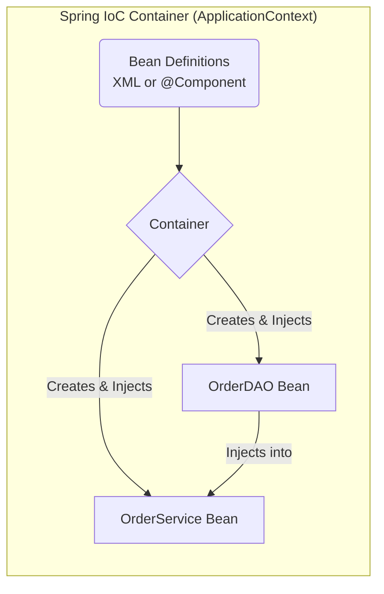
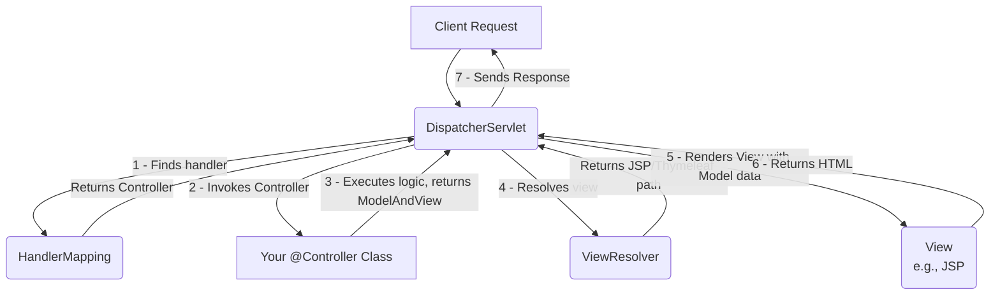

## **Sessions 14, 15, 16 & 17: Spring Framework**

Welcome. After learning how [[WJP Sessions 10, 11, 12 & 13 - Hibernate Framework|Hibernate]] can simplify our data persistence layer, we now turn to a framework that can manage our entire application: the **Spring Framework**. Spring is a powerful, lightweight, and modular framework for building enterprise Java applications. Its core features, **Inversion of Control (IoC)** and **Dependency Injection (DI)**, have become the standard for modern Java development.

---

### What is Spring Framework?
Spring is not a single product; it is a modular framework. You can use its parts independently or together to build an application. Its goal is to make J2EE development easier and to promote good software engineering practices like loose coupling.

#### Spring Modules Overview
Spring is composed of many modules, each providing a specific functionality.
*   **Core Container:** The heart of Spring. It provides the `BeanFactory` and `ApplicationContext`, which are responsible for IoC and DI.
*   **AOP (Aspect-Oriented Programming):** For handling cross-cutting concerns like logging and security.
*   **Data Access/Integration:** Modules for simplifying data access with JDBC, ORMs (like Hibernate), and transaction management.
*   **Web (Spring MVC):** A robust Model-View-Controller framework for building web applications, which we will focus on.

### What is IoC (Inversion of Control)?
**Inversion of Control** is a design principle where the control of object creation and dependency management is inverted from your application code to an external container or framework.

*   **Traditional Control:** Your `OrderService` class is responsible for creating its own dependencies.
    ```java
    public class OrderService {
        private OrderDAO orderDAO;
        public OrderService() {
            this.orderDAO = new OrderDAOImpl(); // The service CONTROLS its dependency.
        }
    }
    ```
    This creates **tight coupling**. `OrderService` is permanently tied to `OrderDAOImpl`.

*   **Inversion of Control:** You write your class and simply declare its dependencies. The Spring container is then responsible for creating the `OrderDAOImpl` object and "injecting" it into the `OrderService`.
    ```java
    public class OrderService {
        private OrderDAO orderDAO;
        public OrderService(OrderDAO orderDAO) { // Dependency is passed in.
            this.orderDAO = orderDAO;
        }
    }
    ```
    The control is inverted—from the component to the container.

### Dependency Injection (DI)
**Dependency Injection** is the *implementation* of the IoC principle. It's the process by which the Spring IoC container "injects" the dependencies into a component (called a **Spring Bean**).

There are three main types of DI:
1.  **Constructor Injection:** Dependencies are provided through the class constructor. This is the **preferred method** as it ensures an object is created in a valid, fully-initialized state.
2.  **Setter Injection:** The container calls setter methods on your bean after it has been instantiated.
3.  **Field Injection (using `@Autowired` on a field):** The easiest to write but generally discouraged because it makes testing harder and hides the class's dependencies.

#### The IoC Container and Spring Beans
*   **Spring Bean:** An object that is instantiated, assembled, and managed by the Spring IoC container.
*   **IoC Container (`ApplicationContext`):** The engine that reads configuration metadata (from XML or annotations), instantiates the beans, wires them together via DI, and manages their complete lifecycle.

**Visualizing the IoC Container:**


### Understanding Spring Annotations
Modern Spring uses annotations heavily to configure beans and dependencies, replacing bulky XML files.

*   **`@Component`**: A generic stereotype annotation that marks a Java class as a Spring Bean.
*   **`@Repository`**: A specialized `@Component` for DAOs. It also enables exception translation.
*   **`@Service`**: A specialized `@Component` for service layer classes.
*   **`@Controller`**: A specialized `@Component` for Spring MVC controllers.
*   **`@Autowired`**: The core annotation for Dependency Injection. Spring will look for a bean of the required type in the container and inject it automatically.
*   **`@Bean`**: Used in a configuration class (marked with `@Configuration`) to explicitly declare a bean, typically for third-party classes you can't annotate.

**Example of Annotation-based DI:**
```java
@Repository
public class OrderDAOImpl implements OrderDAO { ... }

@Service
public class OrderServiceImpl implements OrderService {
    private final OrderDAO orderDAO;

    @Autowired // Constructor Injection
    public OrderServiceImpl(OrderDAO orderDAO) {
        this.orderDAO = orderDAO;
    }
    ...
}
```
When Spring starts, it will find the `@Repository` and `@Service` annotations, create instances of both classes, and because the `OrderServiceImpl` constructor is marked with `@Autowired`, it will automatically pass the `OrderDAOImpl` instance into it.

---

### Spring MVC
Spring MVC is a web framework built on top of the [[WJP Sessions 4, 5, 6 & 7 - Servlets|Servlet API]] that provides a robust implementation of the Model-View-Controller pattern.

#### Front Controller Pattern
Spring MVC is designed around the **Front Controller** pattern. All incoming requests are intercepted by a single, central servlet called the **`DispatcherServlet`**.

**Request Flow in Spring MVC:**



1.  The `DispatcherServlet` receives the request.
2.  It consults the `HandlerMapping` to find which `@Controller` method should handle this request URL.
3.  The controller method is invoked. It performs business logic and returns a `ModelAndView` object (or just a view name as a `String`).
4.  The `DispatcherServlet` asks the `ViewResolver` to find the actual view file (e.g., a JSP or Thymeleaf template) based on the logical view name.
5.  The model data is passed to the view, which is then rendered.
6.  The final HTML response is sent back to the client.

---

### Topic Summary & Revision

*   **Spring Framework:** A modular framework for building enterprise Java applications.
*   **IoC (Inversion of Control):** A design principle where a framework (the container) is responsible for object creation and dependency management, not the application code itself.
*   **DI (Dependency Injection):** The implementation of IoC. Spring "injects" dependencies into components (**beans**). **Constructor injection** is the preferred method.
*   **Annotations:** Modern Spring uses annotations like `@Component`, `@Service`, `@Repository` to define beans and `@Autowired` to perform injection.
*   **IoC Container:** The `ApplicationContext` reads configuration, creates and wires beans together.
*   **Spring MVC:** A web framework using the **Front Controller** pattern, where a central `DispatcherServlet` manages the request-response lifecycle.

---

### MCQs for Exam Preparation

1.  **What is the core principle of Inversion of Control (IoC)?**
    - [ ] The programmer manually controls the creation of all objects.
    - [ ] A framework or container is responsible for creating objects and managing their dependencies.
    - [ ] Control flow is inverted, making `if` statements work like `else` statements.
    - [ ] The database controls the application logic.
    <br>

2.  **Which of the following is the most recommended type of Dependency Injection in Spring?**
    - [ ] Field Injection
    - [ ] Setter Injection
    - [ ] Constructor Injection
    - [ ] Interface Injection
    <br>

3.  **In Spring, an object managed by the IoC container is known as a:**
    - [ ] `Servlet`
    - [ ] `POJO`
    - [ ] `Bean`
    - [ ] `Module`
    <br>

4.  **Which annotation is a generic stereotype used to mark a class as a component to be managed by Spring?**
    - [ ] `@Bean`
    - [ ] `@Autowired`
    - [ ] `@Service`
    - [ ] `@Component`
    <br>

5.  **What is the name of the central servlet in the Spring MVC framework that handles all incoming requests?**
    - [ ] `FrontServlet`
    - [ ] `MainServlet`
    - [ ] `DispatcherServlet`
    - [ ] `MvcServlet`
    <br>

6.  **In Spring MVC, what is the primary role of the `ViewResolver`?**
    - [ ] To resolve which controller should handle a request.
    - [ ] To map a logical view name (like "home") to an actual view technology and file (like `/WEB-INF/views/home.jsp`).
    - [ ] To resolve dependencies for a View.
    - [ ] To validate the data in the model before rendering.
    <br>

7.  **If you have two classes, `MyService` and `MyRepository`, and `MyService` needs an instance of `MyRepository`, what does `@Autowired` on the `MyService` constructor achieve?**
    - [ ] It tells `MyService` to create a new `MyRepository` instance.
    - [ ] It tells the Spring container to find the `MyRepository` bean in its context and pass it as an argument when creating the `MyService` bean.
    - [ ] It converts the `MyService` class into a repository.
    - [ ] It marks the constructor for deletion.
    <br>

8.  **The default scope for a Spring bean is:**
    - [ ] `prototype` (a new instance for every request)
    - [ ] `request` (a new instance for each HTTP request)
    - [ ] `session` (a new instance for each user session)
    - [ ] `singleton` (one shared instance for the entire application)
    <br>

9.  **Which design pattern is implemented by Spring MVC's `DispatcherServlet`?**
    - [ ] Factory Pattern
    - [ ] Singleton Pattern
    - [ ] Front Controller Pattern
    - [ ] DAO Pattern
    <br>

10. **To use an alternative view technology like Thymeleaf instead of JSP in Spring MVC, you would primarily need to configure a different:**
    - [ ] `HandlerMapping`
    - [ ] `DispatcherServlet`
    - [ ] `ApplicationContext`
    - [ ] `ViewResolver`
    <br>

**Answer Key**
1.  **B**: ||IoC inverts the traditional flow. Instead of your object creating its dependencies, the container creates the dependencies and provides them to your object, "inverting" the control.||
2.  **C**: ||Constructor injection is preferred because it makes the component's dependencies explicit and ensures the object cannot be created in an invalid state (i.e., without its required dependencies). It also makes the object easier to test.||
3.  **C**: ||A Spring Bean is any object whose lifecycle is managed by the Spring IoC container.||
4.  **D**: ||@Component is the base annotation. @Service, @Repository, and @Controller are specialized versions of @Component that add semantic meaning for their respective layers.||
5.  **C**: ||The DispatcherServlet is the core of Spring MVC. It acts as a single entry point for all web requests and is responsible for delegating the work to other components in the framework.||
6.  **B**: ||The controller returns a logical view name (a string). The ViewResolver is configured to translate this logical name into the path of the actual template file (e.g., adding a prefix /WEB-INF/views/ and a suffix .jsp).||
7.  **B**: ||@Autowired signals to the IoC container that a dependency needs to be injected. The container finds a matching bean (in this case, the MyRepository bean) and supplies it to the MyService constructor.||
8.  **D**: ||By default, Spring creates only one instance of each bean and shares it across the entire application. This is the singleton scope. This is efficient but requires beans to be thread-safe.||
9.  **C**: ||The Front Controller pattern uses a single handler to process all requests. The DispatcherServlet fulfills this role by intercepting every request and delegating processing to other components.||
10. **D**: ||The ViewResolver is the component responsible for mapping logical view names to a specific view technology. By plugging in a ThymeleafViewResolver instead of an InternalResourceViewResolver (for JSP), you can tell Spring MVC to render views using Thymeleaf.||

---

### **Bonus Tips**

*   **Loose Coupling is the Goal:** The entire point of IoC and DI is to achieve **loose coupling** between your components. Your `OrderService` should depend on the `OrderDAO` *interface*, not the `OrderDAOImpl` *class*. This allows you to easily swap out the implementation (e.g., from a MySQL DAO to an Oracle DAO, or to a mock DAO for testing) without changing the `OrderService` at all.
*   **Annotations are Metadata:** Think of annotations like `@Component` or `@Autowired` as metadata that you provide to the Spring Framework. They don't do anything by themselves. It's the Spring IoC container that reads this metadata at startup and uses it to build the application graph.
*   **Spring vs. J2EE:** Spring was created to simplify the complexity of early J2EE (especially Enterprise JavaBeans). While modern Jakarta EE has adopted many of Spring's ideas (like CDI for dependency injection), Spring remains more popular because it provides a comprehensive, integrated ecosystem for building modern applications, especially with the addition of Spring Boot.
*   **XML vs. Annotations:** While modern Spring is almost entirely annotation-driven, it's useful to know that all of this was originally configured in large XML files. You might encounter this in legacy projects. The annotations we use today are essentially a more convenient and readable shortcut for that XML configuration.

**🔗Links:** [[WJP Sessions 18, 19 & 20 - Spring Boot]]