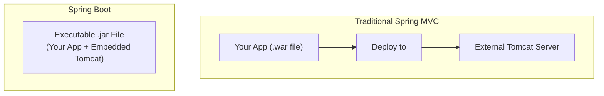

## **Sessions 18, 19 & 20: Spring Boot**

Welcome. In the last session, we saw the power of the [[WJP Sessions 14, 15, 16 & 17 - Spring Framework|Spring Framework]], but also its reliance on configuration (whether XML or annotations). **Spring Boot** is not a new framework; it is an **opinionated extension of the Spring Framework** that eliminates most of the boilerplate configuration required to build an application.

---

### Why Spring Boot? The Problem it Solves
Building a production-ready Spring application traditionally required significant configuration:
*   Configuring the `DispatcherServlet`.
*   Setting up a `ViewResolver`.
*   Choosing and configuring a dependency management tool like Maven or Gradle.
*   Deciding which library versions are compatible with each other.
*   Configuring a servlet container like Tomcat and deploying a `.war` file to it.

**Spring Boot's Core Idea:** Make intelligent, "opinionated" decisions for you. It follows the principle of **"convention over configuration."** It provides sensible defaults for almost everything, allowing you to get a standalone application running with minimal code.

### Spring Boot Essentials

#### Auto-Configuration
This is the "magic" of Spring Boot. Spring Boot looks at the JAR dependencies you have on your classpath and automatically configures the beans and settings that you are most likely to need.
*   If it sees `spring-boot-starter-web` on the classpath, it automatically configures Tomcat, a `DispatcherServlet`, a `ViewResolver`, and JSON message converters.
*   If it sees `spring-boot-starter-data-jpa` and a database driver like `mysql-connector-java`, it automatically configures a `DataSource` and a Hibernate `EntityManager`.

You can always override these defaults if you need to, but for most cases, they work out of the box.

#### Starter POMs / Dependencies
Instead of picking and choosing individual library versions, Spring Boot provides "starter" packages. These are convenient dependency descriptors that you can include in your build tool (like Maven or Gradle).

*   `spring-boot-starter-web`: Pulls in everything you need for a standard web application (Spring MVC, Tomcat, Jackson for JSON).
*   `spring-boot-starter-data-jpa`: Pulls in everything for data persistence with JPA/Hibernate.
*   `spring-boot-starter-test`: Pulls in common testing libraries like JUnit and Mockito.

These starters manage a curated, compatible set of library versions for you, eliminating "dependency hell."

#### Embedded Server
Spring Boot applications are typically packaged as a **standalone, executable `.jar` file**. This is possible because they include an **embedded servlet container** (like Tomcat, Jetty, or Undertow) directly inside the JAR.

**Visualizing the Difference:**

This makes deployment incredibly simple. You don't need to install a separate Tomcat server on your machine. You just run the application with `java -jar myapp.jar`.

### Building a Spring Boot Web Application
A minimal Spring Boot application has one main class.

```java
// Import necessary annotations
import org.springframework.boot.SpringApplication;
import org.springframework.boot.autoconfigure.SpringBootApplication;
import org.springframework.web.bind.annotation.GetMapping;
import org.springframework.web.bind.annotation.RestController;

@SpringBootApplication // The key auto-configuration annotation
@RestController // Marks this class as a controller where every method returns a domain object instead of a view
public class HelloWorldApplication {

    public static void main(String[] args) {
        // This single line boots up the entire application
        SpringApplication.run(HelloWorldApplication.class, args);
    }

    @GetMapping("/") // Maps HTTP GET requests for the root URL "/" to this method
    public String sayHello() {
        return "Hello World!";
    }
}
```

**Breakdown:**
*   **`@SpringBootApplication`**: This single annotation is a combination of three important annotations:
    1.  **`@Configuration`**: Tags the class as a source of bean definitions.
    2.  **`@EnableAutoConfiguration`**: Tells Spring Boot to start adding beans based on classpath settings.
    3.  **`@ComponentScan`**: Tells Spring to look for other components, configurations, and services in the current package and its sub-packages.
*   **`main` method:** The standard entry point for a Java application.
*   **`SpringApplication.run(...)`**: This static method bootstraps the application. It creates the `ApplicationContext`, starts the auto-configuration process, and starts the embedded servlet container.

### Basic Introduction of MAVEN
**Maven** is a powerful **build automation and dependency management tool**. It helps manage the project's structure, dependencies (libraries), and the build process (compiling, testing, packaging).

*   **`pom.xml` (Project Object Model):** The central configuration file for a Maven project. You define your project's dependencies (like `spring-boot-starter-web`) in this file. Maven then automatically downloads the required JAR files and their transitive dependencies from a central repository.

> **Quick Question:** What is the primary purpose of the `@SpringBootApplication` annotation?
> **Answer:** It's a convenience annotation that enables three key features: component scanning, auto-configuration, and Java-based configuration, effectively launching the entire Spring Boot application.

---

### Topic Summary & Revision

*   **Spring Boot:** An opinionated extension of the Spring Framework designed for rapid application development and simplified deployment.
*   **Core Principles:**
    *   **Auto-Configuration:** Intelligently configures your application based on the dependencies present.
    *   **Starter Dependencies:** Simplifies dependency management by providing curated bundles of libraries (e.g., `spring-boot-starter-web`).
    *   **Convention over Configuration:** Provides sensible defaults for most settings, reducing boilerplate.
*   **Embedded Server:** Spring Boot applications are packaged as executable `.jar` files with an embedded server (like Tomcat), making them easy to run anywhere.
*   **`@SpringBootApplication`:** The key annotation that triggers the entire auto-configuration and component scanning process.
*   **MAVEN:** A build and dependency management tool that uses a `pom.xml` file to manage the project's libraries.

---

### MCQs for Exam Preparation

1.  **What is the main goal of Spring Boot?**
    - [ ] To replace the core Spring Framework with a new set of APIs.
    - [ ] To simplify the process of building and deploying production-ready, standalone Spring applications.
    - [ ] To provide a graphical user interface for managing Spring beans.
    - [ ] To force developers to use XML for configuration.
    <br>

2.  **What does "auto-configuration" in Spring Boot do?**
    - [ ] It automatically writes your business logic for you.
    - [ ] It attempts to automatically configure your Spring application based on the JAR dependencies you have added.
    - [ ] It configures the operating system for optimal performance.
    - [ ] It automatically creates database tables based on your model classes.
    <br>

3.  **A Spring Boot application is typically packaged as a:**
    - [ ] `.war` file to be deployed on an external server.
    - [ ] `.dll` library.
    - [ ] `.zip` archive containing source code.
    - [ ] Standalone, executable `.jar` file with an embedded server.
    <br>

4.  **In a Maven project, where do you declare your project's dependencies, such as `spring-boot-starter-web`?**
    - [ ] In the main application class using annotations.
    - [ ] In a `config.properties` file.
    - [ ] In the `pom.xml` file.
    - [ ] In the `web.xml` deployment descriptor.
    <br>

5.  **The `@SpringBootApplication` annotation is a convenience annotation that combines which three annotations?**
    - [ ] `@Service`, `@Repository`, and `@Controller`.
    - [ ] `@Bean`, `@Autowired`, and `@Configuration`.
    - [ ] `@Configuration`, `@EnableAutoConfiguration`, and `@ComponentScan`.
    - [ ] `@GetMapping`, `@PostMapping`, and `@RestController`.
    <br>

6.  **If you include the `spring-boot-starter-web` dependency in your `pom.xml`, what does Spring Boot auto-configure for you?**
    - [ ] A connection to a MySQL database.
    - [ ] A Spring Security configuration.
    - [ ] An embedded Tomcat server and Spring MVC components like `DispatcherServlet`.
    - [ ] A connection to a remote server via SSH.
    <br>

7.  **What is the purpose of the `@RestController` annotation in a Spring Boot application?**
    - [ ] It marks a class as a standard Spring MVC controller that returns view names.
    - [ ] It is a combination of `@Controller` and `@ResponseBody`, indicating that every method's return value should be written directly to the response body (typically as JSON).
    - [ ] It restricts the controller to only handle RESTful `GET` requests.
    - [ ] It enables REST-based security for the controller.
    <br>

8.  **How do you run a packaged Spring Boot application from the command line?**
    - [ ] `java -jar myapp.war`
    - [ ] `mvn spring:run`
    - [ ] `java -jar myapp.jar`
    - [ ] `tomcat start myapp.jar`
    <br>

9.  **What is the primary benefit of using "starter" dependencies (e.g., `spring-boot-starter-data-jpa`)?**
    - [ ] They are smaller in size than regular dependencies.
    - [ ] They provide a single dependency that pulls in a curated, compatible set of all the libraries needed for a specific functionality.
    - [ ] They automatically write your DAO and Repository code.
    - [ ] They are only for testing purposes.
    <br>

10. **The "convention over configuration" philosophy means:**
    - [ ] You must follow strict conventions, and configuration is not allowed.
    - [ ] Spring Boot provides sensible default configurations based on common conventions, which you can override if needed.
    - [ ] You must configure everything in XML files according to a convention.
    - [ ] You configure the conventions in a `pom.xml` file.
    <br>

**Answer Key**
1.  **B**: ||Spring Boot's main objective is to drastically reduce the configuration and setup time required for new Spring projects, allowing developers to focus on writing business logic.||
2.  **B**: ||Auto-configuration is the mechanism where Spring Boot inspects the classpath and other settings to provide intelligent default configurations for the components it finds.||
3.  **D**: ||This is a key feature of Spring Boot. By embedding the server, the application becomes self-contained and easy to deploy and run, which is ideal for microservices and cloud environments.||
4.  **C**: ||The pom.xml is the heart of a Maven project. It defines the project's coordinates (group, artifact, version), dependencies, plugins, and other build information.||
5.  **C**: ||These three annotations together enable the core functionality of a Spring Boot application: Java-based configuration, the auto-configuration engine, and the scanning for user-defined beans.||
6.  **C**: ||The spring-boot-starter-web starter transitively includes dependencies for Spring MVC, data binding, and an embedded servlet container like Tomcat, providing everything needed for a basic web application out of the box.||
7.  **B**: ||@RestController is a convenience annotation for building RESTful APIs. It tells Spring that the return values of the methods in this class should be serialized (e.g., to JSON) and sent as the HTTP response body, instead of being used to resolve a view name.||
8.  **C**: ||Because a Spring Boot application is packaged as an executable JAR with all its dependencies and the embedded server included, it can be run with a simple java -jar command.||
9.  **B**: ||Starters solve the "dependency hell" problem by providing a one-stop-shop for a specific capability. You include one starter, and Maven/Gradle handles downloading all the necessary, version-compatible libraries.||
10. **B**: ||This principle is key to Spring Boot's ease of use. It makes assumptions about how you want to configure things (e.g., a Thymeleaf template will be in /templates/). If you follow the convention, you don't need any configuration. If you don't, you can provide configuration to override the default.||

---

### **Bonus Tips**

*   **`application.properties` (or `.yml`):** While Spring Boot auto-configures almost everything, you can easily override the defaults in the `src/main/resources/application.properties` file. For example, you can change the server port (`server.port=8081`), set the database URL, or configure logging levels. This is the central place for application configuration.
*   **Spring Initializr:** The best way to start a new Spring Boot project is by using the Spring Initializr (`start.spring.io`). It's a web-based tool that allows you to pick your project metadata (Maven/Gradle), language, Spring Boot version, and a list of starter dependencies you need. It then generates a complete, ready-to-run project structure for you to download.
*   **Actuator:** For production applications, you should always include the `spring-boot-starter-actuator` dependency. It exposes a set of production-ready endpoints (like `/health`, `/metrics`, `/info`) that provide crucial insights into your running application's health and state.
*   **The Power of `@RestController`:** When building APIs, combining `@RestController` on the class with mapping annotations like `@GetMapping`, `@PostMapping`, etc., on the methods is the standard approach. Spring Boot automatically handles the serialization of your return objects (e.g., a `List<User>`) into a JSON array and sets the correct HTTP response headers.

**🔗Links:** [[WJP Sessions 21 & 22 - Spring Data JPA]]