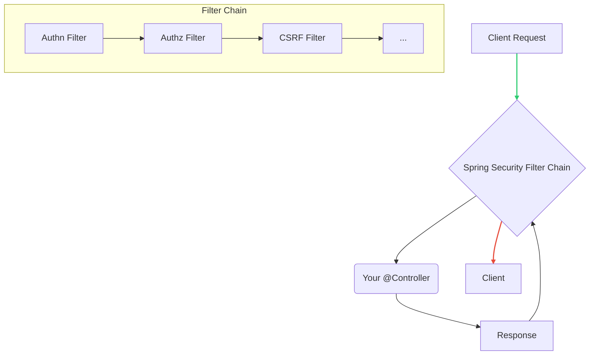

## **Sessions 26 & 27: Testing and Security in Spring**

Welcome. Building an application is only part of the job. We must also ensure it is correct, reliable, and secure. This session focuses on **Testing** our Spring applications to verify their behavior and **Securing** them to protect against unauthorized access. Spring Boot provides excellent support for both of these crucial activities.

---

### Testing in Spring
Testing is the process of verifying that your code does what it is expected to do. A good test suite acts as a safety net, allowing you to refactor code and add new features with confidence.

#### Unit Testing
*   **Goal:** To test the smallest piece of testable software in an application (a single method or class) in **isolation**.
*   **Core Idea:** When testing a `UserService`, you should not be testing the actual `UserDAO` or the database. You should **mock** the DAO to simulate its behavior. This ensures your test only fails if there is a problem with the `UserService` logic itself, not because of an external dependency like the database being down.
*   **Tools:**
    *   **JUnit:** The standard framework for writing tests in Java.
    *   **Mockito:** The most popular mocking framework used to create mock objects for dependencies.

**Example: Unit Testing a `Spring MVC Controller`**
*   You don't need to run a real server. You use `MockMvc` to simulate HTTP requests and assert the responses.

```java
// Simplified example
@WebMvcTest(ProductController.class) // Loads only the web layer for this controller
class ProductControllerTest {

    @Autowired
    private MockMvc mockMvc;

    @MockBean // Creates a Mockito mock of the service and puts it in the ApplicationContext
    private ProductService productService;

    @Test
    void testGetProductById() throws Exception {
        // 1. Arrange: Setup the mock behavior
        Product mockProduct = new Product(1L, "Laptop", 1200.00);
        when(productService.findById(1L)).thenReturn(Optional.of(mockProduct));

        // 2. Act & 3. Assert: Perform the request and check the result
        mockMvc.perform(get("/api/products/1"))
               .andExpect(status().isOk())
               .andExpect(jsonPath("$.name").value("Laptop"));
    }
}
```

#### Integration Testing
*   **Goal:** To test how different parts of the application work together.
*   **Core Idea:** Instead of mocking dependencies, you use the real components. An integration test for the web layer might involve starting up an in-memory database and testing the full flow from the controller to the service to the repository and back.
*   **Annotation:** **`@SpringBootTest`** is used to bootstrap the entire Spring `ApplicationContext` for an integration test.

---

### Securing Web Application with Spring Security
**Spring Security** is a powerful and highly customizable framework that provides authentication and authorization for Spring applications. It is the de facto standard for securing Spring-based applications.

#### What is Spring Security?
It's a framework built around a chain of **servlet filters**. Every incoming request passes through this chain, where security checks are performed.



#### Core Concepts
*   **Authentication (Authn):** "Who are you?" This is the process of verifying a user's identity. The most common form is username and password. The result of authentication is a `Principal` object (often a `UserDetails` object) that represents the logged-in user.
*   **Authorization (Authz):** "What are you allowed to do?" This is the process of determining if an authenticated user has permission to access a specific resource. This is typically done by checking the user's **roles** or **authorities** (e.g., `ROLE_ADMIN`, `ROLE_USER`).
*   **Basic Authentication:** A simple authentication scheme where the username and password are sent in the `Authorization` header of every HTTP request, Base64 encoded. It is simple but not very secure as credentials are sent with every request.
*   **JWT (JSON Web Token) Authorization:** A modern, stateless approach for securing APIs.
    1.  A user authenticates once (e.g., with a username/password).
    2.  The server validates the credentials and generates a **JWT**. A JWT is a digitally signed, self-contained JSON object that includes user information (like username and roles).
    3.  The server sends this token back to the client.
    4.  The client stores the token (e.g., in local storage) and includes it in the `Authorization` header of all subsequent requests (`Authorization: Bearer <token>`).
    5.  A Spring Security filter on the server intercepts each request, validates the JWT's signature, and if valid, uses the information within it to authenticate and authorize the user for that request.

**Why JWT?** It's **stateless**. The server doesn't need to store session information. It just needs to be able to validate the token's signature, making it ideal for distributed systems and microservices.

---

### Topic Summary & Revision

*   **Unit Testing:** Testing a single class in isolation. Use **Mockito** to create **mocks** for dependencies. Use `@WebMvcTest` for testing the web layer.
*   **Integration Testing:** Testing how multiple components work together. Use `@SpringBootTest` to load the full application context.
*   **Spring Security:** A powerful framework for handling authentication and authorization using a chain of filters.
*   **Authentication vs. Authorization:** Authentication is about identity ("who you are"). Authorization is about permissions ("what you can do").
*   **JWT (JSON Web Token):** A modern, stateless mechanism for securing APIs. A client authenticates once to get a token and then sends that token with every subsequent request.

---

### MCQs for Exam Preparation

1.  **What is the primary goal of a unit test for a `UserService` class that depends on a `UserRepository`?**
    - [ ] To test that the `UserService` and `UserRepository` work correctly together.
    - [ ] To test the logic of the `UserService` class in complete isolation from the `UserRepository`.
    - [ ] To test the database connection.
    - [ ] To test the performance of the `UserService`.
    <br>

2.  **Which library is most commonly used in the Spring ecosystem to create "mock" objects for dependencies in unit tests?**
    - [ ] JUnit
    - [ ] Spring Test
    - [ ] Mockito
    - [ ] AssertJ
    <br>

3.  **The `@SpringBootTest` annotation is typically used for:**
    - [ ] Unit tests
    - [ ] Integration tests
    - [ ] Performance tests
    - [ ] Security tests
    <br>

4.  **"Verifying that a user is who they claim to be" is the definition of:**
    - [ ] Authorization
    - [ ] Authentication
    - [ ] Auditing
    - [ ] Accounting
    <br>

5.  **Which of the following is a key advantage of using JWT for API security?**
    - [ ] It is stateful, allowing the server to easily track user sessions.
    - [ ] The token contains all necessary user information and is self-contained, making the system stateless and scalable.
    - [ ] It requires the client to send the username and password with every request.
    - [ ] The token is stored on the server, not the client.
    <br>

6.  **Spring Security's architecture is primarily based on which design pattern?**
    - [ ] Model-View-Controller
    - [ ] Chain of Responsibility (via a servlet filter chain)
    - [ ] Factory Pattern
    - [ ] Singleton Pattern
    <br>

7.  **In a Spring Security unit test using `@WebMvcTest`, which annotation is used to provide a mock implementation of a service or repository bean?**
    - [ ] `@Autowired`
    - [ ] `@Mock`
    - [ ] `@Inject`
    - [ ] `@MockBean`
    <br>

8.  **"Determining if a user with the `ROLE_ADMIN` is allowed to access the `/admin` URL" is an example of:**
    - [ ] Authentication
    - [ ] Authorization
    - [ ] Registration
    - [ ] Encryption
    <br>

9.  **In a JWT-based system, how does the client typically send the token to the server after login?**
    - [ ] As a query parameter in the URL.
    - [ ] In a cookie.
    - [ ] In the HTTP `Authorization` header, usually with a "Bearer" prefix.
    - [ ] In the body of a `POST` request.
    <br>

10. **When writing an integration test for a feature that involves the database, what is a common best practice?**
    - [ ] To use a mock database.
    - [ ] To connect the test to the live production database.
    - [ ] To use a separate, dedicated test database (or an in-memory database like H2) to ensure tests are isolated and repeatable.
    - [ ] To disable all database interactions during the test.
    <br>

**Answer Key**
1.  **B**: ||The purpose of a unit test is isolation. By mocking the UserRepository, you ensure that the test's success or failure depends only on the business logic within UserService, not on external factors like the database.||
2.  **C**: ||Mockito is the standard mocking framework used with JUnit and Spring Test. It allows you to create mock objects and define their behavior (e.g., "when userRepository.findById(1) is called, then return this mock user object").||
3.  **B**: ||@SpringBootTest bootstraps the entire application context, loading all the beans and configurations, which is necessary for testing the integration between different layers (e.g., controller -> service -> repository).||
4.  **B**: ||Authentication is the process of establishing identity. Authorization is the process of granting permissions based on that identity.||
5.  **B**: ||Because a JWT is self-contained and digitally signed, the server does not need to maintain session state. Any server in a cluster can validate the token and serve the request, which makes the architecture highly scalable.||
6.  **B**: ||Spring Security processes incoming requests through a series of filters. Each filter has a specific responsibility (e.g., handling basic auth, checking for a JWT, handling CSRF). A request passes down this chain, and if it passes all checks, it reaches the controller.||
7.  **D**: ||@MockBean is a Spring Boot test annotation that replaces an existing bean in the application context with a Mockito mock. This is perfect for unit testing the web layer in isolation from the service layer.||
8.  **B**: ||Authorization is about checking permissions. Once a user is authenticated, the authorization process checks if their assigned roles or authorities grant them access to the requested resource.||
9.  **C**: ||This is the standard convention for token-based authentication. The client sends the header Authorization: Bearer \<your-jwt-token>, and a server-side filter extracts and validates this token.||
10. **C**: ||Integration tests should be repeatable and should not affect or be affected by other tests or a production environment. Using a dedicated test database that can be reset before each test run ensures this isolation. In-memory databases like H2 are very popular for this.||

---

### **Bonus Tips**

*   **Test-Driven Development (TDD):** A development practice where you write a failing test *before* you write the production code to make it pass. This encourages simple design and ensures you always have test coverage. The cycle is often called "Red-Green-Refactor": 1. Write a failing test (Red). 2. Write the minimum code to make the test pass (Green). 3. Refactor the code to improve its design.
*   **Authentication vs. Authorization is a Key Interview Question:** Be prepared to clearly articulate the difference. A simple analogy: Authentication is showing your ID card to enter a building. Authorization is checking if your ID card has the special sticker that lets you enter the server room.
*   **Stateless JWTs:** One challenge with JWTs is that they are difficult to invalidate. Once issued, a token is valid until it expires. If a user's permissions change or their account is disabled, their existing token will still work. Solutions involve keeping a "blacklist" of invalid tokens (which introduces state) or keeping token expiration times very short.
*   **Security is a Layered Concern:** Don't just rely on API security. A robust application has multiple layers of security: network security (firewalls), transport security (HTTPS), application security (Spring Security), and database security (user permissions).

**🔗Links:** [[WJP Sessions 28 & 29 - Microservices]]