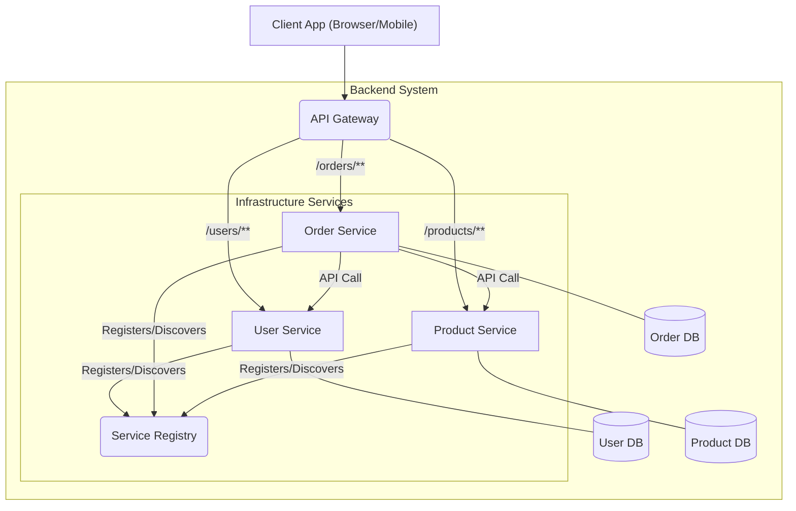

## **Sessions 28 & 29: Microservices**

Welcome to your final sessions. We have journeyed from standalone Java applications to complex, monolithic web applications managed by the Spring Framework. Now, we explore a modern architectural style designed to solve the challenges of building very large, complex systems: **Microservices**.

---

### Introduction to Microservices
A **Microservice Architecture** is an architectural style that structures an application as a collection of small, autonomous, and loosely coupled services. Each service is self-contained and implements a single piece of business capability.

**Analogy: The Monolith vs. The Microservices Restaurant**
*   **Monolithic Application:** A single, giant restaurant. There is one massive kitchen (the codebase), one head chef (the development team), and one front door (the API).
    *   **Pros:** Simple to start, all staff are in one place.
    *   **Cons:** If the kitchen gets too busy, the whole restaurant slows down. A small fire in the kitchen (a bug) shuts down the entire restaurant. Remodeling the kitchen (deploying a new version) is a huge, risky event that requires closing for the night.
*   **Microservice Architecture:** A modern food court with many independent food stalls.
    *   **The Pizza Stall (`PizzaService`):** Has its own small kitchen, its own staff, and its own menu. It is responsible only for making and selling pizzas.
    *   **The Taco Stall (`TacoService`):** A completely separate, independent unit.
    *   **Pros:** The pizza stall can be incredibly busy without affecting the taco stall. If the pizza oven breaks, only the pizza stall closes; the rest of the food court keeps running. The pizza team can add a new type of pizza to their menu and deploy it without coordinating with the taco team.
    *   **Cons:** Customers need a way to find all the stalls (Service Discovery). You need a central payment counter or a way for stalls to communicate (API Gateway). Managing many small stalls is more complex operationally than managing one big kitchen.

### Microservices Architecture vs. Monolithic Architecture

| Feature | Monolithic Architecture | Microservices Architecture |
| :--- | :--- | :--- |
| **Codebase** | Single, large, unified codebase. | Multiple, small, independent codebases. |
| **Deployment** | Deployed as a single unit. A small change requires redeploying the entire application. | Each service can be deployed independently. |
| **Technology Stack**| Typically a single, uniform technology stack (e.g., all Java/Spring). | Polyglot. Each service can use the best technology for its specific job (e.g., Java for one, Python for another). |
| **Scalability** | Must scale the entire application, even if only one part is a bottleneck. | Can scale individual services based on their specific needs. |
| **Resilience/Fault Tolerance**| A failure in one component can bring down the entire application. | A failure in one service can be isolated, and the rest of the application can continue to function (graceful degradation). |
| **Development** | Large teams working on a single codebase can lead to slower development cycles. | Small, autonomous teams can develop, deploy, and scale their services independently, leading to faster innovation. |
| **Complexity** | Simpler to develop and deploy initially. | Much higher operational complexity (networking, service discovery, distributed data management). |

---

### Key Concepts and Patterns in Microservices

Building a microservice architecture introduces new challenges that require specific patterns to solve.

#### Fragmentation of Business Requirement
The first step is to break down the business domain into small, well-defined, and independent services. This is often done using a technique called **Domain-Driven Design (DDD)**, where you identify the "Bounded Contexts" of your application. For an e-commerce app, this might be `UserService`, `ProductCatalogService`, `OrderService`, and `PaymentService`.

#### API Gateway
*   **Problem:** If a mobile app needs data from five different services, should it make five separate network calls? This is inefficient and couples the client tightly to the backend architecture.
*   **Solution:** An **API Gateway** acts as a single entry point for all clients. The client makes one request to the gateway, and the gateway then communicates with the necessary internal microservices to fulfill that request, aggregating the results before sending them back.
*   **It also handles cross-cutting concerns** like authentication, rate limiting, and logging.

#### Service Discovery
*   **Problem:** In a dynamic cloud environment, services are constantly starting and stopping, and their network locations (IP addresses) can change. How does `OrderService` find the current, healthy instances of `PaymentService`?
*   **Solution:** A **Service Discovery** mechanism.
    1.  When a service instance starts, it registers itself with a central **Service Registry** (e.g., Eureka, Consul).
    2.  When another service wants to call it, it queries the Service Registry to get the current network location of an available instance.

#### Database Management for Microservices
This is one of the biggest challenges. The core principle is **"one database per service."**
*   Each microservice should own and manage its own database. No other service is allowed to access that database directly.
*   Services must communicate through well-defined APIs, not by sharing a database.
*   **Why?** This ensures loose coupling. If the `ProductService` team wants to change their database schema, they can do so without breaking the `OrderService`, as long as their API contract remains the same.
*   **Challenge:** This leads to the problem of **distributed data consistency**. How do you handle a transaction that spans multiple services (e.g., an order that must update inventory and charge a payment)? This requires advanced patterns like the **Saga pattern**, which are beyond the scope of this introduction.

**Microservices Architecture Visualization:**

---

### Topic Summary & Revision

*   **Microservices Architecture:** An approach to building an application as a suite of small, independent services, each running in its own process and communicating over a network.
*   **Monolith vs. Microservices:** The key trade-off is initial simplicity (Monolith) versus long-term scalability, resilience, and team autonomy (Microservices).
*   **Independent Deployment:** A core benefit of microservices is that each service can be developed, tested, and deployed independently.
*   **Key Patterns:**
    *   **API Gateway:** A single entry point for clients that routes requests to internal services.
    *   **Service Discovery:** A mechanism (like a Service Registry) for services to find and communicate with each other in a dynamic environment.
    *   **Database per Service:** Each service owns its own data to ensure loose coupling. This introduces challenges with distributed transactions.

---

### MCQs for Exam Preparation

1.  **Which of the following is a primary characteristic of a microservice architecture?**
    - [ ] A single, large, monolithic codebase.
    - [ ] A single database shared by all components.
    - [ ] The application is structured as a collection of small, independently deployable services.
    - [ ] All services must be written in the same programming language.
     

2.  **What is a major advantage of microservices over a monolithic architecture?**
    - [ ] Simplified initial development and deployment.
    - [ ] Reduced operational complexity.
    - [ ] Improved fault isolation; a failure in one service is less likely to bring down the entire application.
    - [ ] Easier to manage data consistency across the application.
     

3.  **In a microservice architecture, what is the role of an API Gateway?**
    - [ ] To store the data for all microservices.
    - [ ] To act as a single entry point for clients, routing requests to the appropriate backend services.
    - [ ] To monitor the health of the microservices.
    - [ ] To replace the need for a service registry.
     

4.  **The principle of "one database per service" is crucial for:**
    - [ ] Ensuring strong data consistency across all services.
    - [ ] Simplifying database backups.
    - [ ] Achieving loose coupling between services.
    - [ ] Improving the performance of `JOIN` operations.
     

5.  **In a dynamic cloud environment, how does one microservice typically find the network address of another microservice it needs to call?**
    - [ ] The address is hardcoded in a configuration file.
    - [ ] It broadcasts a message on the network.
    - [ ] It queries a Service Registry.
    - [ ] All services run on the same machine and use `localhost`.
     

6.  **"Polyglot persistence" in a microservices context means:**
    - [ ] All services must persist their data in multiple formats.
    - [ ] The ability for each service to choose the database technology best suited to its needs (e.g., one uses SQL, another uses MongoDB).
    - [ ] A database that can understand multiple query languages.
    - [ ] A pattern for ensuring data consistency across different databases.
     

7.  **Which of the following is a significant *disadvantage* of microservices?**
    - [ ] They are difficult to scale horizontally.
    - [ ] They introduce significant operational complexity related to deployment, monitoring, and distributed systems.
    - [ ] They are not suitable for web applications.
    - [ ] They discourage team autonomy.
     

8.  **The architectural style that is the philosophical opposite of microservices is:**
    - [ ] Service-Oriented Architecture (SOA)
    - [ ] Event-Driven Architecture
    - [ ] Monolithic Architecture
    - [ ] Client-Server Architecture
     

9.  **A client application needs to get a user's profile and their 5 most recent orders. In a microservice architecture, this would likely involve:**
    - [ ] A single call to a `UserOrderService`.
    - [ ] A single call to an API Gateway, which then makes separate calls to a `UserService` and an `OrderService`.
    - [ ] The client making two separate calls: one to the `UserService` and one to the `OrderService`.
    - [ ] A direct `JOIN` query on a shared database.
     

10. **A change is made to the `ProductService`. In a well-designed microservice architecture, what needs to be redeployed?**
    - [ ] The entire application, including the `UserService` and `OrderService`.
    - [ ] Only the `ProductService`.
    - [ ] The `ProductService` and the `API Gateway`.
    - [ ] The `ProductService` and its database.
     

**Answer Key**
1.  **C**: ||The core idea of microservices is to decompose a large application into a suite of small, focused, and autonomous services.||
2.  **C**: ||Because services are isolated (often running in their own processes or containers), a crash or bug in one non-critical service will not necessarily cause the entire system to fail. This improves overall resilience.||
3.  **B**: ||The API Gateway provides a unified entry point, simplifying the client-side logic and handling cross-cutting concerns like authentication and rate limiting before forwarding requests to the internal services.||
4.  **C**: ||By ensuring each service owns its data, you can change a service's internal database schema without affecting any other service, as long as its public API contract remains the same. This enforces loose coupling.||
5.  **C**: ||Service Discovery is the standard pattern for this. A central Service Registry (like Eureka or Consul) keeps track of the locations of all running service instances, allowing for dynamic communication.||
6.  **B**: ||This is a key benefit of the microservice architecture. You can use a relational database for your transactional OrderService but a high-performance NoSQL database for your ProductCatalogService, choosing the right tool for each job.||
7.  **B**: ||While individual services are simple, managing the entire distributed system is complex. You have to deal with network latency, fault tolerance, distributed logging and monitoring, service discovery, and data consistency, which is much harder than in a monolith.||
8.  **C**: ||A monolithic architecture, where the entire application is built and deployed as a single, unified unit, is the direct opposite of the distributed, decomposed nature of microservices.||
9.  **B**: ||This is the responsibility of the API Gateway. It acts as a "backend for the frontend" (BFF), aggregating data from multiple microservices to fulfill a specific client request with a single network call.||
10. **B**: ||Independent deployability is a core tenet of microservices. A change contained within one service should only require that single service to be rebuilt and redeployed, allowing for faster and safer release cycles.||

---

### **Bonus Tips**

*   **Start with a Monolith:** A very common piece of advice is: "Don't start with microservices." For a new project, the overhead and complexity of a microservice architecture can be crushing. It is often better to start with a well-structured monolith and only break out services later when you have a clear understanding of the domain and are facing actual scalability or team-scaling problems. This is known as the "Monolith First" strategy.
*   **Communication Style:**
    *   **Synchronous:** Services can call each other directly via REST APIs (like in our diagram). This is simple but can lead to tight coupling and cascading failures.
    *   **Asynchronous:** Services can communicate via a **message broker** (like RabbitMQ or Kafka). The `OrderService` publishes an "OrderCreated" event, and the `NotificationService` and `InventoryService` subscribe to this event and react accordingly. This is more complex but creates a much more resilient and loosely coupled system.
*   **Containerization is Key:** Modern microservices are almost always deployed using **containers** (like Docker) and orchestrated by a platform like **Kubernetes**. These tools make it much easier to manage the deployment, scaling, and networking of hundreds or thousands of independent service instances.
*   **Observability:** In a monolithic application, you can look at a single log file to debug an issue. In a microservice architecture, a single user request might travel through 5-10 different services. This makes **distributed tracing**, centralized logging, and metrics aggregation (collectively known as "observability") absolutely critical for debugging and monitoring.

This concludes the Web-based Java Programming module. Congratulations on completing the syllabus