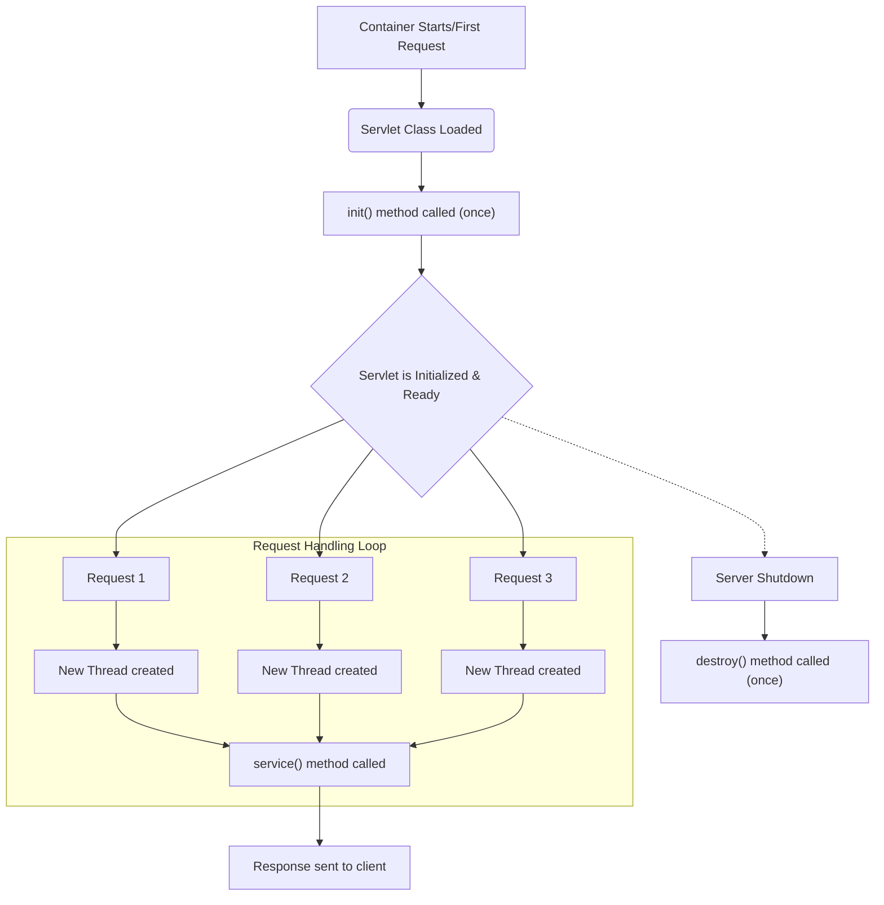
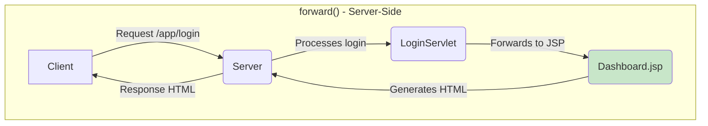
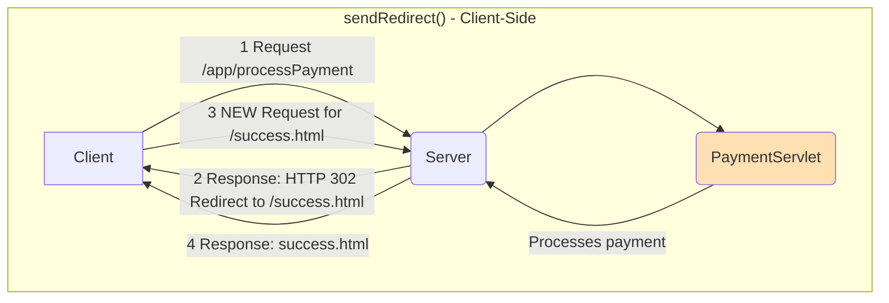

## **Sessions 4, 5, 6 & 7: Servlets**

Welcome. Now that we have an overview of the [[WJP Session 3 - J2EE Overview|J2EE platform]], we can explore its first core component: **Java Servlets**. A Servlet is a Java class that runs on a web server and is used to handle client requests and generate dynamic responses. It is the fundamental building block for creating dynamic web content on the Java platform.

---

### Servlets: Dynamic Content Generation
Before servlets, the common way to generate dynamic content was using **CGI (Common Gateway Interface)**. A CGI script was an external program that the web server would execute for every single request.

#### Advantages of Servlets over CGI
*   **Performance:** A new process is created for every CGI request, which is very slow and resource-intensive. Servlets run as **threads** within a single JVM process managed by the servlet container. The container creates a servlet instance once and then uses multiple threads to handle concurrent requests, which is vastly more efficient.
*   **Platform Independence:** Servlets are written in Java and can run on any platform with a JVM and a compliant servlet container.
*   **Robustness & Services:** Servlets run inside the [[WJP Session 3 - J2EE Overview#The J2EE Container|J2EE container]], which provides services like security, session management, and lifecycle management.

### The Servlet Life Cycle
The servlet container manages the entire life cycle of a servlet instance. This lifecycle consists of three main methods:

1.  **`init()`**: Called by the container **only once** when the servlet is first loaded into memory. It is used for one-time initialization tasks, like setting up a database connection or loading configuration data.
2.  **`service()`**: Called by the container for **every single HTTP request** that is mapped to this servlet. This is where the core logic for processing the request and generating a response resides. The container creates new threads to handle concurrent calls to `service()`.
3.  **`destroy()`**: Called by the container **only once** just before the servlet is unloaded from memory (e.g., when the server is shutting down). It is used to clean up any resources allocated in the `init()` method.

**Life Cycle Visualization:**



### The Servlet API
The core of the Servlet API is in the `jakarta.servlet` package.

*   **`Servlet` interface**: The fundamental interface that all servlets must implement. It defines the lifecycle methods (`init`, `service`, `destroy`).
*   **`GenericServlet` class**: An abstract class that provides a basic, protocol-independent implementation of the `Servlet` interface.
*   **`HttpServlet` class**: An abstract class that extends `GenericServlet` and is specifically designed to handle HTTP requests. **This is the class you will almost always extend.** It provides convenient methods like `doGet()`, `doPost()`, etc.

#### `HttpServletRequest` and `HttpServletResponse`
The `service()` method of an `HttpServlet` receives two crucial objects from the container:

*   **`HttpServletRequest`**: Represents the incoming HTTP request from the client. It contains all the information about the request:
    *   Request parameters: `request.getParameter("name")`
    *   HTTP method: `request.getMethod()`
    *   Headers: `request.getHeader("User-Agent")`
    *   Cookies, session information, and more.

*   **`HttpServletResponse`**: Represents the HTTP response that your servlet will send back to the client. You use this object to:
    *   Set the content type: `response.setContentType("text/html")`
    -   Get a writer to send text back: `PrintWriter out = response.getWriter()`
    -   Redirect the user: `response.sendRedirect("newpage.html")`

The `service()` method of `HttpServlet` reads the HTTP method (GET, POST, etc.) from the request and dispatches it to a corresponding `doXxx()` method. You typically override `doGet()` and/or `doPost()` instead of `service()` itself.

```java
// Example Servlet Structure
public class HelloServlet extends HttpServlet {
    public void doGet(HttpServletRequest request, HttpServletResponse response) 
        throws ServletException, IOException {
        
        response.setContentType("text/html");
        PrintWriter out = response.getWriter();
        
        String name = request.getParameter("username");
        if (name == null) {
            name = "Guest";
        }
        
        out.println("<html><body>");
        out.println("<h1>Hello, " + name + "!</h1>");
        out.println("</body></html>");
    }
}
```

> **Quick Question:** If you have logic that should only run for `POST` requests (like processing a form submission), which method should you override in your `HttpServlet` subclass?
> **Answer:** The `doPost()` method.

### Session Management
HTTP is a [[WPT Session 1 - Architecture of Web#HTTP Protocols|stateless protocol]]. Each request is independent. Session management is the mechanism used to maintain a user's state across multiple requests (e.g., keeping a user logged in, managing a shopping cart).

#### `HttpSession`
This is the standard server-side solution provided by the Servlet API.
*   **How it works:** When a user first visits, the server creates a unique session object (`HttpSession`) and a unique session ID. This ID is sent back to the client, usually stored in a **cookie**. For every subsequent request, the client sends this cookie back, allowing the server to retrieve the correct `HttpSession` object and its stored data.
*   **Getting the session:** `HttpSession session = request.getSession();`
*   **Storing data:** `session.setAttribute("username", "ravi");`
*   **Retrieving data:** `String user = (String) session.getAttribute("username");`

#### Cookies
A cookie is a small piece of data that the server sends to the client's browser. The browser stores it and sends it back with every subsequent request to the same server. `HttpSession` uses cookies under the hood, but you can also manage them directly.

**`HttpSession` is generally preferred** over manual cookie management for session tracking because it is more secure (the data is stored on the server) and easier to manage.

### Request Dispatcher & Page Navigation
A servlet can either generate a response itself or forward the request to another resource (like another servlet or a JSP page) to handle it.

*   **`RequestDispatcher`**: An object that can dispatch a request to another resource.
*   **`forward()`**: Transfers the request and response objects to another resource on the **server-side**. The client's browser URL does not change. This is used in the MVC pattern to forward from a controller servlet to a view JSP.
*   **`include()`**: Includes the content of another resource within the current servlet's response.
*   **`response.sendRedirect()`**: Sends a response back to the client telling it to make a **new request** to a different URL. The browser's URL *does* change. This is a client-side redirect.

**`forward()` vs. `sendRedirect()` Visualization:**


---

### Topic Summary & Revision

*   **Servlet:** A Java class that runs on a server to handle HTTP requests and generate dynamic responses.
*   **Life Cycle:** `init()` (once), `service()` (for every request), `destroy()` (once). Managed by the container.
*   **API:** Extend `HttpServlet` and override `doGet()` or `doPost()`. Use `HttpServletRequest` to get data from the client and `HttpServletResponse` to send data back.
*   **Session Management:** HTTP is stateless. Use `HttpSession` to track a user's state across multiple requests. The server manages this using a session ID, usually stored in a cookie.
*   **Navigation:**
    *   `forward()`: Server-side transfer of control. URL does not change.
    *   `sendRedirect()`: Client-side redirect. The browser makes a new request, and the URL changes.

---

### MCQs for Exam Preparation

1.  **Which method in the Servlet lifecycle is called only once when the servlet is first loaded?**
    - [ ] `service()`
    - [ ] `constructor()`
    - [ ] `init()`
    - [ ] `doGet()`
    <br>

2.  **What is the primary advantage of Servlets over the older CGI technology?**
    - [ ] Servlets are written in a more secure language.
    - [ ] Servlets run in a single process using multiple threads, which is more efficient and scalable than creating a new process for every request.
    - [ ] Servlets can only generate HTML, while CGI can generate any content type.
    - [ ] Servlets do not require a web server to run.
    <br>

3.  **To get the value of a form field submitted via a `POST` request, which method would you use?**
    - [ ] `request.getSession().getAttribute("fieldName")`
    - [ ] `response.getParameter("fieldName")`
    - [ ] `request.getParameter("fieldName")`
    - [ ] `session.getPostData("fieldName")`
    <br>

4.  **A user logs into a website. To keep them logged in across multiple pages, where should the user's identity be stored?**
    - [ ] In a local variable inside the `doPost` method.
    - [ ] In the `HttpServletResponse` object.
    - [ ] In the `HttpSession` object.
    - [ ] In the `ServletContext` object.
    <br>

5.  **What is the key difference between `request.getRequestDispatcher(...).forward()` and `response.sendRedirect()`?**
    - [ ] `forward` is a client-side redirect, while `sendRedirect` is server-side.
    - [ ] `forward` changes the URL in the browser, while `sendRedirect` does not.
    - [ ] `forward` is faster as it's a single server-side operation, while `sendRedirect` involves a new round trip from the client.
    - [ ] `forward` can only go to JSPs, while `sendRedirect` can go to any URL.
    <br>

6.  **The `service()` method of `HttpServlet` typically does what?**
    - [ ] Contains the main business logic of the servlet.
    - [ ] Initializes the servlet's resources.
    - [ ] Checks the HTTP request method (GET, POST, etc.) and dispatches the request to the corresponding `doXxx()` method.
    - [ ] Closes the database connection.
    <br>

7.  **If you set an attribute in the `HttpSession` object, its scope is:**
    - [ ] A single request.
    - [ ] The entire web application, shared by all users.
    - [ ] A single user's session, across multiple requests.
    - [ ] A single page (JSP).
    <br>

8.  **Modern servlet applications often use annotations instead of `web.xml`. Which annotation is used to map a servlet to a URL pattern?**
    - [ ] `@Servlet`
    - [ ] `@Path`
    - [ ] `@RequestMapping`
    - [ ] `@WebServlet`
    <br>

9.  **Which object would you use to write HTML content back to the browser?**
    - [ ] `PrintWriter out = response.getWriter();`
    - [ ] `InputStream in = request.getInputStream();`
    - [ ] `ServletContext ctx = getServletContext();`
    - [ ] `HttpSession session = request.getSession();`
    <br>

10. **The `destroy()` method of a servlet is guaranteed to be called:**
    - [ ] After every request is served.
    - [ ] When the user's session expires.
    - [ ] When the server is shutting down or the application is being undeployed.
    - [ ] If an exception occurs in the `service()` method.
    <br>

**Answer Key**
1.  **C**: ||The init() method is part of the servlet lifecycle and is called by the container exactly once to perform one-time setup before the servlet handles any requests.||
2.  **B**: ||The servlet container uses a multi-threaded model, handling many requests with lightweight threads within one process, whereas CGI required launching a heavy, separate OS process for each request.||
3.  **C**: ||The HttpServletRequest object contains all incoming data from the client, including form parameters, which are accessed via request.getParameter("parameterName")`.||
4.  **C**: ||The HttpSession object is designed specifically for this purpose. It provides a stateful "memory" for a specific user across multiple stateless HTTP requests. The ServletContext is for application-wide data shared by all users.||
5.  **C**: ||forward() is a single, internal redirect on the server. sendRedirect() requires two full HTTP round trips: one for the server to send a 302 redirect response, and a second for the browser to make a new request to the new URL.||
6.  **C**: ||The HttpServlet class provides a convenient base implementation. Its service() method acts as a front controller that delegates the request to the appropriate doGet(), doPost(), etc., based on the request type.||
7.  **C**: ||Attributes stored in the HttpSession are tied to a specific user's session and will be available to that user for all subsequent requests until the session expires or is invalidated.||
8.  **D**: ||The @WebServlet("/myurl") annotation is the modern, standard way to declare a servlet and map it to a URL pattern, replacing the equivalent \<servlet> and \<servlet-mapping> tags in web.xml.||
9.  **A**: ||The HttpServletResponse object gives you access to an output stream to send content back to the client. For character data like HTML, you get a PrintWriter object using response.getWriter().||
10. **C**: ||The destroy() method is the final stage in the lifecycle, designed for graceful shutdown and resource cleanup (e.g., closing a database connection pool). It is called by the container when the application is being stopped.||

---

### **Bonus Tips**

*   **Servlets are Controllers:** In a modern MVC (Model-View-Controller) architecture, Servlets are not used to generate HTML directly. This is considered bad practice because it mixes Java logic with presentation code. Instead, the Servlet's role is to act as the **Controller**: it receives the request, calls business logic (Model), prepares the data, and then **forwards** the request to a **JSP** (the View) to render the HTML.
*   **Thread Safety:** Because the `service()` method is called by multiple threads concurrently, you must be very careful about instance variables in your servlet. Modifying an instance variable without proper synchronization can lead to race conditions. The best practice is to **avoid using instance variables for request-specific data**. All request-specific data should be kept in local variables within the `doGet`/`doPost` methods.
*   **The Deployment Descriptor (`web.xml`):** While annotations are common, `web.xml` is still very powerful. It's used to configure things that are application-wide and not tied to a single servlet, such as welcome file lists, error page mappings, session timeout durations, and security constraints.
*   **POJO, DAO, Service Layers:** A well-structured servlet application will use the [[WJP Sessions 1 & 2 - JDBC & Transaction Management#Design Pattern: Data Access Object (DAO)|DAO pattern]]. The flow is typically: `Servlet (Controller) -> Service Layer (Business Logic) -> DAO Layer (Data Access)`. This separation of concerns makes the application much cleaner and easier to test and maintain.

**🔗Links:** [[WJP Sessions 8 & 9 - JSP]]