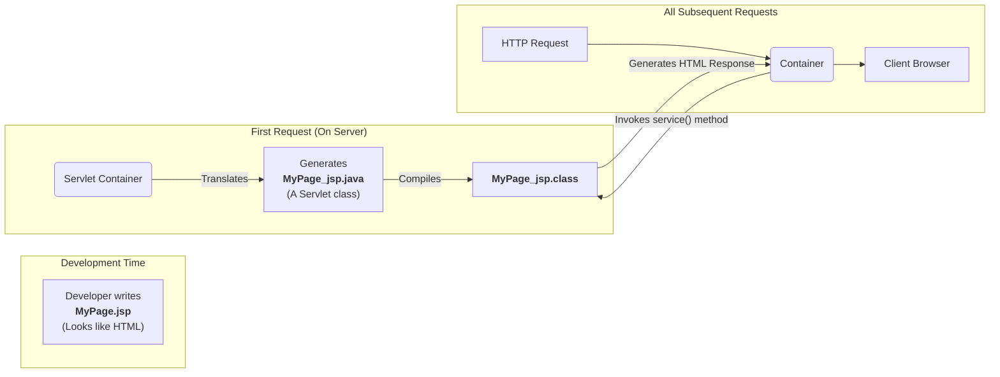

## **Sessions 8 & 9: JSP (JavaServer Pages)**

Welcome. In our last session, we saw that generating HTML directly from a [[WJP Sessions 4, 5, 6 & 7 - Servlets|Servlet]] using `PrintWriter` is cumbersome and mixes presentation logic with business logic. **JSP (JavaServer Pages)** was created to solve this problem. It allows us to write dynamic web pages in a way that looks more like HTML, separating the UI from the content generation code.

---

### JSP: Separating UI from Content Generation
A JSP page is essentially an HTML page with special tags and embedded Java code that gets executed on the server.

*   **The Core Idea:** Instead of Java code printing HTML, we write an HTML page and embed small pieces of Java code where we need dynamic content.
*   **How it Works (Under the Hood):** When a JSP page is requested for the first time, the Servlet Container **translates** it into a Java Servlet, **compiles** that servlet, and then executes it just like any other servlet. For subsequent requests, the already compiled servlet is used directly, which makes it efficient.

**The Servlet-JSP Relationship:**



### The MVC Architecture
JSP technology is a key component of the **Model-View-Controller (MVC)** design pattern for web applications.
*   **Model:** The data and business logic (e.g., POJO classes, DAOs, Service layers).
*   **View:** The presentation layer responsible for rendering the UI. **JSP is the View.**
*   **Controller:** Handles user input, interacts with the Model, and decides which View to display. **Servlets are the Controller.**

By separating these concerns, the application becomes much easier to manage, test, and develop, as UI designers can work on the JSP (View) while Java developers work on the Servlet (Controller) and backend logic (Model).

### Life Cycle of a JSP Page
The JSP life cycle is managed by the container and mirrors the servlet life cycle because a JSP *is* a servlet.
1.  **Translation:** The JSP source (`.jsp`) is converted into Java servlet source code (`.java`).
2.  **Compilation:** The generated `.java` file is compiled into a `.class` file.
3.  **Loading & Instantiation:** The container loads the class and creates an instance of it.
4.  **Initialization:** The container calls the `jspInit()` method (equivalent to a servlet's `init()`).
5.  **Request Processing:** For each request, the container calls the `_jspService()` method (equivalent to a servlet's `service()`).
6.  **Destruction:** The container calls the `jspDestroy()` method (equivalent to a servlet's `destroy()`).

### JSP Elements

#### Directives (`<%@ ... %>`)
Directives are messages to the JSP container that affect the overall structure of the page.
*   **`<%@ page ... %>`**: Defines page-dependent attributes, like the language, session participation, and importantly, importing Java classes.
    `<%@ page import="java.util.Date, java.util.ArrayList" %>`
*   **`<%@ include ... %>`**: Includes the content of another file (HTML, JSP, etc.) *at translation time*. The content of the included file is merged into the JSP's source code before it's compiled.
*   **`<%@ taglib ... %>`**: Declares a tag library (like JSTL) that will be used on the page.

#### Implicit and Explicit Objects
The JSP container makes several objects automatically available to use within scriptlets and expressions. These are called **implicit objects**.

*   `request`: The `HttpServletRequest` object for the current request.
*   `response`: The `HttpServletResponse` object.
*   `out`: A `JspWriter` object (similar to `PrintWriter`) used to write content to the response.
*   `session`: The `HttpSession` object for the current user.
*   `application`: The `ServletContext` object, shared by all users of the web application.
*   `pageContext`: Provides access to all other objects and scopes.
*   `config`: The `ServletConfig` object.
*   `page`: A reference to the servlet instance itself (`this`).
*   `exception`: The `Throwable` object, only available on designated error pages.

#### Scripting Elements
These are the elements used to embed Java code. **In modern development, their use is heavily discouraged in favor of Expression Language (EL) and JSTL.**

*   **Scriptlets (`<% ... %>`)**: A block of Java code to be executed.
    `<% for(int i=0; i<5; i++) { ... } %>`
*   **Expressions (`<%= ... %>`)**: An expression that is evaluated, converted to a String, and written to the output stream. It's a shortcut for `out.print(...)`.
    `Current time is: <%= new java.util.Date() %>`
*   **Declarations (`<%! ... %>`)**: Used to declare instance variables or methods for the generated servlet class.

#### Scope
JSP provides four scopes for storing attributes (data objects).
1.  **`page`**: The object is available only on the current JSP page for the current request. (Default scope).
2.  **`request`**: The object is available for the duration of the current HTTP request. It can be accessed by any other resource (like another JSP) that the request is [[WJP Sessions 4, 5, 6 & 7 - Servlets#Request Dispatcher & Page Navigation|forwarded]] to.
3.  **`session`**: The object is available for all requests made by a single user during their session.
4.  **`application`**: The object is available to all users across the entire web application.

> **Quick Question:** A controller servlet fetches a list of products from the database. It then needs to pass this list to `products.jsp` for display. Which scope is the most appropriate for storing the product list?
> **Answer:** The `request` scope. The data is only needed for this single request-response cycle. The servlet would do `request.setAttribute("productList", products)` and then forward to the JSP.

### JSP Error Page Handling
You can configure a specific JSP page to handle any un-caught exceptions that occur during the processing of another page.

In `MyPage.jsp`:
`<%@ page errorPage="error.jsp" %>`

In `error.jsp`:
`<%@ page isErrorPage="true" %>`
Now, the `error.jsp` page has access to the `exception` implicit object to display details about the error.

### JSTL (JSP Standard Tag Library)
Because scriptlets (`<% ... %>`) mix Java and HTML code, making pages hard to maintain, JSTL was created. JSTL is a library of pre-defined tags that replace the need for most scriptlet code.

*   It provides tags for loops, conditionals, formatting, and more.
*   It works hand-in-hand with **Expression Language (EL)**.

**Expression Language (EL):**
*   A simple language for accessing data stored in the various JSP scopes.
*   **Syntax:** `${expression}`.
*   It simplifies getting data. Instead of `<%= request.getAttribute("username") %>`, you can just write `${username}`. EL automatically searches the page, request, session, and application scopes to find the attribute.

**Example: Using JSTL and EL to loop through a list.**
In the Servlet:
`request.setAttribute("userList", users);` // users is a List\<String>

In the JSP:
```js
<%@ taglib prefix="c" uri="http://java.sun.com/jsp/jstl/core" %>
...
<ul>
    <c:forEach var="user" items="${userList}">
        <li><c:out value="${user}" /></li>
    </c:forEach>
</ul>
```
This is much cleaner and easier to read than a Java `for` loop written in a scriptlet.

---

### Topic Summary & Revision

*   **JSP:** A technology for creating dynamic web pages that separates presentation (HTML) from logic (Java). A JSP is translated into a Servlet by the container.
*   **MVC Pattern:** JSP is the **View**, and Servlets are the **Controller**.
*   **Life Cycle:** `jspInit()`, `_jspService()`, `jspDestroy()`.
*   **Implicit Objects:** `request`, `response`, `session`, `application`, `out`, etc., are automatically available.
*   **Scopes:** `page`, `request`, `session`, `application` define the lifetime and visibility of attributes.
*   **JSTL & EL:** The **modern, preferred way** to write JSPs. Use JSTL tags (like `<c:forEach>`) and Expression Language (`${...}`) instead of Java scriptlets (`<%...%>`).

---

### MCQs for Exam Preparation

1.  **What happens when a JSP page is requested for the very first time?**
    - [ ] It is interpreted line by line by the browser.
    - [ ] It is sent directly to the client and executed by JavaScript.
    - [ ] The servlet container translates it into a Java servlet, compiles it, and then executes it.
    - [ ] It is executed by the Java Virtual Machine directly.
    <br>

2.  **In the MVC design pattern, what is the primary role of a JSP?**
    - [ ] The Model (handling business logic)
    - [ ] The View (handling presentation/UI)
    - [ ] The Controller (handling user requests)
    - [ ] The Database
    <br>

3.  **Which JSP scripting element is used to evaluate an expression and write the result directly to the output?**
    - [ ] `<%! ... %>` (Declaration)
    - [ ] `<% ... %>` (Scriptlet)
    - [ ] `<%-- ... --%>` (Comment)
    - [ ] `<%= ... %>` (Expression)
    <br>

4.  **A controller servlet sets an attribute `request.setAttribute("user", userObject)`. The request is then forwarded to a JSP. How should the JSP access the user's name using Expression Language?**
    - [ ] `<%= request.getAttribute("user").getName() %>`
    - [ ] `${request.user.name}`
    - [ ] `${user.name}`
    - [ ] `<% out.print(user.getName()); %>`
    <br>

5.  **What is the main advantage of using JSTL and EL over scriptlets?**
    - [ ] They offer better performance because they are compiled differently.
    - [ ] They allow for more complex Java logic to be written in the page.
    - [ ] They cleanly separate logic from presentation, making the page easier to read and maintain for both developers and web designers.
    - [ ] They provide better security against SQL injection.
    <br>

6.  **Which implicit object would you use to store a "shopping cart" object that needs to be available for a single user across multiple requests?**
    - [ ] `request`
    - [ ] `session`
    - [ ] `application`
    - [ ] `pageContext`
    <br>

7.  **What is the purpose of the `isErrorPage="true"` attribute in a JSP page directive?**
    - [ ] It tells the container to forward all errors to this page.
    - [ ] It makes the `exception` implicit object available on that page.
    - [ ] It prevents the page from throwing any exceptions itself.
    - [ ] It marks the page for deletion by the container.
    <br>

8.  **What is the scope of an object placed in the `application` scope?**
    - [ ] It is available only on the current page.
    - [ ] It is available only for the current request.
    - [ ] It is available only for the current user's session.
    - [ ] It is available to all users across the entire web application.
    <br>

9.  **Which JSTL tag is used to iterate over a collection of items?**
    - [ ] `<c:if>`
    - [ ] `<c:forEach>`
    - [ ] `<c:set>`
    - [ ] `<c:out>`
    <br>

10. **What is the key difference between `<%@ include file="..." %>` and `<jsp:include page="..." />`?**
    - [ ] There is no difference; they are interchangeable.
    - [ ] The `@include` directive includes the content at translation time (static include), while the `<jsp:include>` action includes the content at request time (dynamic include).
    - [ ] The `@include` directive is for HTML files, while `<jsp:include>` is for JSP files.
    - [ ] The `<jsp:include>` action is faster than the `@include` directive.
    <br>

**Answer Key**
1.  **C**: ||The JSP-to-Servlet translation and compilation is a one-time cost on the first request. Subsequent requests are served by the already compiled servlet class, which is highly efficient.||
2.  **B**: ||In MVC, the View's only job is presentation. The JSP is designed for this role, allowing UI-focused development with HTML-like syntax, while the Servlet acts as the Controller to handle the request logic.||
3.  **D**: ||The expression tag <%= ... %> is a shortcut for out.print(...). The result of the expression inside it is converted to a string and printed to the response.||
4.  **C**: ||Expression Language ${...} automatically searches through the page, request, session, and application scopes in that order to find an attribute with the given name. ${user.name} is internally translated to call the getName() method on the userObject.||
5.  **C**: ||JSTL and EL provide a clean, tag-based syntax that removes Java code from the page. This improves maintainability and allows for a better separation of roles between web designers (who can work with tags) and Java developers.||
6.  **B**: ||The session scope is designed to hold data specific to a single user's visit (a session). A shopping cart is a perfect example of this.||
7.  **B**: ||Setting isErrorPage="true" signals to the JSP container that this page is a designated error handler, which then makes the exception implicit object available for use within scriptlets or EL to display error details.||
8.  **D**: ||The application scope (backed by the ServletContext object) is global. An attribute set in this scope is shared by all sessions and all users of the web application until the application is shut down.||
9.  **B**: ||The <c:forEach> tag is the JSTL equivalent of a for loop, used to iterate over arrays, collections, or maps.||
10. **B**: ||This is a key distinction. A static include (\<%@ include %>) merges the files before compilation, resulting in one large servlet. A dynamic include (<jsp:include>) is a request-time operation where the container calls the included resource and adds its output to the response. The dynamic include is more flexible.||

---

### **Bonus Tips**

*   **Avoid Scriptlets at All Costs:** This is the most important modern JSP best practice. The presence of scriptlets (`<% ... %>`) is a "code smell" indicating a poor separation of concerns. Any logic they contain should be moved into a controller servlet or a model class, and the data should be passed to the JSP and accessed using EL and JSTL.
*   **The Power of EL:** Expression Language is more powerful than it looks. It can access properties of beans (`${user.name}`), elements of an array or List (`${myList[0]}`), and values in a Map (`${myMap.keyName}`). It also has a set of implicit objects like `param` (`${param.username}` to get a request parameter) and `header`.
*   **Request Scope is Your Default:** When passing data from a servlet to a view for a single request-response cycle, always use the `request` scope. Only use `session` scope for data that truly needs to persist across multiple requests for a single user. Misusing `session` scope can lead to memory issues and stale data.
*   **JSP is a View Technology:** Remember that while a JSP becomes a servlet, its *purpose* is different. A servlet is for control flow and logic. A JSP is for presentation. Keeping this distinction in mind is key to writing clean, maintainable MVC applications.

**🔗Links:** [[WJP Sessions 10, 11, 12 & 13 - Hibernate Framework]]